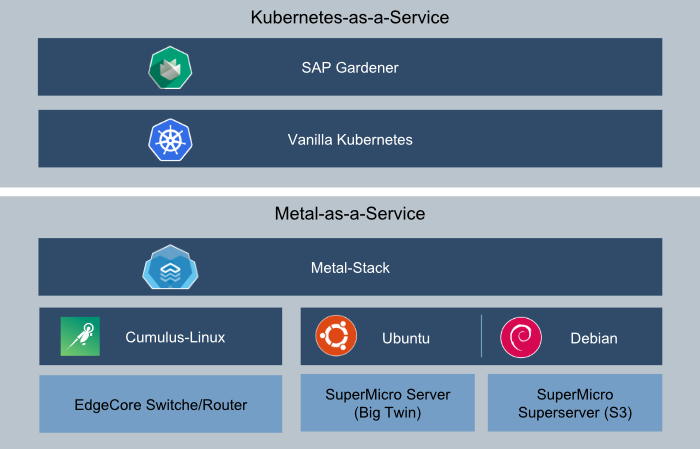

Early in 2018 [FI-TS](https://f-i-ts.de/) decided to build a Kubernetes-as-a-Service solution for
financial institutions. As with every regulated industry, there are digital sovereignty concerns
regarding the control and access of data and compute. Hence, going to the public cloud isn't feasible
for every workload. So, we got the task to find an enterprise ready stack for our own datacenter, while
also introducing the cloud native digital competency standards.

<!-- truncate -->

#### Why we built metal-stack

Initially we were looking for an infrastructure platform to run our Kubernetes services. However,
having advanced requirements, we couldn't find one that fitted our needs. We evaluated different
products, but most of them had shortcomings with regards to networking or set boundary conditions
which we could not compromise on. Maybe OpenStack would have been an option, alas we had no operational
experience with it but already knew about its burdening complexity.

Our main requirements for our Kubernetes services were:

- fast provisioning (infrastructure and Kubernetes)
- tight integration with Kubernetes and its services
- high level of separation for sensitive environments (network segmentation)
- modern network design and software designed networking
- direct Bare-Metal servers without noisy neighbor challenges
- deliver a cloud-native experience out of our own datacenters

Of course, we strived for a Kubernetes idiomatic way of handling infrastructure components.

At that point we came across [SAP Gardener](https://gardener.cloud/) project. SAP Gardener is a
cloud-agnostic Kubernetes cluster-manager that provides an API for Kubernetes installation and management.
And it is implemented with an [Inception design](https://kubernetes.io/blog/2019/12/02/gardener-project-update/),
adhering to the same Kubernetes idiomatic principles that we set as goal. As we didn’t want to manage all
our Kubernetes clusters manually, this became an important piece to our architecture.

Still missing a proper solution for the infrastructure layer, wanting a fresh and clean take on the overall
subject while willing to innovate, we decided:
“What could possibly go wrong. Let’s build our own…”

#### Our solution architecture

##### Network

Finding a really flexible and scalable solution that doesn’t cost a fortune, was one of the hardest challenges
in our quest. By researching and investigating conferences and talks from the big hyperscalers we came to the
conclusion, that we wanted to have:

- Open-Compute Networking equipment (we use EdgeCore Router, but any other vendor should be good), for
  cheap hardware
- Generic Network Operating System based on Linux for our Routers (we leverage Cumulus-Linux), for
  good manageability
- Layer-3 separation by starting an VRF instance for every Kubernetes cluster in our environment with
  dedicated links for the worker-nodes
- an [EVPN overlay](https://cumulusnetworks.com/learn/resources/whitepapers/vxlan-routing-with-evpn)
  network to build a lightweight SDN solution
- [Routing on the host](https://cumulusnetworks.com/learn/resources/whitepapers/routing-host-benefits),
  to gain high-availability and scalability

On top of that, we decided to equip every cluster with a dedicated firewall, that connects the private VRF
instance with an exit router to the internet. This is accomplished by installing one of our servers from
the compute node pool with a special firewall Linux image. Also, we have implemented a
[Kubernetes controller](https://github.com/metal-stack/firewall-policy-controller)
that generates nftables rules for Services and NetworkPolicies deployed to the cluster.

##### Compute

While Open-Compute hardware has interesting servers as well, we were forced to use the existing 19”-Racks in
our datacenter. Therefore, we chose to use a more conservative approach for our compute hardware. As we wanted
to have dedicated links for every server, we ruled out all Blade-Chassis with proprietary switches in their
chassis and decided to buy a bunch of Supermicro Big-Twin servers. These systems have four independent nodes in
a 2U rackmount, that share nothing but the power supplies. Each node is managed by a board management controller,
that can be managed with “standard” IPMI.

As it turned out this form factor is becoming increasingly popular and similar hardware is now available from
other vendors (Lenovo, Dell, …). With increasing standardization it should be possible to integrate any server
that is manageable by IPMI. However, as of today there seems to be no accepted standard IPMI. Each vendor (even model)
implementation has his own quirks. To prevent being caught in a lock-in, we started with a
[hardware abstraction layer](https://github.com/metal-stack/go-hal) that can be adjusted to these specific
characteristics. Metal-stack today runs with Supermicro X11DPT and X11SDV boards and we are expanding our range
with every new adopter (e.g. we know that there is someone working on support for Lenovo servers).

Pull requests for additional hardware are greatly appreciated.

By default, all systems in our compute pool are assigned to a special management network, where a DHCP server
tells them to boot our bootstrapping agent, called [metal-hammer](https://github.com/metal-stack/metal-hammer).
Essentially this agent does two things:

1. It collects all kinds of inventory data from the server and uploads it to our control-service
   ([metal-api](https://github.com/metal-stack/metal-api)).
2. It waits for an installation request from the [metal-api](https://github.com/metal-stack/metal-api),
   downloads a [machine image](https://github.com/metal-stack/metal-images) and burns it to the system drive
   of the server. When finished, a kexec call is made to boot the Linux kernel that was provided in the
   machine image.

##### Storage

To provide storage for our environment, we chose to equip each server with local NVMe or SATA drives. We make these
drives accessible as local persistent volumes from Kubernetes by integrating our
[LVM CSI driver](https://github.com/metal-stack/csi-lvm) as a Gardener extension.

To make sure, that data stored on these drives is erased before handing over the node to a cluster, the
[metal-hammer](https://github.com/metal-stack/metal-hammer) either can erase the disks properly (which can take long)
or simply generates a new encryption key for the hardware encryption of the drives..

While having built this environment for the enterprise space, we did not attach an enterprise storage system to our
platform. Instead we use Rook/Ceph on our nodes and we are looking into other solutions for software defined storage,
but this is out of scope for this post.

##### Tooling

As we wanted to have the “Kubernetes feeling” for metal-stack we implemented (almost) everything in Go and tried
to reuse concepts like gRPC or Microservices for infrastructure management. Of course, there is also a
[Go library](https://github.com/metal-stack/metal-go) and a command line tool
([metalctl](https://github.com/metal-stack/metalctl)) for accessing the metal-api.

To make Kubernetes play well together with metal-stack we have implemented a
[Kubernetes Cloud Controller Manager](https://github.com/metal-stack/metal-ccm) and a
[Gardener extension provider](https://github.com/metal-stack/gardener-extension-provider-metal). With this
in place failed machines will get replaced automatically and and you can even use the Kubernetes cluster autoscaler
for automagical bare-metal server provisioning.

If you want to get a first impression on how metal-stack works, you can install mini-lab.
[mini-lab](https://github.com/metal-stack/mini-lab) is our virtualized deployment, for local development.
It consists of VMs for two Routers ([Cumulus VX](https://cumulusnetworks.com/products/cumulus-vx/)), a metal-api
instance and you can create VMs, that resemble the bare-metal hardware pool.
