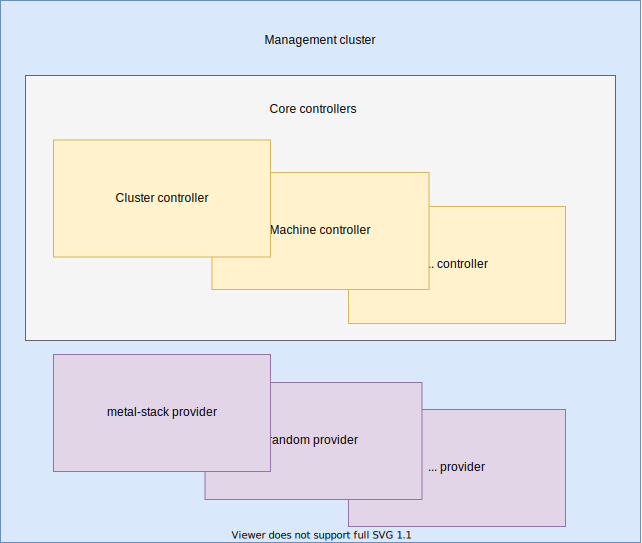
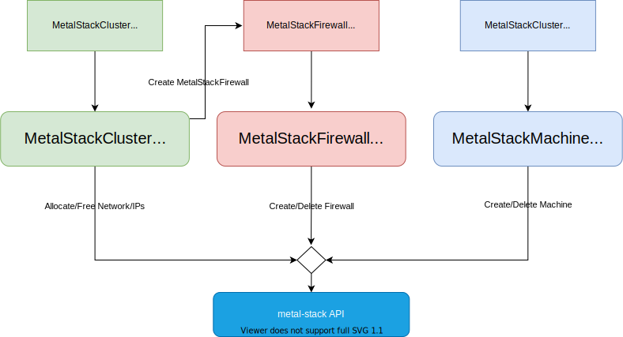

One of the main goals of the `metal-stack` project is to provide a fast and convenient way to provision Kubernetes clusters on bare-metal provided by `metal-stack`'s infrastructure layer.

<!-- truncate -->

Until now [Gardener](https://gardener.cloud/) was the only way to manage Kubernetes clusters on `metal-stack` with [our provider implementation](https://github.com/metal-stack/gardener-extension-provider-metal) for Gardener.

Today we're happy to provide you with a second option: [a provider implementation for the Cluster API spec](https://github.com/metal-stack/cluster-api-provider-metalstack)!

## What is Cluster API

Cluster API was started by the Kubernetes Special Interest Group (SIG) Cluster Lifecycle and its goal is to simplify provisioning, upgrading, and operating multiple Kubernetes clusters. Thereby it's using Kubernetes-style APIs to automate cluster lifecycle management. Clusters and nodes can be managed similar to how applications can be managed with `Pods` and `Deployments`:

- to manage clusters, there is a `Cluster` resource
- for managing machines, there is a `Machine` resource (comparable to the `Pod` resource for apps)
- and a `MachineDeployment` resource (comparable to the `Deployment` resource for apps)



Cluster API components usually run in a separate management cluster. It includes core controllers, like [Cluster controller](https://cluster-api.sigs.k8s.io/developer/architecture/controllers/cluster.html) and [Machine controller](https://cluster-api.sigs.k8s.io/developer/architecture/controllers/machine.html) which implement high-level logic for managing the cluster lifecycle. Infrastructure providers contain provider specific logic, like communication with bare-metal machines and setting additional services and functionality (cluster network, firewalls, etc).

For more details, you may check the [Cluster API docs](https://cluster-api.sigs.k8s.io/).

## Architecture

The provider can be seen as an intermediate layer between the `metal-stack` infrastructure layer, which manages bare-metal machines and the Cluster API, which manages Kubernetes clusters. It communicates with the `metal-stack` API using our golang client [`metal-go`](https://github.com/metal-stack/metal-go).



The provider consists of 3 controllers:

- [MetalStackCluster controller](https://github.com/metal-stack/cluster-api-provider-metalstack/blob/master/docs/controllers/MetalStackCluster_Controller.md) -- reconciles [MetalStackCluster](https://github.com/metal-stack/cluster-api-provider-metalstack/blob/master/docs/resources/MetalStackCluster.md) resources and manages cluster and all underlying resources (machines, networks, firewall).
- [MetalStackMachine controller](https://github.com/metal-stack/cluster-api-provider-metalstack/blob/master/docs/controllers/MetalStackMachine_Controller.md) -- reconciles [MetalStackMachine](https://github.com/metal-stack/cluster-api-provider-metalstack/blob/master/docs/resources/MetalStackMachine.md) resources and creates/updates/deletes Control Plane/Worker nodes on bare-metal, served by `metal-stack`.
- [MetalStackFirewall controller](https://github.com/metal-stack/cluster-api-provider-metalstack/blob/master/docs/controllers/MetalStackFirewall_Controller.md) -- reconciles [MetalStackFirewall](https://github.com/metal-stack/cluster-api-provider-metalstack/blob/master/docs/resources/MetalStackFirewall.md) resources and creates/updates/deletes a firewall, served by `metal-stack`.

For more details about provider components (controllers, resources), take a look at our [provider documentation](https://github.com/metal-stack/cluster-api-provider-metalstack/blob/master/docs/contents.md).

## Try it out on your machine

### Prerequisites

To start our Cluster API provider locally, you need to clone the provider repository and the branch `3-machines` of the mini-lab:

```bash
git clone https://github.com/metal-stack/cluster-api-provider-metalstack.git
git clone https://github.com/metal-stack/mini-lab.git
cd mini-lab && git checkout 3-machines && cd -
```

After that, follow the instructions in the [README file](https://github.com/metal-stack/mini-lab/blob/3-machines/README.md).

Besides that, you'll need:

- [kubectl](https://kubernetes.io/docs/tasks/tools/)
- [clusterctl](https://cluster-api.sigs.k8s.io/clusterctl/overview.html)
- [kustomize](https://kubectl.docs.kubernetes.io/installation/kustomize/)

### Install Cluster API components

Before initializing the Cluster API management cluster run:

```bash
make manager-test
```

That command generates a manifest file that bundles the provider deployment and all required CRDs and places it in `out/` directory. To install Cluster API components (including the `metal-stack` provider) in the `kind` cluster deployed by `mini-lab`, run `clusterctl init` with generated manifest file passed as `--config` flag:

```bash
clusterctl init --config=out/test/infrastructure-metalstack/clusterctl-{latest_tag}-dirty.yaml --infrastructure=metalstack -v3
```

### Create a cluster

After everything is ready (you can check readiness of pods by running `kubectl get pods -A`), you can generate a manifest file from [template](https://github.com/metal-stack/cluster-api-provider-metalstack/blob/master/templates/cluster-template.yaml). Some important resources are defined there:

- [KubeadmControlPlane](https://cluster-api.sigs.k8s.io/developer/architecture/controllers/control-plane.html) -- used for configuring Control Plane nodes of cluster.
- [MetalStackCluster](https://github.com/metal-stack/cluster-api-provider-metalstack/blob/master/docs/resources/MetalStackCluster.md) -- specifies things like private network, partition and project in which cluster will be provisioned.
- MachineDeployment -- similar to `Deployment` resource, but for machines. Specifies machine config and number of machines to provision. Used for configuring and replicating worker nodes.

To generate the manifest file, just run `make cluster` which places it in `out/` directory. After it's ready, run `kubectl apply -f out/cluster.yaml` which creates the corresponding resources that define the control plane and worker machines. After some time, the control plane and worker nodes become ready and you can fetch the Kubeconfig of the just created cluster and play with it!

Check it out and have fun!
