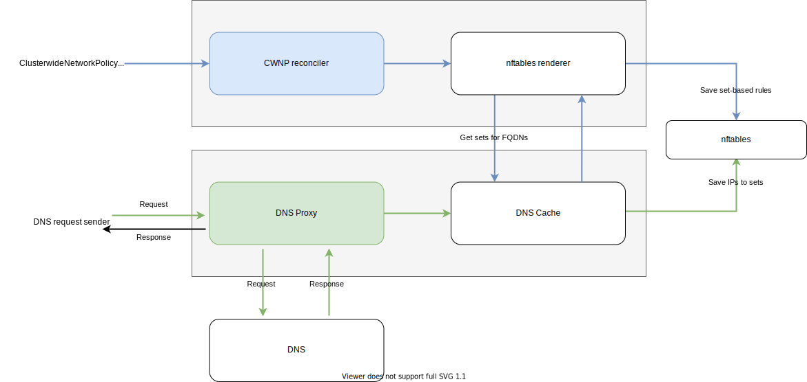

We just released a new firewall-controller that now comes with DNS-based L3 policies support! Read this post to find out when it can be useful and how you can try this out.

<!-- truncate -->

## What is Firewall Controller

In case servers need access to external networks (e.g. the internet), metal-stack provisions a separate firewall machine to act as a gateway for these servers (for more details read our [networking doc](https://docs.metal-stack.io/stable/overview/networking/)).


The **firewall-controller** service is the main component running on the firewall machine. Technically, it's an external Kubernetes controller that listens to events on the user cluster. It's responsible for setting machine routing and packet filtering rules based on the user configuration provided via a [Firewall](https://github.com/metal-stack/firewall-controller/blob/master/api/v1/firewall_types.go#L37) resource or through [ClusterwideNetworkPolicy](https://github.com/metal-stack/firewall-controller/blob/master/api/v1/clusterwidenetworkpolicy_types.go#L34) resources (**CWNP** for future references):

- The `Firewall` resource is used for multiple purposes like firewall-controller configuration itself, set up of [SNAT](https://en.wikipedia.org/wiki/Network_address_translation#SNAT) rules, known networks and more.
- `ClusterwideNetworkPolicy` resource is used for filtering Ingress/Egress traffic. Internally, policies provided by CWNP are translated to nftables rules.

## DNS-Based Policies

### Concept

Until now it was possible to define Egress policies only using CIDR notation ([Classless Inter-Domain Routing](https://en.wikipedia.org/wiki/Classless_Inter-Domain_Routing)). That's not always useful. For example, when you rely on an external service that can change its IP address. There are also scenarios, when the FQDN ([fully qualified domain name](https://en.wikipedia.org/wiki/Fully_qualified_domain_name)) is required by services (e.g. [name based virtual hosting](https://en.wikipedia.org/wiki/Shared_web_hosting_service) is used).

For such situations, DNS-based policies come quite handy. Instead of filtering the CIDR you can filter by specific domain names or even by domain name patterns like `*.example`.

### Implementation

As we discussed in the previous section [What is Firewall Controller](./#what-is-firewall-controller), one of the responsibilities of the firewall-controller is to apply Ingress/Egress policies provided by a user (reminder: it's done via CWNP resource). These policies are translated to nftables rules, which are later used by nftables service to filter network packets.

nftables rules can use individual IP addresses or CIDRs for filtering, but know nothing about DNS. So it's quite trivial to create nftables rules based on CIDR policies, provided by a user. But in case of DNS-based rules, we need to translate the provided FQDNs to actual IP addresses.

Here's flow chart to illustrate how DNS based policies are handled:



1. **DNS proxy** intercepts DNS traffic and propagates query results to the DNS cache. Traffic is intercepted with the help of nftables DNAT rules. There are two rules (one for TCP and one for UDP packets) for each private interface that needs access to a public network. These rules change their original destination address to the public IP address of firewall machine (where DNS proxy is waiting for packets):

```plain
table inet nat {
    chain prerouting {
      type nat hook prerouting priority 0; policy accept;
      iifname "vlan<Private>" tcp dport { 53 } dnat to <PublicIP> counter accept comment "redirecting to DNS proxy/TCP"
      iifname "vlan<Private>" udp dport { 53 } dnat to <PublicIP> counter accept comment "redirecting to DNS proxy/TCP"
      ...
    }
  ...
}
```

2. **DNS cache** creates/updates nftables sets and then stores FQDN to set-names mappings in memory along with some metadata needed to decide when to update the cache.
3. **ClusterwideNetworkPolicies reconciler** reconciles (created/updated/deleted) CWNP resources. It delegates nftables rules updates to the nftables renderer.
4. **nftables renderer** translates policies to rules and persists these rules to nftables. If policy is DNS-based, it uses DNS cache to get set names for FQDN or provided pattern and creates corresponding filtering rules.

### How to Use It

The new version of the firewall-controller supports DNS-based requests by default. But if you wish, you can disable it, by running the controller with the flag `--disable-dns=true`. There's also an additional flag that allows you to change the port on which the DNS proxy will be running `--dns-port=port`(by default it's set to port 53).

The next step after firewall-controller is started would be to create CWNP resources that filters Egress traffic based on FQDN. There are two options for that:

1. You can provide a specific domain name to filter via `matchName` option, like in this example:

```yaml
apiVersion: metal-stack.io/v1
kind: ClusterwideNetworkPolicy
metadata:
  namespace: firewall
  name: clusterwidenetworkpolicy-fqdn
spec:
  egress:
    - toFQDNs:
        - matchName: example.com
      ports:
        - protocol: UDP
          port: 80
        - protocol: TCP
          port: 80
```

2. Instead of filtering single domain name, you can provide a pattern, to filter all FQDNs that match with it via `matchPattern` option. Pattern can consist of any literal characters allowed in domain names and wildcards `*` placed anywhere. Here is an example that allows traffic to port 80 of all resources in the `.example` top-level domain:

```yaml
apiVersion: metal-stack.io/v1
kind: ClusterwideNetworkPolicy
metadata:
  namespace: firewall
  name: clusterwidenetworkpolicy-fqdn-pattern
spec:
  egress:
  - toFQDNs:
    - matchPattern: *.example
    ports:
    - protocol: UDP
      port: 80
    - protocol: TCP
      port: 80
```

By default, DNS info is collected from [Google DNS](https://en.wikipedia.org/wiki/Google_Public_DNS) (with address `8.8.8.8:53`). The preferred DNS server can be changed by specifying the `dnsServerAddress` field in [Firewall](https://github.com/metal-stack/firewall-controller/blob/master/api/v1/firewall_types.go#L37) resource:

```yaml
apiVersion: metal-stack.io/v1
kind: Firewall
metadata:
  namespace: firewall
  name: firewall
spec:
  ...
  dnsServerAddress: 8.8.4.4:53
  ...
```

Now you are ready to try and have some fun with it!
