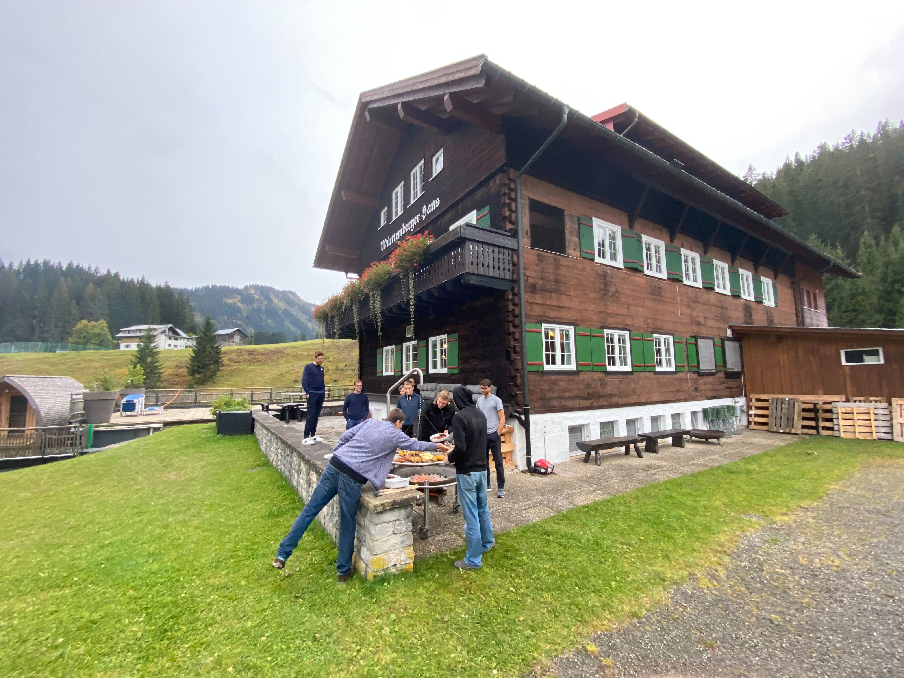
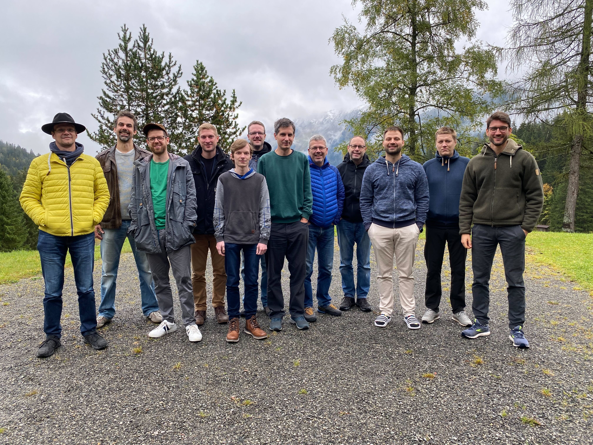

Last year in November, we from the metal-stack and the SAP Gardener team held our first joined hackathon in the Tyrolean Alps [Hack the Metal](https://metal-stack.io/blog/2021/11/hack-the-metal/). We all said that this must be repeated because it was so much fun and we created a lot of useful enhancements which otherwise wouldn't exist.

<!-- truncate -->

This year in the last week of September it happened again and more folks joined: A stunning party of five companies came together to repeat this. The attendees were from the core Gardener and the onmetal team at [SAP](https://sap.com), [STACKIT](https://www.stackit.de/), [23technologies](https://23technologies.cloud/), and the metal-stack team from [FI-TS](https://f-i-ts.de) and [x-cellent technologies](https://x-cellent.com).

The event took place in the [Württembergerhaus](https://www.wuerttembergerhaus.de/) in Hirschberg in the Kleinwalsertal.

## Preparation

As we all have serious workloads running on top of gardener created and orchestrated kubernetes clusters since several years, all parties have a lot of improvement ideas in mind. The challenge is to collect a list of valuable topics which are fun to work at together and fit in the timeframe of 4 days. To get this list we brainstormed a few weeks before and selected 4 topics equally distributed across all 14 attendees.

- Refactor the templated `bash` scripts which are basis for the `cloud-config-downloader`.
- Create a extensions for a registry pull-through cache.
- Canary rollouts.
- IPv6.

Sadly not all could join, only 12 people where left and for that reason we postponed the first topic.

## Registry pull through Cache

The reasons to have such a pull through cache are two-fold. First, this will reduce the amount of data downloaded from container registries because once a container image was downloaded from one worker, the next download would be served from the cache. This will also speed up the download by a huge factor. Second, if the pull through cache is placed outside of the cluster, network policies are possible to restrict the access to the internet to only reach this particular cache, which is forced by some security design principles.

The implementation was done within this week and is working in in POC manner. Integration tests and documentation is still missing and is planned to be done after the hackathon by the folks which implemented it.

## Canary Rollout

Currently when updating gardener and it's extensions, all shoots get updated either immediately or in their maintenance window, which is within the next 24 hours. There is no way to stop the reconciliation trough the whole landscape. For big environments with hundreds or even thousands of shoot clusters this could be a operational burden.

With canary rollout, some seeds are marked as `canary` and the newer version of gardener and the extensions is rollout out only there, but as soon as a certain, configurable amount of shoots get unhealthy the rollout stops. This prevents further destruction of all remaining shoots and the operator can identify what was the cause and implement a fix.

A POC is working, but the final approach needs further discussion of some open questions. After that a [GEP](https://github.com/gardener/gardener/blob/master/docs/proposals/README.md) needs to be written.

## IPv6

Gardener actually can only create IPv4 shoots. Kubernetes fully support IPv6 since 1.20 and IPv4/IPv6 dual-stack since v1.23.

There are different motivations to support IPv6 based kubernetes clusters.

Just to mention some from the attending companies:

- IPv4 is getting expensive if not used from a hyperscaler.
- existing Management infrastructure is IPv6 based.
- enable large clusters with more worker nodes.
- make gardener future proof.
- get rid of NAT.
- fully support IoT scenarios.

It was obvious from the beginning that this topic is huge and to get something implemented we must narrow what we would address during the hackathon. So we decided to focus on IPv6 only support instead of the dual-stack support. We can try our code changes in the [garden-local](https://github.com/gardener/gardener/blob/master/docs/development/getting_started_locally.md) setup, which was developed in the last hackathon.

We reached a point where the shoot in the garden-local setup reached 83%, the remaining 17% are part of the work which needs to be done after this week.

A [pull request](https://github.com/gardener/gardener/pull/6755) was raised with the core gardener modifications which are required to cope with both address families. The code modifications are surprisingly small and can eventually be merged independently after all integration tests and reviews passed.

## Fast Tracks

Some smaller topics have been addressed as well:

- Access Control for Shoot Clusters, the current PR was closed and a extension has been created which will eventually be placed in a gardener-community organization at github.com.
- Cilium Support for Metal-Stack [PR](https://github.com/gardener/gardener-extension-networking-cilium/pull/130)
- Kubelet Server Certificate, the kubelet was still using a self signed certificate, this was migrated to a `CertificateSigningRequest` and rotated regularly.
- Replace the last remaining shell script from metal-stack [PR](https://github.com/metal-stack/metal-images/pull/157).
- Resource manager health check watches instead of polling. Huge speed improvement to detect status of `ManagedResource`s.

## Conclusion

Can we achieve the same results in the same time when working in the (Home)-Office ? Can different companies work together and bring their ideas to live in another form of cooperation? Can a company satisfy their employees more?

I think the answer to all these questions is simple.

With this I am looking forward for the next event in 2023.
