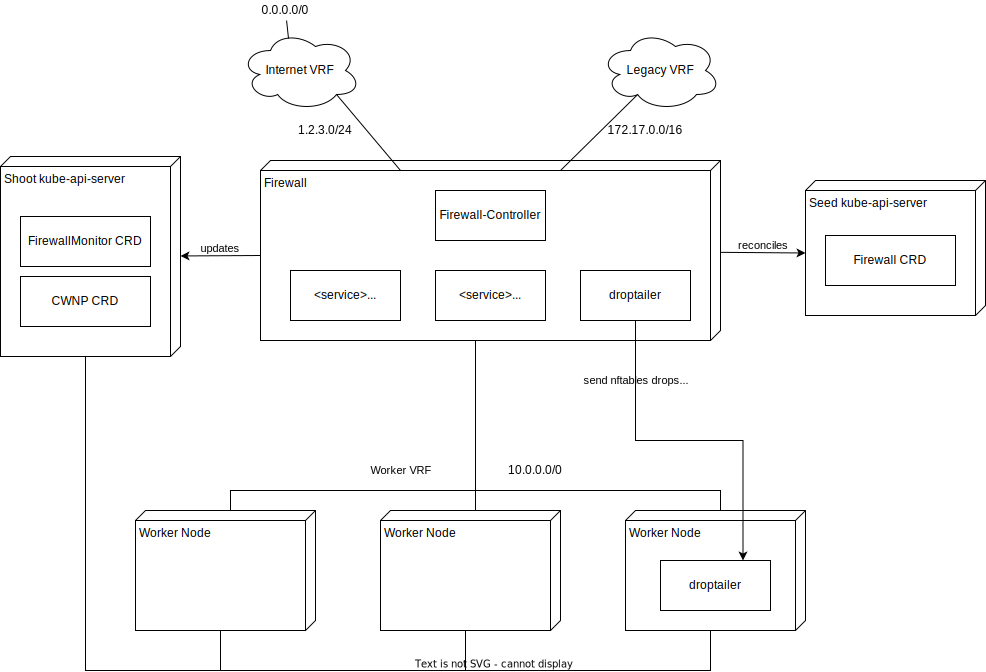

With metal-stack v0.13.0 we are undergoing big changes to our Gardener integration. In this release, we give birth to a new Kubernetes controller called [firewall-controller-manager](https://github.com/metal-stack/firewall-controller-manager) (FCM). The reasons behind the decision to implement a new controller and the features we added to it are presented in this blog article.

<!-- truncate -->

- [Reasoning Behind the New Controller](#reasoning-behind-the-new-controller)
  - [FCM Architecture](#fcm-architecture)
  - [Migration and Operations](#migration-and-operations)
- [New OS Images](#new-os-images)
- [Outlook](#outlook)
- [More Information](#more-information)

Check out the direct link to the release [here](https://github.com/metal-stack/releases/releases/tag/v0.13.0).

## Reasoning Behind the New Controller

There actually were a couple of reasons why we introduced the firewall-controller-manager.

The first problem is that we are currently blocked updating our Gardener integration with metal-stack. The supported version for Gardener at the time being is `v1.44`. The reason why we cannot move on quicker is that the [gardener-extension-provider-metal](https://github.com/metal-stack/gardener-extension-provider-metal) relies on certificate management utilities from the Gardener extensions library, which changed in Gardener `v1.45` in order to implement certificate rotation (you can check their umbrella issue from back then in [gardener#3292](https://github.com/gardener/gardener/issues/3292)).

With the new firewall-controller-manager we adapted to the new extensions library allowing us to also rotate certificates (even with the [firewall-controller](https://github.com/metal-stack/firewall-controller), which is running on the firewall and not directly part of the Kubernetes cluster).

The second reason for the FCM is coming from the architectural angle. In Gardener, there is a strong separation between the Kubernetes control plane components and the worker nodes. The control plane components reside in Gardener-managed Kubernetes cluster (seed cluster) and are managed by the provider. The end-user can only a retrieve an admin kubeconfig to the kube-apiserver deployed in the provider-operated seed cluster. This isolation makes a lot of sense to divide responsibilities of the operator and the end-user.

With the FCM, we follow this principle by providing two kubeconfigs to the firewall-controller (instead of only one as it was before). The firewall resources are now fully operated by the provider and reconciled with a seed client on the firewall-controller (permissions on the seed kubeconfig are very restricted and read-only). The user `ClusterwideNetworkPolicy`s are still read from the shoot cluster with a shoot client as before. This way, the user cannot manipulate or mess up his own firewall by setting up mutating webhooks on the firewall resource. Unnecessary information is now hidden from the end-user.

The third problem we tackle with the controller is the reduction of downtime for external network traffic during a firewall update. Before FCM, the gardener-extension-provider-metal managed the cluster's firewall lifecycle. The reconciliation algorithm had already grown quite complex but still left room for many improvements such as creating a new firewall before throwing away the old one. The advantage of this approach is that bad scenarios like a cluster being cut off from the internet for an uncertain amount because there are no more machines available for allocation can be prevented. The new controller comes with much more sophisticated reconciliation loops, which are easier to integration-test, more robust and support update strategies like `RollingUpdate` or `Recreate`.

So, all of these decisions lead us to the new controller. The next paragraph will go into details of the implementation of the FCM.

### FCM Architecture

The architecture of the FCM is pretty much inspired by Kubernetes `Deployment`s (including `ReplicasSet` and `Pod`) and the Gardener [machine-controller-manager](https://github.com/gardener/machine-controller-manager/). In analogy to these APIs, the FCM introduces the resources `FirewallDeployment`, `FirewallSet` and `Firewall`. The FCM also deploys a `FirewallMonitor` into the cluster of the end-user, mirroring important information of the state of the firewall into the shoot cluster.

Here is a brief drawing showing the essential parts of the architecture:



The following table is a summary over the [CRDs](https://kubernetes.io/docs/concepts/extend-kubernetes/api-extension/custom-resources/) introduced by the FCM:

| Custom Resource Object | Description                                                                                                                                                     |
| ---------------------- | --------------------------------------------------------------------------------------------------------------------------------------------------------------- |
| `FirewallDeployment`   | A `FirewallDeployment` contains the spec template of a `Firewall` resource similar to a `Deployment` and implements update strategies like rolling update.      |
| `FirewallSet`          | A `FirewallSet` is similar to `ReplicaSet`. It is typically owned by a `FirewallDeployment` and attempts to run the defined replica amount of the `Firewall`(s) |
| `Firewall`             | A `Firewall` is similar to a `Pod` and has a 1:1 relationship to a firewall in the metal-stack api.                                                             |
| `FirewallMonitor`      | Deployed into the cluster of the user (shoot cluster), which is useful for monitoring the firewall or user-triggered actions on the firewall.                   |

The `FirewallDeployment` reconciler manages the lifecycle of a `FirewallSet`. It syncs the `Firewall` template spec and if significant changes were made, it may trigger a `FirewallSet` roll. When choosing `RollingUpdate` as a deployment strategy, the deployment controller is waiting for the firewall-controller to connect before throwing away an old `FirewallSet`. The `Recreate` strategy maintains the old behavior of the gardener-extension-provider-metal to first release firewalls before creating a new one (can be useful for environments which ran out of available machines but you still want to update).

Here is an example of the `FirewallDeployment` resource:

```bash
# a user does not see these resources, they are located in the seed cluster
❯ kubectl get fwdeploy
NAME             REPLICAS   READY   PROGRESSING   UNHEALTHY   AGE
shoot-firewall   1          1       0             0           5d11h

❯ kubectl get fwdeploy shoot-firewall -o yaml | kubectl neat
apiVersion: firewall.metal-stack.io/v2
kind: FirewallDeployment
metadata:
  labels:
    gardener-shoot-namespace: shoot-namespace
  name: shoot-firewall
  namespace: shoot-namespace
spec:
  replicas: 1
  selector:
    cluster.metal-stack.io/id: 92724dd6-b809-44e3-b8a8-7a9fdadfd454
  strategy: RollingUpdate
  template:
    metadata:
      labels:
        cluster.metal-stack.io/id: 92724dd6-b809-44e3-b8a8-7a9fdadfd454
    spec:
      controllerURL: https://images.metal-stack.io/firewall-controller/v2.0.2/firewall-controller
      controllerVersion: v2.0.2
      image: firewall-ubuntu-2.0.20221025
      interval: 10s
      networks:
      - internet
      - a5aed141-5ae9-406b-88ef-e37c79b4098c
      partition: fra-equ01
      project: 4390d7f3-5392-4f77-be55-6905bde2c992
      size: n1-medium-x86
      sshPublicKeys:
      - ...
      userdata: '{"ignition": ...}'
status:
  conditions:
  - lastTransitionTime: "2023-03-29T21:09:25Z"
    lastUpdateTime: "2023-03-29T21:09:25Z"
    message: RBAC provisioned successfully.
    reason: Provisioned
    status: "True"
    type: RBACProvisioned
  - lastTransitionTime: "2023-03-29T21:11:10Z"
    lastUpdateTime: "2023-03-29T21:11:10Z"
    message: Deployment has minimum availability.
    reason: MinimumReplicasAvailable
    status: "True"
    type: Available
  - lastTransitionTime: "2023-03-29T21:09:25Z"
    lastUpdateTime: "2023-04-04T08:59:20Z"
    message: FirewallSet "shoot-firewall-fb357" has successfully progressed.
    reason: NewFirewallSetAvailable
    status: "True"
    type: Progressing
  observedRevision: 0
  progressingReplicas: 0
  readyReplicas: 1
  targetReplicas: 1
  unhealthyReplicas: 0
```

The `FirewallSet` controller scales `Firewall` objects according to the given number of replicas of the set (at the moment only `0` and `1` replicas is supported, but read on to the end of this article to see what we are striving for). It also checks the status of the owned `Firewall`s to derive the overall set status.

```bash
❯ kubectl get fwset
NAME                   REPLICAS   READY   PROGRESSING   UNHEALTHY   AGE
shoot-firewall-fb357   1          1       0             0           5d11h
```

Lastly, the `Firewall` controller creates and deletes the physical firewall machine from the spec at the metal-api. Every `Firewall` resource owns a single firewall at the metal-api.

```bash
❯ kubectl get fw
NAME                           PHASE     MACHINE ID                             LAST EVENT    AGE
shoot--example-firewall-fb520  Running   c410acf3e-3abb-4ed4-bbdb-764c305b3e4d  Phoned Home   5d12h
```

The `Firewall` resource holds pretty detailed status information on the owned firewall. With this information, the machinery can derive proper health attributes for the firewall lifecycle management.

```bash
kubectl get fw shoot--example-firewall-fb520 -o yaml
...
status:
  conditions:
  - lastTransitionTime: "2023-03-29T21:09:25Z"
    lastUpdateTime: "2023-03-29T21:09:25Z"
    message: Firewall "shoot--example-firewall-fb520" created successfully.
    reason: Created
    status: "True"
    type: Created
  - lastTransitionTime: "2023-03-29T21:11:08Z"
    lastUpdateTime: "2023-03-29T21:11:08Z"
    message: Firewall "shoot--example-firewall-fb520" is phoning home and alive.
    reason: Ready
    status: "True"
    type: Ready
  - lastTransitionTime: "2023-04-04T01:54:54Z"
    lastUpdateTime: "2023-04-04T01:54:54Z"
    message: Successfully deployed firewall-monitor.
    reason: Deployed
    status: "True"
    type: MonitorDeployed
  - lastTransitionTime: "2023-04-01T21:44:33Z"
    lastUpdateTime: "2023-04-04T09:11:51Z"
    message: Controller reconciled firewall at 2023-04-04 09:11:51 +0000 UTC.
    reason: Connected
    status: "True"
    type: Connected
  controllerStatus:
    actualVersion: v2.0.2
    lastRun: "2023-04-04T09:11:51Z"
  firewallNetworks:
  - asn: 4210000117
    destinationPrefixes:
    - 0.0.0.0/0
    ips:
    - <external-ip>
    nat: true
    networkID: internet
    networkType: external
    prefixes:
    - <internet-prefix>/24
    vrf: 104009
  - <...>
  machineStatus:
    allocationTimestamp: "2023-03-29T21:09:25Z"
    lastEvent:
      event: Phoned Home
      message: provisioned since 2023-03-29T21:10:05Z
      timestamp: "2023-03-29T21:10:59Z"
    liveliness: Alive
    machineID: c410acf3e-3abb-4ed4-bbdb-764c305b3e4d
  phase: Running
  shootAccess:
    apiServerURL: https://<shoot-api-server-endpoint>
    genericKubeconfigSecretName: generic-token-kubeconfig
    namespace: shoot--example
    sshKeySecretName: ssh-keypair-da4ceac1
    tokenSecretName: shoot-access-firewall-controller-manager
```

Inside the end-user cluster, the `Firewall` controller will deploy a `FirewallMonitor` reflecting relevant fields of the `Firewall` resource. The firewall-controller also puts network statistics into the `FirewallMonitor`.

```bash
❯ kubectl --context shoot-cluster get fwmon -n firewall
NAME                            MACHINE ID                             IMAGE                          SIZE            LAST EVENT    AGE
shoot--example-firewall-fb520   c410acf3e-3abb-4ed4-bbdb-764c305b3e4d  firewall-ubuntu-2.0.20221025   n1-medium-x86   Phoned Home   5d14h
```

Besides that, an end-user can use the `FirewallMonitor` to trigger tasks against the FCM, e.g. by annotating the resource a rolling update of the `FirewallSet` can be triggered:

```bash
❯ kubectl --context shoot-cluster annotate fwmon shoot--example-firewall-fb520 firewall.metal-stack.io/roll-set=true
```

The FCM also comes with a validating and defaulting webhook to make the controller safer and easier to use.

### Migration and Operations

Before installing metal-stack v0.13.0, operators are required to:

- Update the firewall-controller version on every cluster firewall to `v1.3.0`, otherwise the rolling update managed by the FCM does not work.
- Not use new OS images that already contain the firewall-controller `v2`, check out [metal-images releases](https://github.com/metal-stack/metal-images/releases) before adding new image versions to your landscape.

One of the biggest challenges introducing the FCM was the migration path. The migration works as follows:

- The gardener-extension-provider-metal does not manage existing firewall lifecycles anymore.
- If the gardener-extension-provider-metal finds firewalls in the metal-api that are not managed by the FCM, it deploys a migration `Firewall` resource.
- The FCM will find this firewall and take over the lifecycle management of this firewall.
- The gardener-extension-provider-metal then deploys a `FirewallDeployment` of which the selector matches migration firewalls, such that the deployment will adopt the migration firewalls if there are any.
- Existing firewall-controllers can still read the old `Firewall/v1` in the shoot cluster for reconciliation, which is still deployed by the gardener-extension-provider-metal.
- firewall-controller versions below `v2` are offered a migration kubeconfig, such that an update to a `v2` version can use this kubeconfig to communicate to the seed.

So, after setting up this version of metal-stack, operators should also update the firewall-controller versions in the landscape to `v2` and provide the latest OS images from metal-images in order to prepare for the next metal-stack releases where we will remove some of the migration logic over time.

## New OS Images

In this release we also announce the support of new OS images, namely:

- Debian 11
- Ubuntu 22.04
- Firewall 3

Thanks to [@majst01](https://github.com/majst01) and [@mwennrich](https://github.com/mwennrich) for all the hard work to test these images and resolve performance issues. 🤯

## Outlook

At the time being, it is not possible to have multiple firewalls in front of a metal-stack cluster because network traffic is load-balanced by BGP to the firewalls and due to SNAT for outgoing cluster traffic, response packages may arrive on a firewall which does not know where for forward it to.

To further reduce the amount of downtime for external network traffic during a firewall rolling update, we are planning to also orchestrate the lengths of `as-path`s on the firewall through another field in the `Firewall` spec called `Distance` ([firewall-controller-manager#24](https://github.com/metal-stack/firewall-controller-manager/pull/24)). This sets up firewall staging with minimal traffic interruption and prepares for the possibility of active/standby firewalling – getting rid off the last single point of failure in the network topology. The FCM already prepared for this and can already handle multiple firewall replicas in the deployment spec. As soon as the feature is implemented, we can lift the validation to allow more than a single replica in the deployment spec.

We are going to continuing to focus on catching up with the pace of the Gardener project. We are keen to pass on the latest features and most up-to-date versions to the metal-stack users. Our progress on the compatibility for Gardener `v1.45` is tracked in [gardener-extension-provider-metal#276](https://github.com/metal-stack/gardener-extension-provider-metal/issues/276).

## More Information

This is only a small extract of what went into our v0.13.0 release.

Please check out the [release notes](https://github.com/metal-stack/releases/releases/tag/v0.13.0) to find a full overview over every change that went part of this release.

As always, feel free to visit our Slack channel and ask if there are any questions. 😄
