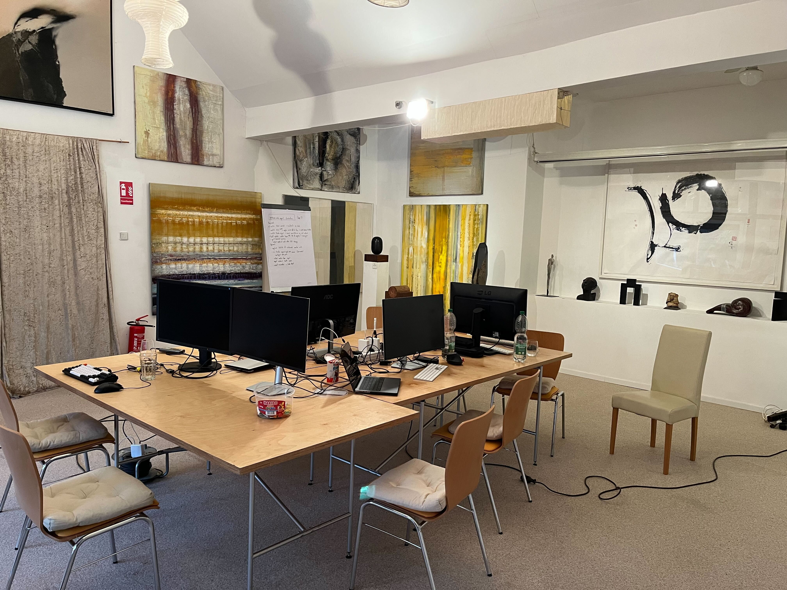
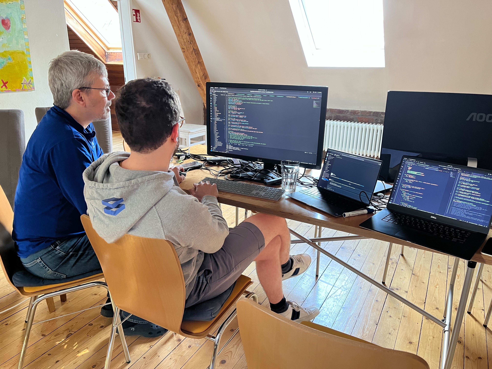
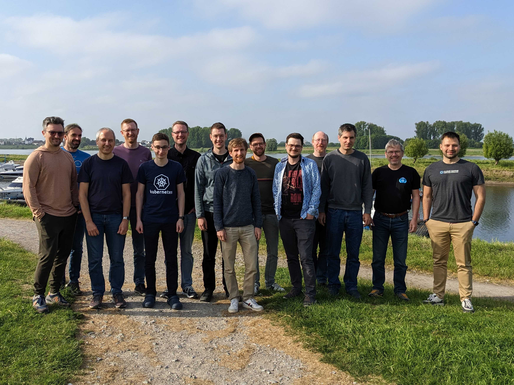

After the success of the two previous hackathons, [STACKIT](https://www.stackit.de/) invited the gardener community to Leverkusen for a week of hacking on Gardener. The attendees were from [SAP](https://sap.com), [STACKIT](https://www.stackit.de/), [23technologies](https://23technologies.cloud/), and the metal-stack team from [FI-TS](https://f-i-ts.de) and [x-cellent technologies](https://x-cellent.com).

<!-- truncate -->

We met at the [Open Sky House in Leverkusen](https://www.openskyhouse.org/en/) right beside the Rhine river.

## Topics

When many people and companies come together, many different experiences, visions, but also pain points come together. To make the best of the time, we brainstormed in a meeting a few weeks before the actual event to find the most interesting topics to work on.

We voted and ranked them. Once we met in Leverkusen, we built teams around the topics and started hacking.

### Introduction Of `gardener-node-agent`

The first topic we tackled was the introduction of the `gardener-node-agent` and is as old as the first hackathon. Currently there is the `cloud-config-downloader`. It runs on every node, sets up necessary configuration files, configures and starts system services like the `kubelet` and updates itself. It also polls to check for changes, reapplies the configuration and restarts the services. And it is written in bash. And it is generated by templates. It is just hard to maintain.

The goal was to introduce a brand new Go binary that is responsible for the same tasks. But in a more structured and maintainable way. It no longer polls for changes, but instead it watches for changes. It is written like any other Gardener controller. It is now capable to avoid restarts of services in case no changes in the configuration have occurred. This is particularly useful for services like the `kubelet` for which a service restart would result in a node becoming `NotReady` for a short period of time causing some side-effects which are better to be avoided. It also cleans up outdated config files and services, that are no longer needed.

Overall it should reduce traffic, improve scalability, the developer experience and the overall stability of the system running in production.

In case you are interested in a more detailed write up, [we got you covered](https://github.com/gardener-community/hackathon/blob/main/2023-05_Leverkusen/gardener-node-agent/readme.md).

### IPv6 On Cloud Provider

Another recurring topic is IPv6 support. In the [last Hackathon](https://metal-stack.io/blog/2022/10/hack-the-garden/) we already started to get IPv6 running on local Gardener clusters. This time we wanted to get it running on a cloud provider to future proof Gardener. We focused on an IPv6-only stack to not overlook any potential issues IPv4 in a dual stack might hide.

The cloud providers' IPv6 support vastly differs, but none being perfect.
In the end we got a shoot cluster running on a GCP dev box! Although it required many manual steps, these guide us to the next steps to automate the process. A more in depth-overview can be found [here](https://github.com/gardener-community/hackathon/tree/main/2023-05_Leverkusen#-ipv6-on-cloud-provider).

### Bootstrapping "Masterful Clusters" aka "Autonomous Shoots"

When setting up Gardener an initial Kubernetes cluster is strictly required. This "initial cluster" has to come from somewhere and usually it comes from a hyperscaler. This specific cluster has a completely different management lifecycle as compared to all the other clusters that will from then on be provisioned by Gardener. Gardener tries to aim for the same experience for all clusters - no matter on which provider they are actually running on. But this promise excludes the Garden cluster, because it is running on a foreign infrastructure. And the goal of this task is to find a way to get rid of that difference and third party dependency.

The developed strategy is to create the initial seed cluster as is. As usually a shoot will be created. Then, the initial seed cluster will be removed and migrated in to the shoot cluster. But as there is no other seed to help it come up, all of its core services need to be moved into the static pods, which will always be running on the node. Within the week, we were able to spin up a few services as static pods.

Deeper information is available [here](https://github.com/gardener-community/hackathon/tree/main/2023-05_Leverkusen/masterful-shoot).

### Garden Cluster Access For Extensions In Seed Clusters

Extensions running in seed clusters cannot directly access the garden cluster. Though some use cases need access. Thus, some extension implementations already access the garden cluster by re-using the `kubeconfig` of the `gardenlet`. This is certainly problematic as it is not possible to audit controller operations when controllers are stealing the gardenlet's identity.

Thanks to the hackathon, there will be a dedicated token secret that allows access to the garden cluster. As this topic introduces a new contract it is [open for discussion](https://github.com/gardener-community/hackathon/tree/main/2023-05_Leverkusen#-garden-cluster-access-for-extensions-in-seed-clusters).

### Moving `machine-controller-manager` Deployment Responsibility To `gardenlet`

Currently the `machine-controller-manager` is deployed by provider extensions. But in practice it is always configured the same way, thus wasting resources and making it harder to maintain. Only its sidecar controller which is responsible to provide the cloud provider API is different.

Now the `gardenlet` includes the generic parts of the `machine-controller-manager`. The provider extensions only need to provide their sidecar controller using a webhook. This reduces the amount of resources needed and makes it easier to maintain. Now it will automatically be updated once the `gardenlet` gets deployed.

If you are interested for the next steps until this change hits production, have a [look at this summary](https://github.com/gardener-community/hackathon/tree/main/2023-05_Leverkusen#-moving-machine-controller-manager-deployment-responsibility-to-gardenlet).

### Fast Tracks

Beside the big topics above, there were smaller ones for teams, that finished earlier than expected. Of course we couldn't address all fast tracks, but we got an impressive amount of them done.

- [Replacement Of `ShootStates` With Data In Backup Buckets](https://github.com/gardener-community/hackathon/tree/main/2023-05_Leverkusen#-replacement-of-shootstates-with-data-in-backup-buckets) by introducing new resources
- [Introducing `InternalSecret` Resource In Gardener API](https://github.com/gardener-community/hackathon/tree/main/2023-05_Leverkusen#-introducing-internalsecret-resource-in-gardener-api) to separate Gardener from user secrets
- [Improved E2E Test Accuracy For Local Control Plane Migration](https://github.com/gardener-community/hackathon/tree/main/2023-05_Leverkusen#-improved-e2e-test-accuracy-for-local-control-plane-migration) by adapting worker migration in `provider-local`
- [Moving `apiserver-proxy-pod-mutator` Webhook Into `gardener-resource-manager`](https://github.com/gardener-community/hackathon/tree/main/2023-05_Leverkusen#%EF%B8%8F-moving-apiserver-proxy-pod-mutator-webhook-into-gardener-resource-manager) away from the `kube-apiserver`
- [ETCD Encryption For Custom Resources](https://github.com/gardener-community/hackathon/tree/main/2023-05_Leverkusen#%EF%B8%8F-etcd-encryption-for-custom-resources) in first preparations of the `Shoot` and `Garden` APIs

## Conclusion

Although we split up into smaller teams for each topic, we regularly met to share our progress and findings or to chat. In the evenings we had some drinks and played some games together.

If you want to dig deeper into one of the above topics, have a look on the [Gardener Community Hackathon](https://github.com/gardener-community/hackathon/blob/main/2023-05_Leverkusen/README.md) repository. We also included summaries of the past two hackathon there, too! And if you want to see some demos, have a look at the [community meeting recording](https://sap-my.sharepoint.com/:v:/p/rafael_franzke/Eb4L8MjN7IdGoep2r6OSDA0BrpiLq4ot_cex59hOBecmdQ?e=FDZT8k).

It was incredible to see that many productive teams, sitting next to each other and working together, mostly for the first time, and across organizational boundaries contribting to the same overarching goal. Let's get everything clean and merged. Psst, we are already looking forward to the next hackathon!
