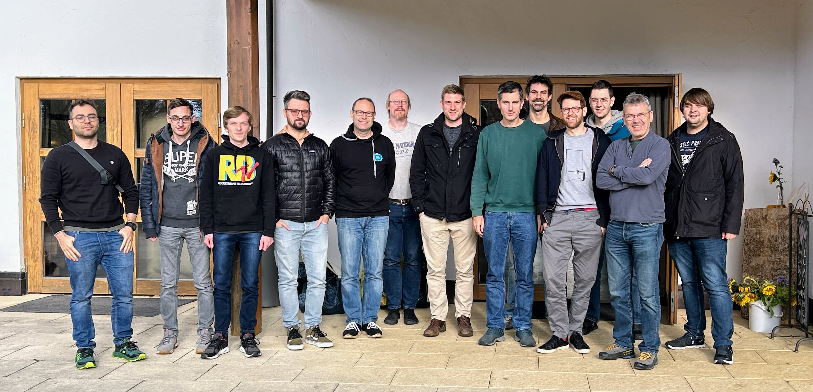

It has already become a regular event to come together every six months to hack and improve the Gardener Project.
This time it was the fourth time this _Hack the Garden_ event took place. Everybody who was participating one of the previous events was keen to join the next.

<!-- truncate -->

This time attendees from four different companies joined. Obviously, the Gardener core and onmetal team from [SAP](https://sap.com), but also from [STACKIT](https://stackit.de), [FI-TS](https://f-i-ts.de) and [x-cellent technologies GmbH](https://www.x-cellent.com).

The event took place in the heart of the _Swabian Alb_ nearby Schelklingen at [Schlosshof](https://schlosshof-info.de).

## Preparation

Before we come together for the _Hack the Garden_ event, we collect all the ideas which might be worth hacking on from the attendees. After that everyone votes for 3 topics he is interested in. The voting result are a good starting point. We also try to have people from different companies taking care of each topic to ensure the mixed knowledge will bring the best ideas.

The following sections contain a brief summary of the topics that we were working on. A fully detailed summary can be found in the [Gardener Community Hackathon Repo](https://github.com/gardener-community/hackathon/tree/main/2023-11_Schelklingen).

## Topics

### Generic Extension For Shoot Cluster Audit Logs

Audit logs of shoot clusters need to be managed outside of Gardener (no built-in/out-of-the-box solution available). Every community member has developed their own closed-source implementations of an audit log extension.

A new design has been proposed for reworking the existing implementation (contributed by x-cellent) to be more reliable and reusable: A new StatefulSet is added to the shoot control plane that can receive the API server's audit logs via an audit webhook. The webhook backend's logs can be collected via fluent-bit and transported to a desired sink from there. The backend basically acts as an audit log buffer. The first steps for implementing the new design were finished and collecting the audit logs in the buffer works.

Code: [Gardener Extension Audit](https://github.com/metal-stack/gardener-extension-audit)

### Stop Vendoring Third-Party Code In vendor Folder

The vendor folder in the root of Go modules contains a copy of all third-party code the module depends on. This blows up the repository and source code releases, makes reviewing pull requests harder because many different files are changed, and creates merge conflicts for many files when both master and a PR change dependencies. Committing the vendor folder to version control systems is discouraged with newer versions of Golang.

This is already merged into the `master` branch of Gardener.

### Make ACL Extension Production-Ready

The ACL extension for restricting shoot cluster API server access via IP allow-lists only had support for the OpenStack infrastructure and single istio-ingressgateways (i.e., it did neither support HA control planes nor the ExposureClass feature of Gardener).

Code: [Gardener Extension ACL](https://github.com/stackitcloud/gardener-extension-acl)

### Discussion: Air-Gapped Shoot Clusters

Customers are interested in limiting internet access for shoot clusters. Today, the clusters need access to the internet by default for bootstrapping nodes, pulling images from the container registry, resolving DNS names, etc.

Ideas and the underlying problems were discussed. The conclusion is that it would be possible to achieve restricting internet access by hosting a container registry with the required images, and by either running the seed cluster in a restricted environment or by explicitly allow-listing the access to the seed networks. Overall, the concrete goals of the interested customers are not perfectly clear yet.

## Conclusion

It is getting a tradition to celebrate this _Hack the Garden_ event, which everyone enjoys and benefits from. I am sure we will continue this for the foreseeable future, maybe even twice a year as before. We are all sure that the amount of progress and good ideas is not possible for one party alone. It is collaboration in its purest form and best sense. This is also why the idea of _Open Source_ works, and we all are strong believers in this form of software development.
