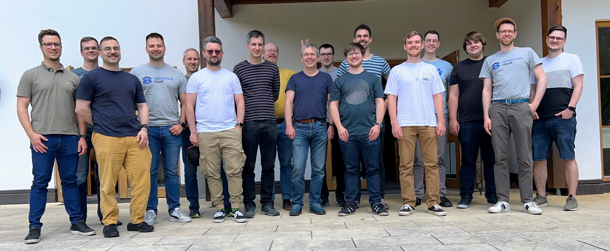

It was the fifth time that people from different companies came together to hack and improve the Gardener project.
With 17 participants, it was the biggest event yet.
Companies involved, besides the Gardener core team from [SAP](https://sap.com), [STACKIT](https://stackit.de), [FI-TS](https://f-i-ts.de), [x-cellent technologies GmbH](https://www.x-cellent.com) and [inovex](https://www.inovex.de/).

<!-- truncate -->

As last time, the event took place at [Schlosshof](https://schlosshof-info.de) nearby Schelklingen.

## Preparation

Before we come together for the _Hack the Garden_ event, we collect all the ideas which might be worth hacking on from the attendees. After that everyone votes for 3 topics he is interested in. The voting result are a good starting point. We also try to have people from different companies taking care of each topic to ensure the mixed knowledge will bring the best ideas.

The following sections contain a brief summary of the topics that we were working on. A fully detailed summary including all topics can be found in the [Gardener Community Hackathon Repo](https://github.com/gardener-community/hackathon/tree/main/2024-05_Schelklingen).

## Topics

### Tailscale VPN Access to the Kubernetes API Server

A Shoot cluster created by Gardener can be secured with a [Gardener ACL Extension](https://github.com/stackitcloud/gardener-extension-acl) to restrict who can access the Kubernetes API Server by specifying an access control list which restricts the allowed Source IPs. This is fine for a lot of use cases. Though in some scenarios like working from home this does not work.

Here comes [Tailscale VPN](https://tailscale.com) in handy. This is a very simple to use VPN, which is based on [Wireguard](https://wireguard.com). Tailscale already offers an Operator for Kubernetes which simplifies the setup for Kubernetes a lot.

With this, it was not necessary to implement something for Gardener to make this work, writing a How-To-Guide was enough.

And it has already been published: [Tailscale for Kubernetes API Server](https://gardener.cloud/docs/guides/administer-shoots/tailscale/)

### VPN2

[VPN2](https://github.com/gardener/vpn2) is a critical component which enables the Kubernetes API Server in the control plane to talk to Pods and Services in the Shoot. This is done via an OpenVPN Server on the control plane side and an OpenVPN client on the Shoot. The logic to setup this VPN is mostly written in bash.

During the Hackathon several topics regarding VPN2 have been addressed:

- Rewrite of the whole setup logic in go [PR84](https://github.com/gardener/vpn2/pull/84)
- Use of IPv6 only as transfernetwork [PR83](https://github.com/gardener/vpn2/pull/83)

### Node Agent

The node-agent replaced the former logic written in bash which is responsible to bootstrap and further manage the worker node since the last Gardener Hackathon.
As it is now a controller-runtime based operator, a lot of further improvements are possible.

One of the topics on the wishlist for the node-agent was to make its configuration more type safe. Up to now, the configuration is based on files and systemd units. This is problematic for configurtations files where multiple parties want to ship modifications, e.g. the `containerd.toml` which requires modifications when a different container runtime should be used, a GPU is in the worker node or a Registry Mirror should be used.

To make such modifications possible without destroying the configuration of another requirement, a type safe configuration for the node-agent was introduced and some extensions where already converted to take advantage of this new feature.

[Branch](https://github.com/metal-stack/gardener/tree/enh.osc-api)

### Garden Local Setup

The garden local setup is critical for development, as it allows developers of gardener to run a whole setup with seed and shoot in a kind cluster on the laptop.
Since a few month, development of the gardener operator is ongoing. The gardener operator will simplify the installation of the garden cluster dramatically.
The gardener operator was not configured in the garden local setup to spin up the initial gardener components. During the hackathon this was achieved.

[PR](https://github.com/gardener/gardener/pull/9763)

## Conclusion

This was the second **Hack the Garden** Hackathon celebrated at the same location [Schlosshof](https://schlosshof-info.de), we all tend to keep this as our go-to location for the next ones.
