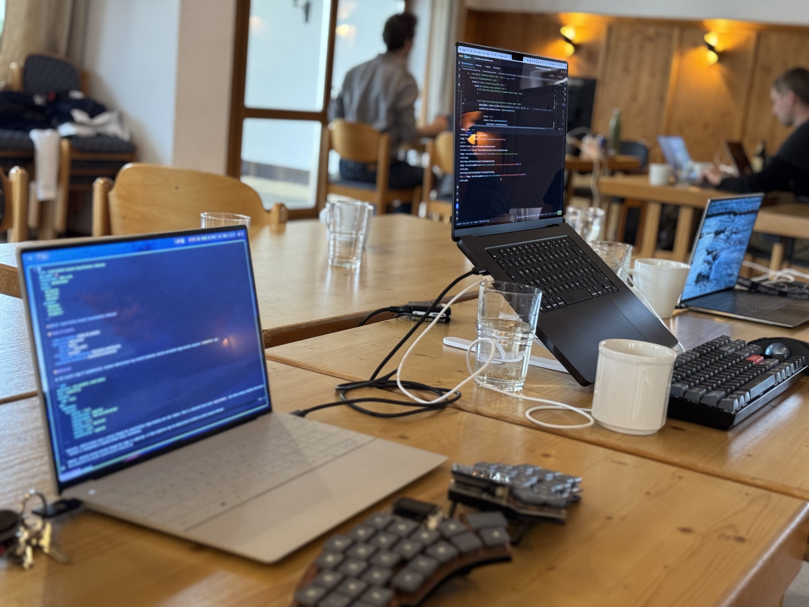
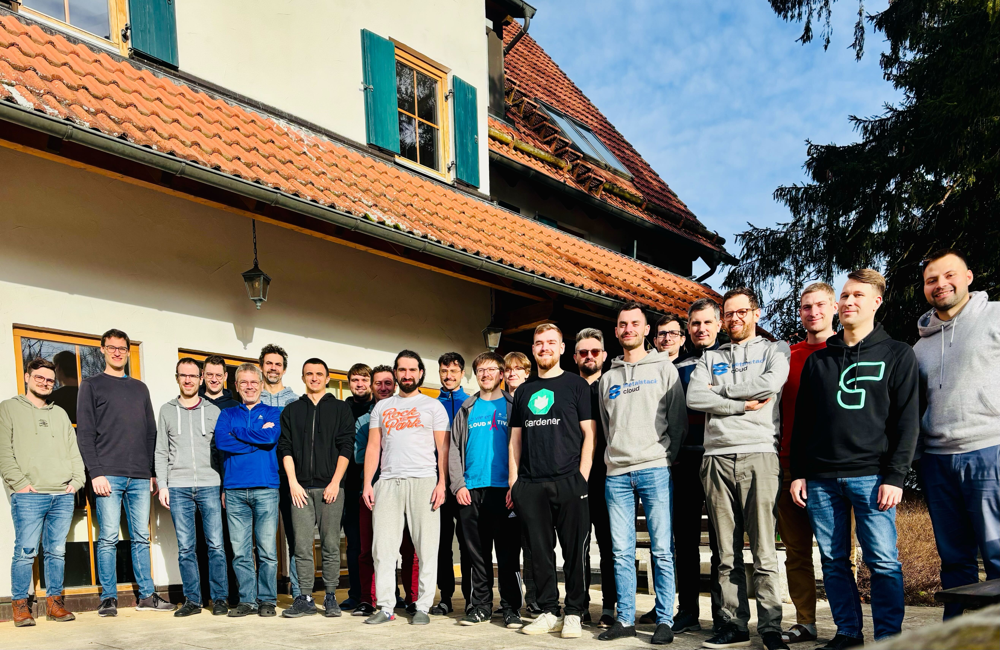

At the beginning of December we came together and started the 6th Hack the Garden event. With 22 participants from Germany and Bulgaria, this hackathon set a new record. Participating were [SAP](https://sap.com), [STACKIT](https://stackit.de), [x-cellent technologies GmbH](https://www.x-cellent.com) and [inovex](https://www.inovex.de/).

<!-- truncate -->

For the third time in a row, we visited the [Schlosshof](https://schlosshof-info.de) in Schelklingen, Germany, because the location and the space fit so well.

  

## Topics

An event of this magnitude cannot begin without proper preparation. One of the biggest keys to success is knowing the topics and who will work on them.
So, as in previous events, we collected all the ideas in advance, voted on interesting topics, and said what everyone would like to work on.
That way, we were able to form teams before the event started. As always, the teams came from different companies to benefit from a wider range of experience.

As the hackathon progressed, the list of topics grew considerably. This time a whopping 23 topics were covered! A complete list with an overview of each topic can be found at [gardener-community/hackathon](https://github.com/gardener-community/hackathon/tree/main/2024-12_Schelklingen).

  

### IPv6 Support

A Gardener hackathon is no hackathon if IPv6 support is not a topic. This time this was no different.
Here we tested Gardener's DualStack compatibility against antother IaaS. After all the previous hackathons working on this topic, we finally found no bug in Gardener itself and new shoots could be reconciled to 100%!

Next time Gardener with metal-stack and DualStack is on the list. Stay tuned!

### Version Classification Lifecycle in Cloud Profiles

In Gardener versions of Kubernetes and machine images can be declared using a `CloudProfile`. Versions can be classified as `preview`, `supported` and `deprecated`. Automatic updates are only considered for `supported` versions. Once the administrators decide to promote a given version to the next stage of its lifecycle, a new deployment is required. The only exception is marking a version as expired.

With the changes proposed in [GEP-32](https://github.com/gardener/gardener/pull/10982) it is now possible to plan the entire classification lifecycle of a version without manual interaction based on date. Of course it is still possible to change the planned lifecycle later.
A corresponding reference implementation has also been created.

### Gardener SLIs: Shoot Cluster Creation and Deletion Times

Do you know how long your shoots take to prepare or how much time they spend in deletion? Have you observed how this has changed over time and have you introduced regression? Which phase should be improved first? These questions and many more can now be answered with new metrics.

The goal is to improve productivity and overall quality. Here, a new Prometheus instance has been deployed in the Prow cluster and dashboards for the new metrics provide nice insights.

## Conclusion

  

This hackathon was incredibly productive, we were able to tackle many challenges and connect with each other!
If you want to dig deeper into all these topics, have a look on the [Gardener Community Hackathon](https://github.com/gardener-community/hackathon/tree/main/2024-12_Schelklingen) repository.
We are already looking forward to the next **Hack the Garden**!
