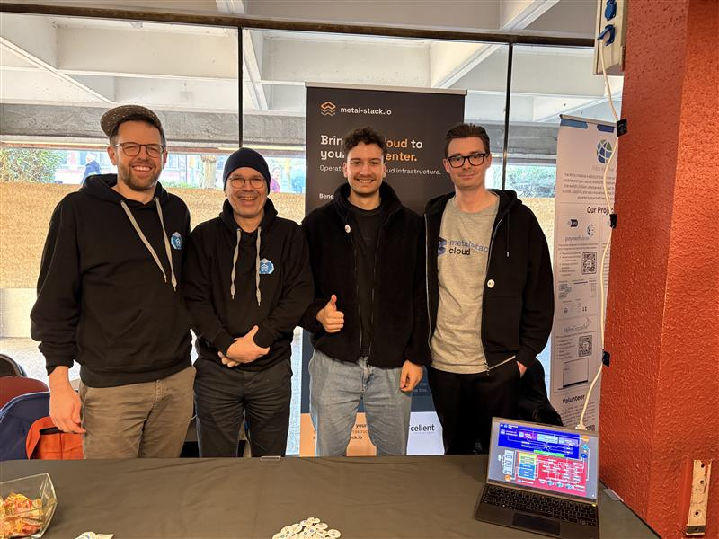

Without high expectations, we submitted an application to [FOSDEM](https://fosdem.org/) at the end of last year. So we were very excited when we heard that metal-stack had been accepted with a stand and a presentation at FOSDEM 2025. It was a sign for us. It proved to us that there is a demand for solutions that provide highly scalable infrastructure in on-premises data centers.

<!-- truncate -->

FOSDEM is an open source conference held in the heart of Europe in Brussels, Belgium. It is one of the largest, if not the largest, open source software conference in the world. As a visitor we have been there in the past and enjoyed the high amount of technical talks and the diversity of the conference. In fact, it is a melting pot of people from all kinds of areas - from project maintainers to decision makers, from eminent authorities to hobbyists, from computer enthusiasts to the press.

All in all, we are very grateful for the opportunity to present our project to a wider audience. We have never met so many new faces and people to talk to about this project in such a short time. It was great to be able to talk about the software and the ideas and concepts that we have come up with with metal-stack - to exchange thoughts with others, get new inspiration and identify potential partners for future collaborations.

You can find our talk [here](https://fosdem.org/2025/schedule/event/fosdem-2025-4665-on-prem-kubernetes-at-scale-with-metal-stack-io/). At the time of writing the video has not become publicly available yet, but we are sure it will be available soon.

In the meantime, we would like to thank everyone who came and showed interest. And of course a big thank you to the organizers of FOSDEM, the Virtualization and Cloud Infrastructure Dev Room, for their trust. We had a great time and hope to stay in touch with all of you! See you soon!

