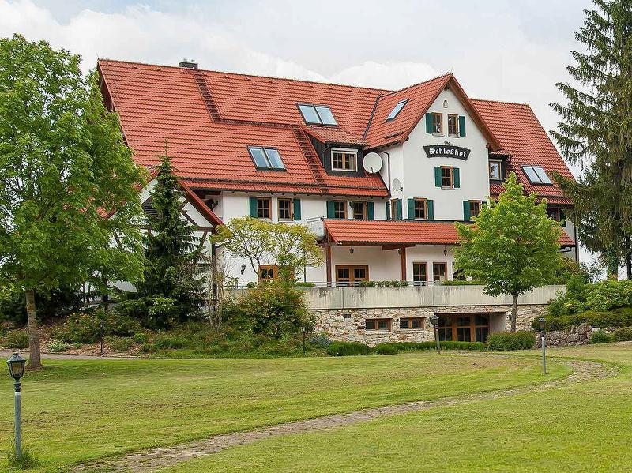
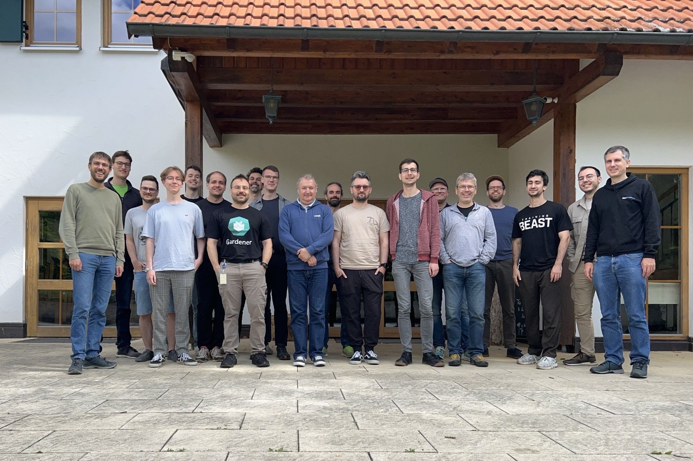

At the start of June 2025, the Gardener community met again for the 7th Gardener Hackathon. By now it's a tradition that brings together multiple companies, minds and topics for a week of coding, documentation and community building. This time, the event took place in Schelklingen, Germany, from June 2nd to 6th, and it was a week filled with innovation, collaboration, and a shared passion for enhancing the Gardener ecosystem.

<!-- truncate -->

As the previous three times, we doubled down to choose the [Schlosshof](https://schlosshof-info.de) in Schelklingen, Germany, as our location as it served us well in the past.

## Topics

Coordinating a sprint of a new team for one week is no easy task and needed to be prepared beforehand. We collected all possible topic ideas, prioritized by votes. Thereafter everyone commented below their favorite topics where they'd like to participate.
Before the event started everybody knew their track and we mixed the teams up to ensure a diverse range of skills and perspectives.

What made this hackathon's topics special was the inclusion of frontend developers, which broadened the scope of tracks and allowed for significant improvements in user interfaces and user experience of the Gardener Dashboard and the documentation website itself.

### Documentation Revamp

While Gardener is well documented, finding the right information can be challenging. This is what this track is all about. For one the glossary was updated to reflect the latest changes and technologies.

But more importantly metadata was attached to every single documentation page. This drastically improves the search results.

As a result the documentation should be much more welcoming for new users and for more experienced users alike.

In addition to that, the team made a proposal for exchanging the existing docs framework with [vitepress](https://vitepress.dev/). The result looks very promising and even simplifies the developer experience significantly. Maybe we'll gonna see a new Gardener docs website soon?

### Dashboard Usability Improvements

What do the users of Gardener actually see? In many cases it's mostly the Gardener Dashboard. Currently all options are displayed and can be edited - regardless if they would break the cluster or not.

To mitigate this, the project administrators are now able to define defaults and even hide UI elements within the form to prevent users from unintended or overly complex configurations.

### L7 Load Balancing for `kube-apiserver`

In the [previous hackathon](/blog/2024/12/hack-the-garden) proper load balancing of the Gardener kube-apiservers was implemented for external traffic. Though the internal traffic is still not load balanced leading to bad distributions of requests and potentially overloading a single kube-apiserver. The resulting throttling cannot be solved by simply scaling things up.

Instead the internal traffic will now be load balanced, too. This is achieved by routing the internal traffic through the Istio Gateway and thereby treating the internal traffic similar to the external traffic.

### Single-Node Ready Gardener Operator

Gardener is configured and deployed with high availability in mind. Though in some bootstrapping bare-metal scenarios a reduced amount of nodes are available.
When running only on one node multiple replicas of some components impossible or simply overkill.

In this track lots of small adjustments and tests were made to ensure supporting this scenario as well.

## Community and Collaboration

This time 19 contributors from [x-cellent technologies](https://www.x-cellent.com), [SAP](https://sap.com) and [noris network](https://www.noris.de) joined. Most from Germany, but some from Bulgaria. In general we were younger and welcomed more first-timers.  What sets this event apart is the way it elevates collaboration across company boundaries, leading to a rich exchange of ideas and perspectives.

During breaks and evenings, we had the opportunity to cook, relax and bond over good food and drinks. The relaxed atmosphere fostered open discussions, idea exchanges, and a sense of camaraderie among participants. Quite a few kilometers were walked and jogged, multiple Volleyball matches played and many table tennis balls were hit.

# Conclusion

A huge thanks to all contributors: you were awesome. If you are keen to dig deeper into the full list of topics and pull requests, check out the [gardener-community/hackathon](https://github.com/gardener-community/hackathon/tree/main/2025-06_Schelklingen) writeup or [watch the demos](https://youtu.be/TCLXovw43HA) from the review meeting.

And we are to proud to be able to announce the next Hackathon in early December 2025. If you'd like to join, head over the [Gardener Slack](https://join.slack.com/t/gardener-cloud/shared_invite/zt-33c9daems-3oOorhnqOSnldZPWqGmIBw).
Happy to meet you there!
