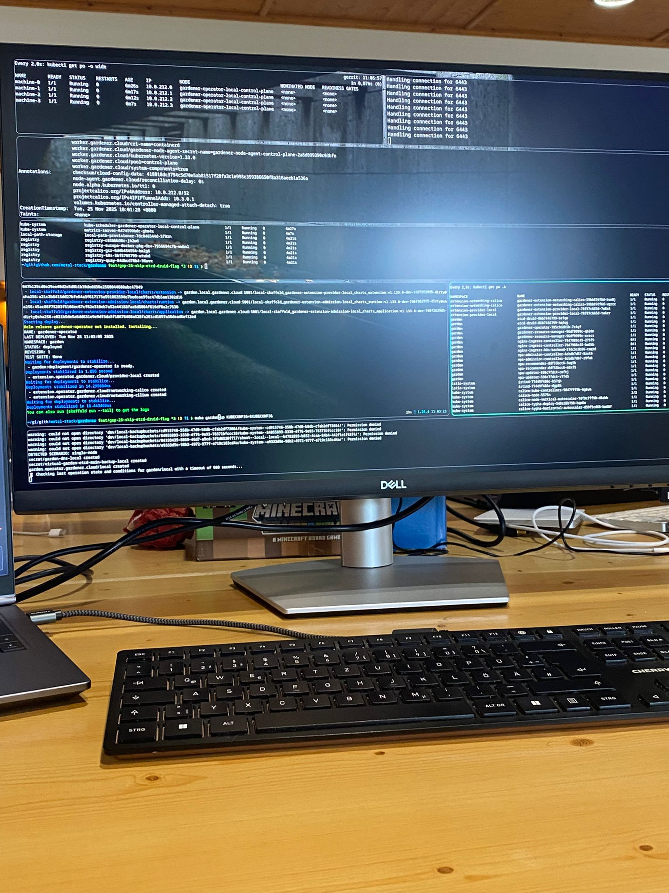

This winter's Hack the Garden ended up being our biggest gathering yet. Twenty-seven contributors squeezed into our temporary headquarters, making it the most crowded (and productive) hackathon we have ever organized. That headcount translated directly into output: we closed long-standing issues, revived ambitious ideas, and compared notes late into the night. If you are looking for the complete list of tracks, check out the official [Gardener Hackathon recap](https://gardener.cloud/community/hackathons/2025-11/), but here are my highlights.

## Venue and Mood Snapshot

The house was filled to the brim with 27 engineers from different companies and backgrounds—almost twice as many as the early days of the hackathon. That energy was palpable from breakfast to the late-night laptop sessions. We still followed the “everyone cooks, everyone cleans” rule, but this time the kitchen was more of a welcome distraction than another meeting room. Getting a break from terminals while chopping vegetables together was honestly one of my favorite parts of the week.

|  |  |
| --- | --- |

## Track Overview

With so many people on-site we divided into multiple tracks. The recap page lists everything, but a few threads stood out to me.

### Autonomous Control Plane and gardenadm

I'm knee-deep in [MEP-18](https://docs.metal-stack.io/stable/contributing/04-Proposals/MEP18/README/) at the moment, so I gravitated toward the `gardenadm` workstream even though it wasn't the main hackathon theme. The Gardener team pushed the tool to roughly 95% completion, ironing out installation flows and HA concerns so that bootstrapping an autonomous Gardener control plane finally feels repeatable. A handful of annoyingly small bugs are still blocking day-to-day usage, yet the remaining work is well understood and in flight.

### Networking Modernization

Around the middle of the week we mapped the migration path from legacy Ingress definitions to the Gateway API. Having everyone around in person helped us compare production experiences and validate the analysis with folks maintaining multi-cluster setups. The outcome is a clear plan for introducing the Gateway API gradually without shocking existing landscapes, plus a backlog of prototype PRs that we can continue remotely.

### Reliability & Scale Testing

Another team stress-tested Gardener to understand how many seeds and shoots a realistic deployment can host before hitting bottlenecks. These scale-out experiments surfaced valuable data for capacity planning and gave us confidence about the limits before we need to add more control planes or tune etcd. It's one thing to assume Gardener will grow with our needs; it's much better to measure it together.

## Community Takeaways

Personally, I learned a ton by pairing with people I usually only see in issue trackers. The cross-company collaboration was excellent—everyone brought their perspective, whether they were touching networking, control planes, or documentation. Watching first-timers blend in so quickly, and seeing how much the event has grown compared to previous years, makes me even more excited for the next one.

## Call to Action

If this sounds like a week you would enjoy, join the Gardener Slack, follow the hackathon announcements, and bring your ideas next time. The momentum is real—each event gets bigger, kinder, and more impactful, and we would love to build the next chapter with you.
