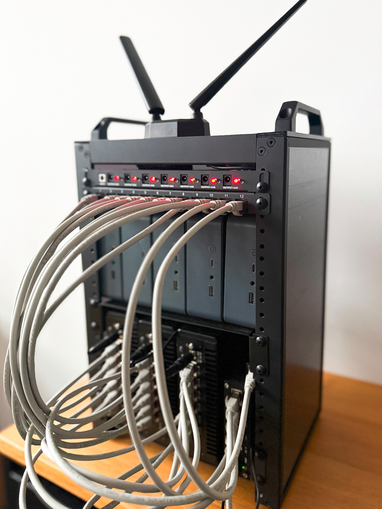

During my time as working student at [Finanz Informatik Technologie Service (FI-TS)](https://www.f-i-ts.de/), I ended up at the team operating the Finance Cloud Native. That is a Kubernetes-platform with around 1700 Machines and over 100 clusters for our customers in the financial industry in Germany, which is based on a metal-stack/Gardener setup. Actually it is the reason why the development of metal-stack was initially started. As I immediately got hooked by this sovereign cloud, I wanted to write my bachelor thesis about it in order to learn more about the underlying concepts of the architecture.

And luckily there was the perfect opportunity, as we now start to migrate our control-plane from the public-cloud to our own data-center. In the last 5-6 months I analyzed the concepts on autonomous control-planes presented in [MEP-18](https://metal-stack.io/docs/v0.22.2/MEP-18-autonomous-control-plane), built up a minimal prototype of it in a mini-rack and even did some failure scenarios to test my theories. So in this article I want to provide you some details on the hard- and software we used to build the mini-rack and the results I found in my thesis.

But first of all I need to say a big "Thank you!" to the whole team at FI-TS for supporting me during this journey, especially to [@honigeintopf](https://github.com/Honigeintopf), who helped me a lot building up the mini-rack, and to my supervisor at [Hochschule München](https://hm.edu/) for accepting the thesis and giving scientific advice on how to write it.

## As always: bare metal

At first we had to find some hardware, which is physically small enough to fit into our 10-inch-rack but at the same time functional enough to host a complete metal-stack/Gardener-Setup including the Control-Planes and a Partition with Shoot-Clusters. 
Inspired by [Jeff Geerlings mini-rack guide](https://github.com/geerlingguy/mini-rack) we bought the following devices:
- GeeekPi / DeskPi RackMate T1
- 1x Teltonika RUTX10 - Wireless Router 4-Port-Switch
- 3x CWWK Mini PC N150 (Upgraded N100) Firewall Appliance
- 5x Beelink EQR6 Mini PC
- GL.iNet KVM Remote Control via the Internet
- AIMOS HDMI KVM Switch, 8 In 1 Out 

The router is used to provide internet access for the whole rack through Wifi and is also our endpoint for tailscale to access the rack from remote. With the CWWKs having six ethernet ports we can use them to simulate the CLOS-architecture of the switches. So we had one spine-switch connected to the router and each of the leaf-switches. The leaf-switches are linked with four of the Beelinks, which are the machines managed by metal-stack. The remaining Beelink is used for an initial k3s-cluster, that is hosting the control-planes of metal-stack and Gardener. The KVM devices are used to remotely access the console of the machines.

## Deploying the stack

Next we brought the system to life by deploying our software on it. The initial k3s-cluster could be easily started with the Ansible roles provided by the k3s-project. For the control-planes we were able to re-use the mini-lab playbooks.

The biggest challenge was to set up the whole network infrastructure. As the metal-core running on the leaf-switches is dependent on the SONiC operating system, we had to somehow get SONiC on those CWWK machines. We solved this problem by installing a virtual machine and mapping all of the physical ports into that VM.

As we do not have a dedicated management network and servers, we also had to dually attach the leaves to the spine and the spine to the router: one cable for the management-address provided by a dhcp-server and one cable for the BGP-network. On top of that underlay BGP we have the standard overlay routing with Vxlan and VRFs.

The machines and switches could then reach the control-planes and communicate with it using self-signed certificates. For the PXE-Booting process of the machines we had to install another dhcp-server and the pixiecore on one of the leaves. As the machines do not have a BMC we weren't able to do the lifecycle management with metal-stack, but luckily they have a nice little Power-Button on the front and can be PXE-booted again.

The four machines were used to install two shoot-clusters with Gardener, each with one firewall and one worker-node. The DNS-entries of the clusters are provided by PowerDNS. As described in the "Matryoshka principle" in MEP-18 we then installed another metal-stack- and Gardener-Control-Plane in these two clusters. In a real setup these two would be used to manage the productive partition and clusters, which we do not have in the mini-rack.

## Everything failed ...

With that the first question of my thesis was answered: Building an autonomous control-plane the way it is described in MEP-18 is a very good solution for our bootstrapping-problem regarding automation and low complexity for the operators. But the second question is still open: What consequences do specific failure scenarios have and how can we return back to normal operation? That's why I did three different failure scenarios on the mini-rack. First I deleted only the k3s-cluster, then only the worker-nodes of the shoots and lastly all five Beelinks at once.

The short-term consequences of the outage were just as expected. When the k3s-cluster fails, there is no direct impact on the productive control-planes.
But the automatic restore-process with the backup-restore-mechanisms of metal-stack and Gardener made some trouble. Because sometimes there was made a new backup instead of restoring an old one. In these case it is important that you have more than just one backup version in your S3-Storage to restore it manually. 

And of course this S3-Storage must still be placed on external infrastructure in the public cloud since we do not want to have the backup in the same data-center as the running control-plane. And also we do not have S3-Storage outside of the Finance Cloud Native. So the backup itself would be dependent on the control-planes, if we placed it there. 