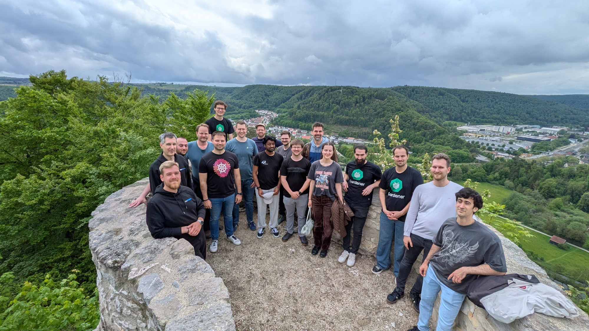
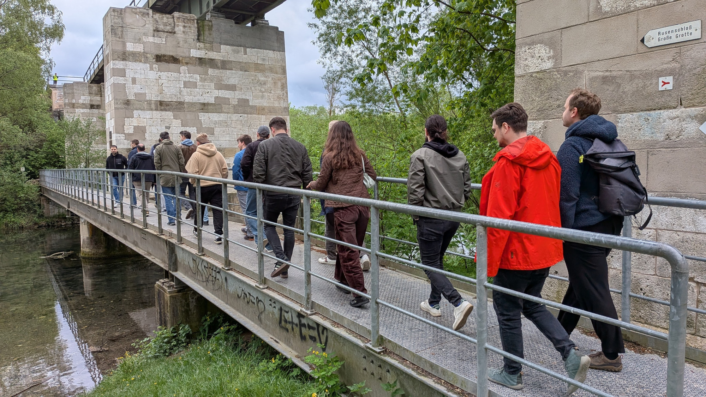
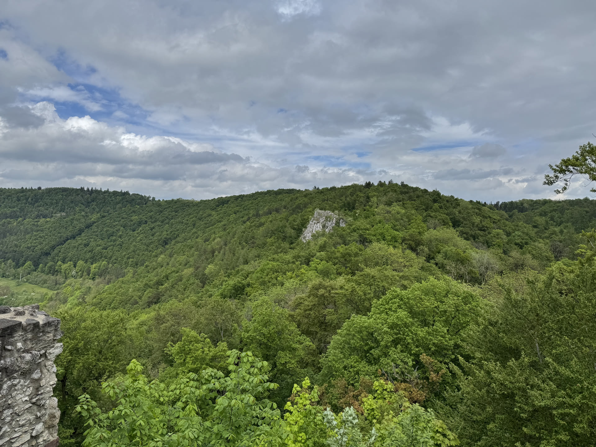
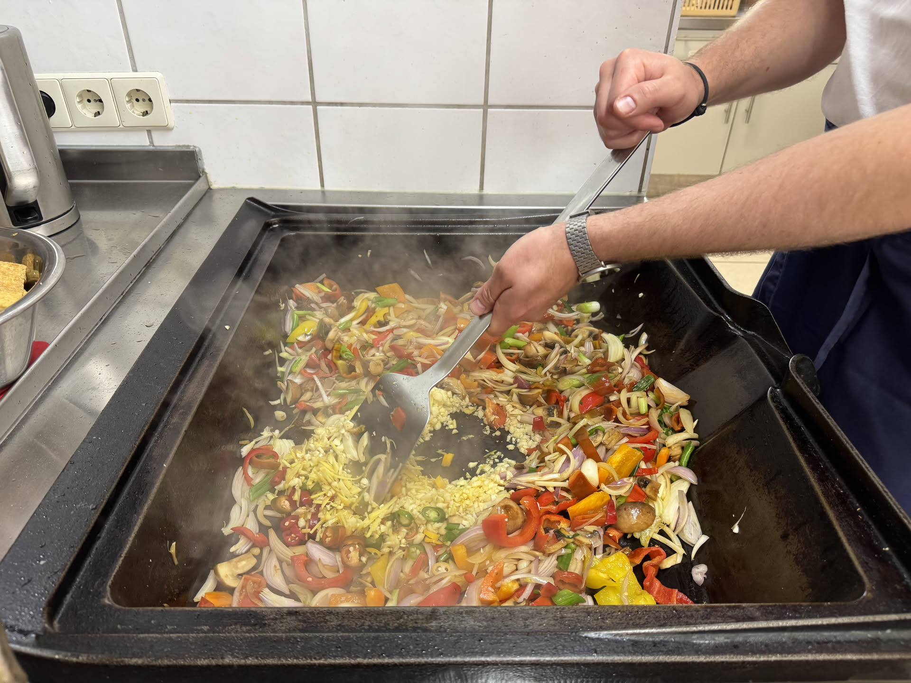
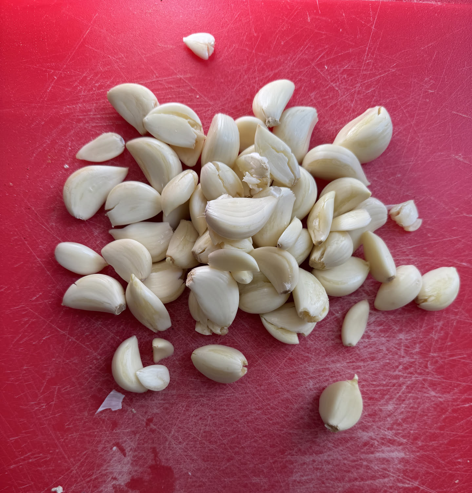

After multiple large hackathons challenging the capacity of our location, we returned back to a more relaxing amount of 20 attendants. This time from May 4th (be with you) to 8th we met again in the Schlosshof in Schelkingen, Germany. It was a week full of collaboration, fun and innovation. All with the goal to further improve [Gardener](https://gardener.cloud).

<!-- truncate -->

This time employees from [SAP](https://sap.com), [Schwarz Digits](https://digits.schwarz), [Inovex](https://inovex.de), [noris network](https://noris.de) and [x-cellent technologies](https://x-cellent.com) joined. Some even booked a flight from Bulgaria to Germany!

Feel free to check out the [Gardener Hack The Garden 05/2026 Wrap Up](https://gardener.cloud/community/hackathons/2026-05/) for a more in-depth view across all topics we tackled.

## Getting Outside

Most of the time all of us were very productive and focused. Of course, from time to time we took some breaks, played some volleyball, billard, table tennis or table football. Some participants also did a social run.

But this time we wanted to add an activity and experience shared by everyone not just small groups. Hence we did a quick hike through the forests, took a glance at a little cave nearby and proceeded our way up to ruins of the Rusenschloss.

Up the hill we were rewarded by a great view over the whole landscape nearby and took our group photo.

## Catering

Besides the easy things like breakfast, a caterer provided lunch and once we went out for dinner on one day. In-between-snacks inclusive.

But have you ever wondered how to prevent a hungry crowd of 20 people from starving with high quality and fresh food? How much ingredients do you need?

Well, one recipe started with a bottle of semsame oil, five heads of garlic, one kilogram of onions, broccoli, paprika, 1.5 kilograms of carrots and tofu, three kilograms of mie-noodles. And we finished it up some coriander, hot chilis and limes.

And this was exactly the right amount!

## Conclusion

What a week, huh? And we are already looking forward to the next hackathon in about half a year.
If you are curios and would like to attend next time, hop over and join the [Gardener Slack](https://join.slack.com/t/gardener-cloud/shared_invite/zt-33c9daems-3oOorhnqOSnldZPWqGmIBw).

A huge thanks to all participants: we enjoyed the time with you. Can't wait to meet all of you again!
