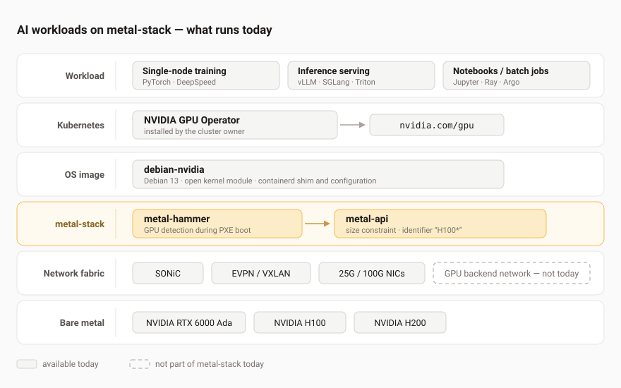

Every few weeks somebody asks us a variation of the same question: can we run our AI workloads on metal-stack, and how far does it actually get us? Sometimes that means serving a large language model to an internal chat frontend. Sometimes it means fine-tuning a model on data that must not leave the building, or a nightly batch job that scores a few million records, or simply giving a data science team notebooks with a real GPU behind them.

This article is our honest answer. What works today, what works with caveats, and where we run into the limits of the platform - based on the current state of metal-stack and the tooling ecosystem around it. We [added GPU support in v0.18.0](https://metal-stack.io/blog/2024/05-metal-stack-v0.18.0) back in 2024, and demand has not exactly slowed down since.

<!-- truncate -->

## Why bare metal for AI

Cloud GPU instances are expensive per accelerator-hour, and on a shared instance you inherit whatever your neighbours are doing to the memory bandwidth. That hurts in both directions: training runs are throughput-bound and long-running, so a 20% slowdown is 20% more money and hours; inference is latency-sensitive, and a chat frontend feels sluggish the moment token generation stutters. If you already own the hardware - or you are buying dedicated servers anyway - running the workload on your own machines removes both the bill and the noisy neighbour, and the training data, the fine-tuned weights and the prompts never leave your data center.

metal-stack's job in that picture is the boring but essential part: discovering the servers, classifying them, installing an operating system, wiring up the network, and handing you a machine that a Kubernetes cluster can schedule onto. It does not care what you then run on the GPU.

## What we ship today

During PXE boot, [metal-hammer](https://github.com/metal-stack/metal-hammer) scans the PCI bus and reports the installed graphics cards back to the metal-api, including vendor and model. The metal-api uses that information to match a machine against a size. Since [v0.19.0](https://metal-stack.io/blog/2024/11-metal-stack-v0.19.0), size constraints carry an `identifier` field with glob pattern matching, so you can define one size per GPU model:

```yaml
- id: g1-large-x86
  constraints:
    - type: gpu
      identifier: "H100*"
      min: 4
      max: 4
```

Three GPU types are [officially supported and verified](https://metal-stack.io/docs/hardware#gpus) by the project: NVIDIA RTX 6000, H100 and H200. Other models might work perfectly well - they simply have not been reported back to us yet.

For the operating system we ship a dedicated `debian-nvidia` image. It is based on Debian 13 and already contains the kernel driver - since v0.22.7 the open kernel module rather than the proprietary one - plus the containerd shim and the containerd configuration a GPU worker needs. No reboot and no driver-provisioning dance after the machine comes up.

That is where metal-stack stops. Exposing the GPUs to pods is the job of the NVIDIA GPU Operator, which the cluster owner installs once the cluster is running:

```bash
helm install --wait --generate-name \
  --namespace gpu-operator --create-namespace \
  nvidia/gpu-operator \
  --set driver.enabled=false \
  --set toolkit.enabled=true
```

Because our image already carries the driver, `driver.enabled=false` is the important flag here. After that, `kubectl describe node` lists `nvidia.com/gpu` in the node capacity and pods can request GPUs like any other resource. The [GPU Workers documentation](https://metal-stack.io/docs/gpu-workers) walks through the whole sequence.



## What that gets you

Once `nvidia.com/gpu` shows up as a schedulable resource, the platform is workload-agnostic. Anything that runs in a container and speaks CUDA works, and in practice that covers most of what teams actually do:

- **Interactive work** - JupyterHub, VS Code servers or [Kubeflow](https://www.kubeflow.org/) notebooks with a card attached, which is usually where a team starts before anything gets productionised.
- **Fine-tuning and training on a single node** - PyTorch, DeepSpeed or Axolotl, with tensor or pipeline parallelism across the four or eight GPUs inside one machine. This is comfortably the sweet spot today.
- **Inference serving** - vLLM, SGLang, NVIDIA Triton or plain TorchServe behind a Kubernetes service.
- **Batch and offline processing** - embedding generation, document parsing, transcription, image or video pipelines, driven by a Job, [Argo Workflows](https://argoproj.github.io/workflows/) or [Ray](https://www.ray.io/).
- **Classic ML and HPC** - RAPIDS, XGBoost on GPU, simulation codes. GPUs predate the current AI wave, and those workloads schedule exactly the same way.

One thing worth planning before you start: model weights and datasets are large and read repeatedly, so budget for fast local NVMe on the GPU nodes or a network filesystem that can keep the cards fed. A starved GPU is an expensive idle GPU.

## One example end to end: LLM inference

To make it concrete, here is the stack we get asked about most. [vLLM](https://github.com/vllm-project/vllm) serves models behind an OpenAI-compatible HTTP API and brings continuous batching and PagedAttention, which is what you want when several people hit the same model at once:

```yaml
apiVersion: apps/v1
kind: Deployment
metadata:
  name: llm-inference
spec:
  replicas: 1
  selector:
    matchLabels:
      app: llm-inference
  template:
    metadata:
      labels:
        app: llm-inference
    spec:
      containers:
        - name: vllm
          image: vllm/vllm-openai:latest
          args:
            - --model
            - meta-llama/Llama-3.1-8B-Instruct
            - --served-model-name
            - llama-3.1-8b
            - --max-model-len
            - "8192"
          ports:
            - containerPort: 8000
          resources:
            limits:
              nvidia.com/gpu: "1"
            requests:
              nvidia.com/gpu: "1"
          volumeMounts:
            - name: shm
              mountPath: /dev/shm
      volumes:
        - name: shm
          emptyDir:
            medium: Memory
            sizeLimit: 8Gi
```

The GPU resource request is what makes Kubernetes place the pod on a node that actually has a card - the same mechanism a training job or a batch worker uses. For larger models such as Mixtral or Llama 70B you either need an H100 or H200 with enough VRAM, or tensor parallelism across several GPUs inside one node, which is precisely what a size with a `min: 4` / `max: 4` GPU constraint gets you.

[OpenWebUI](https://github.com/open-webui/open-webui) then gives your users something to talk to. Point it at the vLLM service and your team has a chat interface over a model that runs entirely on your own hardware.

## Sharing one GPU

With the basic operator installation there is a caveat worth knowing about: only one pod can access a given GPU. That is fine for a training run that wants the whole card anyway, and wasteful for a dozen notebooks that sit idle most of the day. If you want to serve several smaller models, or simply have more workloads than cards, you need to configure sharing.

On H100 and H200, Multi-Instance GPU (MIG) partitions a card into up to seven isolated instances that the device plugin then advertises as separate resources. The RTX 6000 does not support MIG at all, so there you are looking at time-slicing or MPS instead: several pods share the whole card, without the hard isolation MIG gives you.

metal-stack does not manage any of this. The GPU Operator does, and NVIDIA's documentation is the reference; our [GPU Workers page](https://metal-stack.io/docs/gpu-workers) collects the relevant links. What metal-stack contributes is the layer below: GPU-equipped nodes, correctly classified, reliably provisioned.

## Where it gets harder: more than one node

Single-node work is productive today. Beyond one node, we hit things that are worth understanding before you invest time in that direction. What follows is our own assessment rather than documented product scope.

Our fabric is Ethernet. Leaf-spine CLOS topology, [SONiC](https://sonicfoundation.dev) on the switches, BGP with VXLAN/EVPN for the overlay, and servers dual-attached to the leaves with 25G or 100G NICs. InfiniBand and RDMA over Converged Ethernet are not part of that fabric today, and they are not something you can bolt on at the application layer - it would be an addition to the platform's networking layer.

In practice that splits into three cases:

- **Horizontally scaled workloads** - several inference replicas behind a service, or a batch pipeline fanned out across nodes - work fine. This is stateless traffic and Ethernet handles it well.
- **Model-parallel serving across nodes** is feasible on 100G, but NCCL collectives over plain Ethernet cost you latency and bandwidth compared to an RDMA-capable fabric. For very large models that difference becomes noticeable.
- **Distributed training**, with large-scale all-reduce across many nodes, is the demanding case where a proper RDMA fabric earns its keep.

There is a scheduling dimension too. A job sharded across eight nodes needs all eight ready simultaneously - a partial allocation is not a slow start, it is wasted capacity. [Kueue](https://kueue.sigs.k8s.io/) and [Volcano](https://volcano.sh/) can handle that queueing inside Kubernetes, but no scheduler can conjure machines that have not been provisioned.

Finally, topology. The metal-api reports GPU vendor and model, not the PCIe switch layout, NUMA locality or NVLink connectivity of a machine. A scheduler cannot optimise placement it cannot see, and for multi-GPU jobs that placement matters.

## Where we go from here

AI-ready infrastructure patterns are firmly on our longer-term radar, and our [roadmap](https://metal-stack.io/community/roadmap) is public if you want to follow along. None of the gaps above mean metal-stack is inadequate for what it set out to do - they are what happens when a platform that grew up around networking and bare-metal provisioning meets a new class of workload.

If you want to try this today, start small: one GPU node with the `debian-nvidia` image, the GPU Operator, and whichever framework your team already uses. Validate the workload, measure its VRAM and throughput behaviour, and then decide what scaling out should look like for your case.

We would love to hear from anyone experimenting with GPU workloads on metal-stack, or with opinions on what we should prioritise next. Join us in the [metal-stack Slack](https://join.slack.com/t/metal-stack/shared_invite/zt-3eqheaymr-obQueWBLOMkhbEWTZZyDRg) - your experience might well shape what is possible tomorrow.

## References

- [metal-stack hardware support: GPUs](https://metal-stack.io/docs/hardware#gpus)
- [metal-stack GPU workers documentation](https://metal-stack.io/docs/gpu-workers)
- [NVIDIA GPU Operator](https://github.com/NVIDIA/gpu-operator)
- [vLLM](https://github.com/vllm-project/vllm)
- [OpenWebUI](https://github.com/open-webui/open-webui)
- [Kueue](https://kueue.sigs.k8s.io/)
- [Volcano](https://volcano.sh/)
