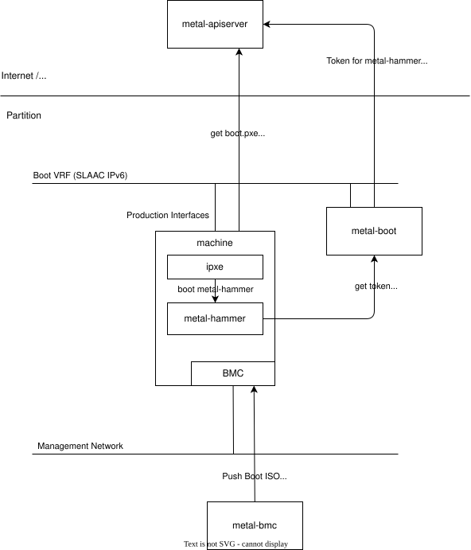
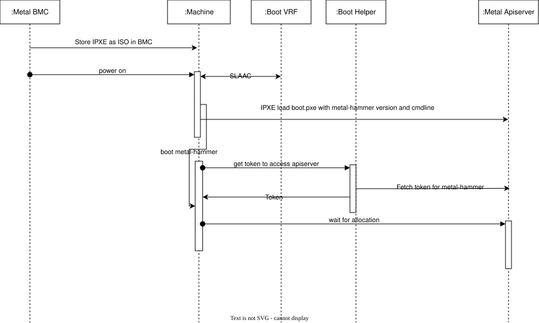

# Machine Provisioning V2

:::info
This document is work in progress.
This MEP depends on MEP-4.
:::

When we started with metal-stack, we decided to go full layer-3 for the dataplane for workloads.
But the inventorization and installation process of machines is done in a layer-2 segment with a traditional DHCP/TFTP/PXE approach.
The benefit of this approach is that it does not require manual configuration steps on any of the components in the datacenter.
New servers just need to be turned on, get the metal-hammer booted via DHCP/TFTP/PXE, register at the API, and are ready to use.

But there are downsides with this approach, too.
Most notably:

- Two different network topologies (L2 and L3) in the dataplane often cause issues on the switches when changing between these two configurations, especially on SONiC and the SWSS daemon.
  The switch port of a machine must be reconfigured between these two modes, once a machine changes from registered to installed and back.
- DHCP and TFTP server (pixiecore) is deployed in the management network of a partition.
  Ideally, the entire machine provisioning cycle would use the production infrastructure, while only the BMC and management access uses the management infrastructure.
- Currently, part of the traffic for machine provisioning runs over the management infrastructe, e.g. OS image pulls, which is undesirable as it may cause bottlenecks and impact service availability of metal-stack.

We were searching for a proper solution which can achieve the same convenient and fast solution but within layer-3.

## Requirements

The following requirements must be fulfilled by the proposed solution:

- Clear separation of management and production infrastructure
- Same "no-touch" experience for new servers
- Configurability of metal-hammer version per partition in real time
- Cache of metal-images accessible from metal-hammer inside a partition
- Preserve all existing discovery, hardware detection, and provisioning logic of the metal-hammer
- Secure network when machine reclaim goes wrong with ACLs on the switch to deny a machine access to anything else than the control plane API.
- Per-partition configuration which provisioning mechanism should be used.
  We cannot expect all adopters to have IPv6 support in place which is a hard requirement for the proposed solution.

### Non-Goals

- Per-machine generation of boot ISOs
- Support both kinds of machine provisioning options — old and new — within a single partition.

## High level Architecture

The main idea is based on three concepts:

- Boot from ISO feature of server BMC firmware which can be configured from remote via redfish.
  Alternatively, configure HTTP-boot instead of mounting the ISO.
- Enable automated IPv6 address acquisition via SLAAC [RFC 4862](https://www.rfc-editor.org/info/rfc4862/) driven by Router Advertisements [RFC 4861](https://rfcinfo.com/rfc-4861/) instead of DHCP.
- IPv6 in a dedicated boot VRF instead of a boot VLAN.

The L3-only boot and registration process can be described as follows:

- Every server must be configured to either boot from ISO or via HTTP-boot.
- There are multiple ways to achieve this configuration (see [Reconfiguration of BMC boot option](#reconfiguration-of-bmc-boot-option)).
- Once the server is powered on, iPXE is booted from the CDROM or HTTP presented from the firmware.
- The metal-core configures switch ports of unallocated machines with a dedicated boot VRF for each partition configured in the metal-apiserver.
- The production interfaces will then acquire a routable IPv6 address in the boot VRF through SLAAC and router advertisement.
  The network must enable the machine to reach the metal-apiserver in the control plane.
- The iPXE ISO must contain a boot configuration which chain loads from a known location a secondary boot configuration.
  To speed up the iPXE startup, the boot.ixpe should disable IPv4 completely as otherwise iPXE will try DHCP first.
  Sample:

  ```ipxe
  #!ipxe
  chain https://v2.metal-stack.dev/boot.ipxe || shell
  ```

Each metal-stack installation requires an individual iPXE ISO with the appropriate boot.ipxe download URL.
The contents of the secondary boot.ipxe will depend on the partition where the request comes from.
The secondary boot.ipxe will then contain the same payload as currently delivered from pixiecore.
This especially contains the configured linux kernel, metal-hammer version, command line.
The service responsible for creating the secondary boot.ipxe will be called `metal-boot`.





From this point onwards, machine provisioning sequence will remain as is.

## Implementation

### Prerequisites

- [x] Ensure iPXE can be packed as ISO image stored in the firmware, booted with DHCP disabled and get a IP with routes from a SLAAC enable switch
- [x] The initial boot.ipxe contains instruction to pull a secondary boot.ipxe which contains kernel, image and cmdline and ipxe chain boots this
- [x] Can iPXE resolve hostnames to IPv6 addresses?
- [ ] How do we configure the boot VRF on the switch
  - [ ] address space per port
  - [ ] ACLs
  - [ ] special VRF type on the metal-core
- [ ] Specify how metal-hammer kernel must be configured to accept IPv6 router advertisements

### Reconfiguration of BMC boot option

metal-bmc interval scan
mep-15
initial server configuration by hand

- If the boot ISO is set to iPXE, the boot source override must be set to CDROM instead of PXE from network and a reboot must be triggered (migration to this approach, not when a machine is allocated).

### metal-boot Component

- With this ipxe will boot into metal-hammer and will contact first the boot-helper on the given url and will get a token to access the metal-apiserver
- metal-image-cache-sync address is also reachable in the boot vrf and works as before.

  New component, must be deployed in the same network as the SLAAC configuration of the machines. The machines boot into a CDROM which has iPXE as payload which is statically configured to pull a initial chainload configuration file from the metal-boot. metal-boot returns a dynamically created answer which contains the metal-kernel and metal-hammer version configured in the same partition. Also the url where to fetch the token for this machine.

It could also be possible to configure the firmware with boot from http and pull the ipxe from metal-boot as well.

- Optional: make `metal-boot` a proxy to metal-apiserver to support IPv4 only control-plane deployments.
- Optional: make `metal-boot` itself act as NTP and DNS server for the metal-hammer. Together with the proxy to the control-plane this would allow to restrict external access to the `metal-boot` source IP (even IPv4 and IPv6).
- `metal-boot` is stateless and can be deployed multiple times and listens to the same anycast IPv6 address for redundancy.

### Scope and Placement of the metal-boot service

There are several ways to place the `metal-boot` service in a partition. The right choice depends heavily on how much traffic is expected to pass through it.

A full boot consists of many small control steps and a few bulk transfers. The small steps such as obtaining a token, fetching the secondary `boot.ipxe`, and optionally resolving names or syncing time are only a handful of packets per booting machine. The bulk transfers are the kernel, initrd and operating system image and are orders of magnitude larger. In the current design these bulk files are served by `metal-image-cache-sync` on the management-server. That data is forwarded by the switch ASIC from port to port and never reaches a switch CPU.

When placing the service on the switches, special attention must be paid to SONiC's Control Plane Policing (CoPP). Any packet addressed to an IP that is local to the switch is punted to the switch CPU and rate limited there. Traffic that does not match a more specific trap falls into the catch-all `ip2me` trap. By default this trap permits only 6000 incoming packets per second. This is plenty for the control traffic described above. It is a limiting factor for file transfers. Even when a file is served from the switch, the outgoing data stream produces a steady flow of incoming TCP ACKs. Those ACKs count against the `ip2me` budget. Traffic that is operationally important for the fabric such as BGP is classified into separate traps with their own buckets and higher priority CPU queues. Hitting the ceiling of `ip2me` therefore does not endanger routing convergence. The `ip2me` limit is adjustable, but raising it weakens the CPU denial of service protection of the switch for all catch-all traffic. That protection matters because the boot VRF carries reclaimed machines that are not yet trusted. CoPP also cannot be scoped to a single L4 port or host, because the traps are recognised in hardware. It is therefore not possible to grant only `metal-boot` a larger budget.

This has a direct consequence for running `metal-boot` as a full proxy between a booting machine and the rest of the network. Proxying the operating system image through a switch resident `metal-boot` would turn traffic that is otherwise forwarded port to port in hardware into traffic terminated on the switch CPU. Both the incoming image stream from `metal-image-cache-sync` and the ACKs from the booting machine would then hit the `ip2me` trap. This is strictly worse than letting the machine pull the image directly from the cache.

The placement therefore follows from the role given to `metal-boot`. If it only handles the lightweight control functions such as token issuance, `boot.ipxe`, DNS and NTP, placing a container on each leaf is acceptable. The small control steps stay well within the `ip2me` budget, and this also fits the suggestion from the design notes that `metal-boot` could be deployed on each switch with a shared anycast address for redundancy. The downside is that it exposes additional services on critical infrastructure, so the container still needs proper hardening. If `metal-boot` must instead act as a complete proxy that also carries bulk traffic, it should be placed on a fabric reachable host such as a management server. From there the proxied traffic is forwarded in hardware and never punted to a switch CPU, so CoPP does not apply.

The metal-image-cache-sync is currently placed on the management-servers. One of the stated goals is to remove the need for connections between the production infrastructure and the management infrastrutcure. Since placing or proxying the image cache on the switches is not viable, the image cache has to move to a different location. The image cache can either be hosted on a metal-stack provisioned machine, or on a server outside of metal-stack's scope.

### Services that must support ipv6

| service                | ipv6 | mandatory support | explanation                                                                                                                                               |
| ---------------------- | ---- | ----------------- | --------------------------------------------------------------------------------------------------------------------------------------------------------- |
| metal-boot             | yes  | yes               | `metal-boot` process must directly communicate with the ipv6 metal-hammer, so it must support ipv6                                                        |
| metal-hammer           | yes  | yes               | `metal-hammer` must configure the it's own interface to use SLAAC                                                                                         |
| metal-image-cache-sync | yes  | yes               | Because the images cannot be through the switch, the cache has to be made available to a booting machine with only an ipv6 address                        |
| metal-apiserver        | yes  | no                | There is negligible traffic between the metal-apiserver and a switch. The connection to the api could be proxied and thus could continue to run over ipv4 |
| metal-bmc              | no   | no                | metal-bmc will continue to exist fully within the management network                                                                                      |
| DNS Resolver           | yes  | yes               | The DNS resolver must be reachable by the booting machine for hostname resolution, requiring native IPv6 connectivity.                                    |

### Service that are replaced

| service   | explanation                                                      |
| --------- | ---------------------------------------------------------------- |
| pixiecore | PXE is no longer required and will be removed in a later release |

## Necessary Changes on Existing Components

This section will summarize what changes are necessary to implement MEP-20 in metal-stack.

### metal-hammer

metal-hammer will need to bring up the physical Interface of the server it is running on. When using the boot option ip=dhcp the linux kernel fully configures the interface before loading the initrd. metal-hammer should execute the following steps.

- bring up the physical machine interface
- perform SLAAC
- wait for duplicate address detection to complete

metal-hammer can then proceed as before.

### metal-apiserver

The metal-apiserver will need the following changes.

- metal-apiserver currently models the booting state as PXEBooting. This should be updated and an additional boot event added for ISO Boot.
- metal-apiserver will need to store and assign the boot address space. There should be a boot supernet per partition from which per port /64 networks are assigned.
- metal-apiserver will need to assign the new boot vrf instead of the PXE VLAN
- _Important_: New servers will no longer be able to boot via PXE and let the metal-hammer set a `metal` and `root` password and store that in the metal-db, instead we must probably pick some of the ideas of the unfinished MEP-15 and allow to store BMC Passwords manually per machine.

### sonic-configdb-utils

sonic-configdb-utils will need to support additional ACL configuration options for ipv6 to prevent east-west traffic between unprovisioned machines. The ruleset is static, so it can be built similarly to the existing CTRLPLANE tables. (permit metal-boot followed by deny all)

### metal-core

metal-core will need to support additional configuration templates for the boot vrf.

```raw
suggested configuration TBD
```

metal-core will also need to dynamically bind the boot ACLs to each port.

### metal-bmc

metal-bmc already scans targets periodically to gather information. In addition to gathering information, metal-bmc should enforce the inserted CDROM and boot mode override.

Sample redfish code to upload a boot media can be found at the gofish documentation [Mount Virtual Media](https://pkg.go.dev/github.com/stmcginnis/gofish?utm_source=godoc#example-package-MountVirtualMedia)

### go-hal

go-hal currently does not support the insertion and removal of virtual media.
