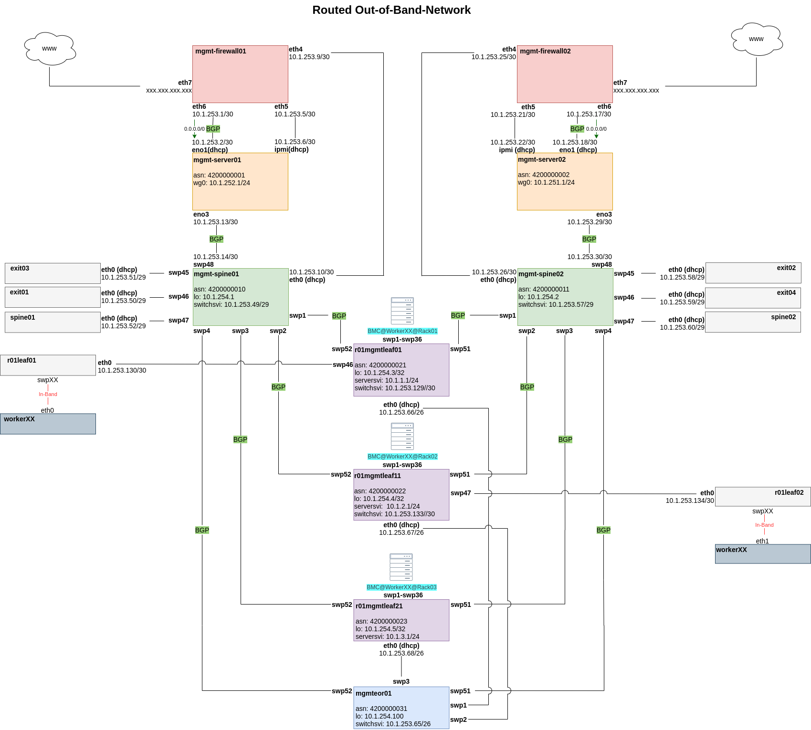

# Partition Deployment

A partition is the data center infrastructure layer — the physical servers, switches, firewalls and their networks that metal-stack manages. See the [architecture overview](../../05-Concepts/01-architecture.mdx#partitions) for the full component breakdown and design principles.

This section continues from the [Control Plane](./03_control-plane.mdx) deployment and covers how to deploy the required infrastructure services and how to connect your partition to the control plane, using the [metal-stack partition Ansible roles](https://github.com/metal-stack/metal-roles/tree/master/partition).
It is assumed that all cabling is done.

During this section, our repository will grow to look something like the following:

```text
.
├── deploy_mgmt_servers.yaml        # management server services
├── deploy_mgmt_switches.yaml       # mgmtleaves and mgmtspines SONiC
├── deploy_spines_exits.yaml        # spine/exit switch SONiC
├── deploy_leaves.yaml              # leaf switch SONiC + metal-core
├── inventory
│   ├── inventory.yaml              # all partition host groups
│   └── group_vars
│       ├── all/
│       │   ├── release_vector.yaml
│       │   └── metal-stack/
│       │       ├── partition.yaml    # partition → control plane connection
│       │       └── control-plane.yaml # vault-encrypted: API keys, BMC passwords
│       ├── mgmtservers/
│       │   ├── common.yaml
│       ├── mgmtspines/
│       │   ├── common.yaml
│       │   ├── metal-bmc.yaml
│       ├── mgmtleaves/
│       │   ├── common.yaml
│       ├── exits/
│       │   ├── common.yaml
│       │   └── sonic.yaml
│       ├── spines/
│       │   ├── common.yaml
│       │   └── sonic.yaml
│       ├── leaves/
│       │   ├── common.yaml
│       │   ├── sonic.yaml
│       │   └── metal-core.yaml
│       └── partition/
│           └── common.yaml
└── .github/
    └── workflows/
        └── deploy-partition.yaml     # CI/CD for partition
```

## Out-Of-Band-Network

The first step of deploying a partition is to deploy the Out-Of-Band-Network.
It provides a dedicated management network that remains accessible even when the production network is down or unconfigured. It is the foundation that enables remote bootstrapping, monitoring, and maintenance of all partition hardware — from leaf and spine switches to bare-metal servers via their BMC/IPMI interfaces.

The [partition networking](https://metal-stack.io/docs/next/networking) is designed to be secure, fully routable via BGP, scalable, resilient, deployable through CI/CD, and selectively accessible from the internet.
To deploy a partition and its networking stack remotely and in a nearly automatic manner, **some components must be initially bootstrapped manually**:

- the management firewalls, management servers, management spines and management leaves need to be configured
- a CI/CD-Runner of your choice needs to be installed to run the automated deployments.

The result should look something like the following image, but could vary for different deployments.



The following subsections provide a suggestion, how the Out-Of-Band-Network could be deployed. Please note that this is only a suggestion — we cannot provide an out-of-the-box solution, as hardware setups and environments differ significantly between deployments.
After bootstrapping the OOBN, we make use of the CI/CD workers to deploy as much of the required software via Ansible.

### Management Firewalls

Management firewalls are the first bastion hosts in a partition, providing the only controlled entry point to the Out-Of-Band-Network from the internet. Each partition should run two firewalls for high availability and load balancing.

As there is no CI/CD runner yet, the **initial configuration of these routers must be done manually**.
This is due to the chicken-and-egg problem of partition deployment, since the firewalls and management servers themselves are needed to automate the rest of the partition. Once the management server is also in place, all subsequent configurations can be deployed automatically via runner and Ansible.

Due to the differing environments and used hardware, we can only give inspiration how the configuration of a management firewall could look like.
There is a [mgmt-firewall role](https://github.com/metal-stack/metal-roles/tree/master/partition/roles/mgmt-firewall) that can give you an idea, how to set it up.

You can adapt the role, create a configuration template with Ansible and for once deploy it manually via copy/paste through the machine console. The next step is to add the SSH keys and user credentials to enable an automated workflow later.

The firewalls (EdgeRouters) must fulfill the following requirements:

- Provide and restrict access to the Out-Of-Band-Network from the internet via firewall rulesets
- Provide destination NAT to the management server and its IPMI interface
- Provide DHCP options for Onie Boot and ZTP of the management spine
- Provide DHCP management addresses for the management spine, management server, and IPMI interfaces
- Perform Hairpin-NAT so the management server can access itself via its public IP (required by the CI runner to delegate jobs)
- Propagate a default gateway via BGP

### Management Servers

Management servers are the main bootstrapping components of the Out-Of-Band-Network and serve as jump hosts for all partition components. Once they are installed, every other component can be deployed automatically.

Bootstrapping the management servers requires remote IPMI access and a way to perform an unattended OS installation with an Ansible user and SSH keys pre-configured. The exact approach depends on your hardware, existing infrastructure, and preferred automation tools. Below are two common examples, but any solultion is fine.

**Preconfigured ISO with preseed** — generate an ISO with a preseed file that installs an OS and an Ansible user, then attach it via the BMC's virtual media function.

**PXE boot with cloud-init** — serve a minimal boot image over the network and provide a cloud-init user-data file for first-boot configuration.

Again we need a minimal installation and guarantee networking and remote access.

After installation, a CI runner needs to be installed on each management server. Deployment jobs (GitHub Actions or GitLab CI) are delegated to these runners, which trigger Ansible playbooks to provision the following services on the management servers:

- CI runner for job delegation
- `metal-bmc` for bare-metal lifecycle management
- Image cache and a simple webserver to serve OS images
- [Onie Boot](https://opencomputeproject.github.io/onie/) and ZTP for switch provisioning
- DHCP server for worker IPMI interfaces and switch management interfaces

The [mgmt-server role](https://github.com/metal-stack/metal-roles/tree/master/partition/roles/mgmt-server) can be used as a template for the initial setup and also to install some of the required services.

The runner on the bastion host needs:

- An SSH key pair for Ansible authentication — private key and public key in each switch's `authorized_keys`
- CI/CD secrets: `ANSIBLE_VAULT_PASSWORD` and `ANSIBLE_PRIVATE_KEY`
- Ansible Vault for encrypting sensitive variables (BMC passwords, API keys)

### Management Spines

Management spines connect the management interfaces of all switches to the management servers.
The spine's own management interface connects to the management firewall, which provides a DHCP address and options to trigger SONiC's [Zero Touch Provisioning](https://github.com/sonic-net/SONiC/blob/master/doc/ztp/ztp.md).
Switch images are then downloaded from the management server, hosting the image-cache.

Each management leaf connects to both management spines for redundant connectivity. BGP is used as the routing protocol, so if a link fails traffic automatically switches to the alternate path.

The management spine also relays DHCP requests from switch management interfaces (leaves, exits, and workers) to the management servers, enabling those switches to Onie Boot and receive their ZTP scripts.

:::tip
If you are using SONiC switches, you can make use of Zero Touch Provisioning and Onie Boot.
:::

### Management Leaves

Management leaves connect worker servers via their IPMI/BMC interfaces, relaying DHCP requests from those interfaces to the management server so workers receive IP addresses for PXE boot.

In our reference setup, the management interfaces of the leaves connect to an end-of-row switch that aggregates the traffic and links to the management spines via fiber. If copper cables can reach the spines directly, the end-of-row switch is not needed.

After the initial bootstrapping, the management interfaces of the leaves continue to be used for CLI access to the switches and for subsequent OS updates (reset → bootstrap → deploy).

### Management Out-Of-Band Switches

In larger deployments, a dedicated set of out-of-band switches (mgmtoobs) may be used to isolate BMC/IPMI traffic from the management network. These switches connect directly to server BMCs and provide a separate L2 domain for IPMI traffic, keeping it isolated from management server and switch management interfaces. They are deployed through the same SONiC automation as other partition switches.

---

With the Out-Of-Band-Network fully bootstrapped, the partition is ready for the first metal-stack deployment via Ansible on the self-hosted runner.
The next step is to configure the Ansible inventory and playbooks that define your partition topology and drive the automated deployment.

## Deployment Reference

The playbooks and directory structure shown in this document represent a **reference implementation** — one way to organize your deployment. The metal-stack partition roles are designed to be flexible, and you are free to organize playbooks, group hosts differently, or run services on different machines as long as the following architectural constraints are met:

- **PXE boot requires DHCP in the same Layer-2 domain** as unprovisioned servers. The PXE VLAN (`vlan4000`) must reach all bare metal servers that need provisioning. In our reference setup, the management server runs the DHCP server, and exit switches run a DHCP relay (configured via the `sonic-config` role) that forwards requests from the production network back to the management server. You may place the DHCP server and relay wherever your network topology allows, as long as the L2 domain is preserved. See the [networking documentation](../../05-Concepts/03-Network/01-theory.md#pxe-boot-mode) for the full PXE/DHCP theory.
- **`metal-core` must run on leaf switches** to dynamically configure them from the metal-api.
- **Pixiecore must be reachable** by servers during PXE boot (TFTP/HTTP).
- **`metal-bmc` must run on a host with BMC/IPMI network access** to manage bare-metal servers.
- **Image cache must be reachable** by switches serving OS images via Onie Boot.

You can split these services across multiple playbooks, combine them into fewer playbooks, or run them on different hosts — the roles are independent and can be mixed and matched. The key is ensuring the services are deployed and the network dependencies are satisfied.

### Host Inventory

Add your networking infrastructure to the inventory and adapt the host names and group structure to match your physical topology.

```yaml
partition:
  children:
    mgmtservers:
      hosts:
        mgmtserver01:
    mgmtleaves:
      hosts:
        mgmtleaf01:
    mgmtspines:
      hosts:
        mgmtspine01:
    spines:
      hosts:
        spine01:
    exits:
      hosts:
        exit01:
    leaves:
      hosts:
        leaf01:
```

### Partition Connection

The `inventory/group_vars/all/metal-stack/partition.yaml` file connects the partition to the control plane:

```yaml
metal_region: <region>
metal_partition_id: <partition-id>

metal_partition_metal_api_protocol: https
metal_partition_metal_api_addr: <metal-api-dns-name>
metal_partition_metal_api_port: 443
metal_partition_metal_api_basepath: /metal/
metal_partition_metal_api_hmac_edit_key: "{{ metal_control_plane_api_edit_key }}"
metal_partition_metal_api_hmac_view_key: "{{ metal_control_plane_api_view_key }}"

metal_partition_metal_api_grpc_address: "{{ metal_partition_mgmt_gateway }}:50051"
metal_partition_metal_api_grpc_ca_cert: "{{ lookup('file', 'certs/ca.pem') }}"
metal_partition_metal_api_grpc_client_cert: "{{ lookup('file', 'certs/metal-api-grpc/client.pem') }}"
metal_partition_metal_api_grpc_client_key: "{{ lookup('file', 'certs/metal-api-grpc/client-key.pem') }}"

metal_partition_mgmt_gateway: 172.17.0.1
```

The HMAC keys and other sensitive values should be stored in an Ansible vault.

### Leaf and Spine Variables

Switch variables define SONiC configuration, `metal-core` settings, and monitoring exporters. Management server variables define BMC access, DHCP configuration, and image cache settings.

The `sonic-config` role handles FRR routing configuration, DHCP relay setup on switches, and generates the complete `config_db.json` for SONiC. For complex configurations such as port breakouts, VRFs, EVPN underlay, interconnects, and extended CACL rules, refer to the [sonic-config role](https://github.com/metal-stack/metal-roles/tree/master/partition/roles/sonic-config) documentation and the `sonic-config` role defaults.

For the full variable reference, see the [metal-roles/partition](https://github.com/metal-stack/metal-roles/tree/master/partition) documentation.

## Ansible Playbooks

The following sections show a reference playbook structure. Each service is deployed through its own Ansible role, and you are free to combine or split them across playbooks as your deployment needs dictate. All playbooks use the common `metal-roles/common/roles/defaults` role for shared configuration.

### Management Server (`deploy_mgmt_servers.yaml`)

The management servers run the CI runners, image caches, DHCP server, ZTP, `metal-bmc`, and Pixiecore and optional services like Tailscale. This is the central bootstrap host — once deployed, it enables automated provisioning of all other partition components.

```yaml
---
- name: deploy management servers
  hosts: mgmtservers
  roles:
    - name: ansible-common
    - name: metal-roles/common/roles/defaults
    - name: metal-roles/partition/roles/mgmt-server
    - name: metal-roles/partition/roles/dhcp
    - name: metal-roles/partition/roles/ztp
    - name: metal-roles/partition/roles/metal-bmc
    - name: metal-roles/partition/roles/pixiecore
    - name: metal-roles/partition/roles/image-cache
    - name: artis3n.tailscale
```

### Management Switches (`deploy_mgmt_switches.yaml`)

Deploys SONiC on management leaves and management spines. These switches form the out-of-band management network and relay DHCP requests from production switches and worker servers to the management server. The `sonic-config` is used to configure FRR routing, BGP peering, and the DHCP relay agent on these switches.

```yaml
---
- name: deploy management switches
  hosts: mgmtleaves,mgmtspines
  roles:
    - name: ansible-common
    - name: metal-roles/common/roles/defaults
    - name: metal-roles/partition/roles/sonic-config
```

### Production Spines and Exits (`deploy_spines_exits.yaml`)

Deploys SONiC on spine and exit switches with serial (rolling) deployment to avoid disrupting the entire fabric at once. The `sonic-config` is used to configure FRR routing, BGP underlay, and the DHCP relay agent on exit switches to forward PXE requests to the management server.

```yaml
---
- name: deploy spines and exits
  hosts: exits,spines
  serial: 1
  roles:
    - name: ansible-common
    - name: metal-roles/common/roles/defaults
    - name: metal-roles/partition/roles/sonic-config
```

### Production Leaves (`deploy_leaves.yaml`)

Deploys SONiC configuration and `metal-core` on leaf switches. `metal-core` dynamically configures the leaf from the metal-api and proxies requests from the metal-hammer (discovery image) during PXE provisioning.

```yaml
---
- name: deploy leaves
  hosts: leaves
  roles:
    - name: ansible-common
    - name: metal-roles/common/roles/defaults
    - name: metal-roles/partition/roles/sonic-config
    - name: metal-roles/partition/roles/metal-core
```

## CI/CD Workflow

Add a CI/CD workflow to your repository (`.github/workflows/deploy-partition.yaml`). The example below uses GitHub Actions, but any runner works — the pattern is the same.

```yaml
---
name: Deploy partition

permissions:
  contents: read

on:
  workflow_dispatch:
    inputs:
      deploy-partition:
        description: "Which partition target to deploy"
        required: true
        type: choice
        options:
          - management-server
          - management-switches
          - spines-exits
          - leaves

env:
  ANSIBLE_INVENTORY: inventory/inventory.yaml
  ANSIBLE_FORCE_COLOR: "1"
  ANSIBLE_JINJA2_NATIVE: "True"

jobs:
  management-server:
    name: Deploy management server
    if: ${{ inputs.deploy-partition == 'management-server' }}
    runs-on: self-hosted
    container: ghcr.io/metal-stack/metal-deployment-base:v0.22.18
    steps:
      - uses: actions/checkout@v7
      - run: rm -rf /github/home/.ansible/roles/*
      - run: |
          printf '%s' "${ANSIBLE_VAULT_PASSWORD}" > ${ANSIBLE_VAULT_PASSWORD_FILE}
          printf '%s' "${ANSIBLE_PRIVATE_KEY}" > ${ANSIBLE_PRIVATE_KEY_FILE}
          chmod 400 ${ANSIBLE_PRIVATE_KEY_FILE}
          ansible localhost -m metalstack.base.metal_stack_release_vector
          ansible-playbook deploy_mgmt_servers.yaml --diff
        env:
          ANSIBLE_VAULT_PASSWORD: ${{ secrets.ANSIBLE_VAULT_PASSWORD }}
          ANSIBLE_VAULT_PASSWORD_FILE: .vault.txt
          ANSIBLE_PRIVATE_KEY: ${{ secrets.ANSIBLE_PRIVATE_KEY }}
          ANSIBLE_PRIVATE_KEY_FILE: .ssh-key
```

Copy this job block for each remaining phase, adjusting the job name, `if` condition, and playbook name.

Each phase is independent and can be deployed separately via workflow dispatch.

## Deployment Order

The recommended deployment sequence respects service dependencies. Each phase can be deployed independently via workflow dispatch, but the order below ensures prerequisites are in place:

```text
1. Management Server    → deploy_mgmt_servers.yaml
   ├── CI runner (enables automated deployments)
   ├── Image cache (serves OS images to switches and servers)
   ├── DHCP server (on management server, relay configured on switches)
   ├── ZTP (provisions management switches)
   ├── metal-bmc (BMC/IPMI management)
   └── Pixiecore (PXE boot image serving)

2. Management Switches  → deploy_mgmt_switches.yaml
   ├── SONiC on mgmtleaves and mgmtspains
   ├── FRR routing and BGP peering
   └── Provides out-of-band network for all partition components

3. Production Spines    → deploy_spines_exits.yaml
   ├── SONiC on spine and exit switches (rolling, serial: 1)
   ├── FRR routing, BGP underlay, and DHCP relay on exits
   └── Route leaks for internet access during provisioning

4. Production Leaves    → deploy_leaves.yaml
   ├── SONiC configuration and FRR routing
   └── metal-core (dynamic leaf switch configuration)

```

## Updating Components

To update metal-stack components:

1. **Update the release version** in `inventory/group_vars/all/release_vector.yaml`. Do not skip versions.
2. **Commit and push** the change to your deployment repository
3. **Trigger the deployment** via GitHub Actions workflow dispatch
4. The `metal_stack_release_vector` Ansible module fetches the latest compatible component versions from the OCI registry
5. Wait for the pipeline to finish
