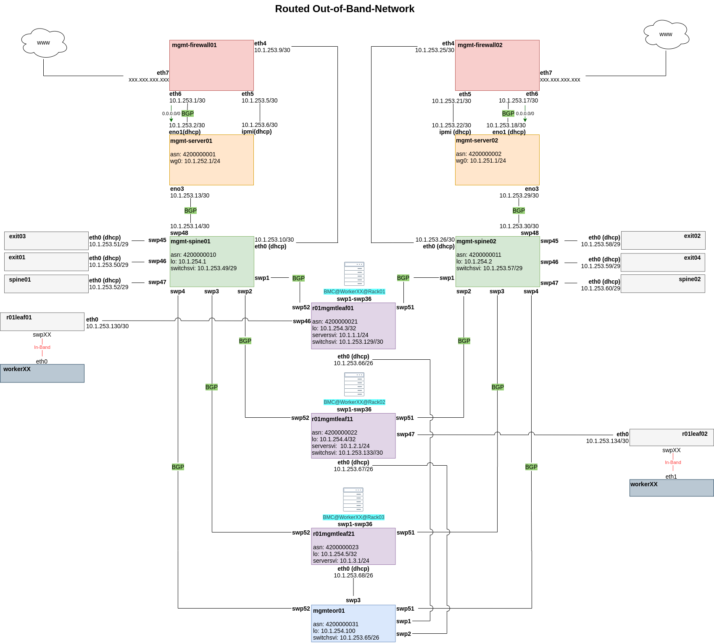

# Partition Deployment

A partition is the data center infrastructure layer — the physical servers, switches, firewalls and their networks that metal-stack manages. See the [architecture overview](../../05-Concepts/01-architecture.mdx#partitions) for the full component breakdown and design principles.

This section continues from the [Control Plane](./03_control-plane.mdx) deployment and covers how to deploy the required infrastructure services and how to connect your partition to the control plane, using the [metal-stack partition Ansible roles](https://github.com/metal-stack/metal-roles/tree/master/partition).
It is assumed that all cabling is done.
Before you try to deploy the partition, you should have had a look at the [architecture](../../05-Concepts/01-architecture.mdx) and [networking](../../05-Concepts/03-Network/01-theory.md) concepts sections — the partition deployment is the point where the network theory becomes concrete configuration, and the roles will not make sense without it.

:::info
Unlike the control plane, a partition deployment touches **physical hardware you have to bootstrap by hand first**. This chapter therefore has two halves: the manual bootstrap of the out-of-band network (firewalls, management servers, management switches) and the automated Ansible deployment of everything else. Budget most of your time for the first half — it is the part that differs the most between environments.
:::

During this section, our repository will grow to look something like the following:

```text
.
├── deploy_mgmt_servers.yaml            # management server services
├── deploy_mgmt_switches.yaml           # mgmtleaves and mgmtspines SONiC
├── deploy_spines_exits.yaml            # spine/exit switch SONiC
├── deploy_leaves.yaml                  # leaf switch SONiC + metal-core
├── inventories
│   ├── partition.yaml                  # all partition host groups
│   ├── host_vars/
│   └── group_vars
│       ├── all/
│       │   └── release_vector.yaml     # unchanged, shared with the control plane
│       ├── partition/
│       │   ├── common.yaml             # partition → control plane connection
│       │   └── secrets.yaml            # vault-encrypted: HMAC keys, BMC passwords
│       ├── mgmtservers/
│       │   ├── common.yaml
│       │   └── metal-bmc.yaml
│       ├── mgmtspines/
│       │   └── common.yaml
│       ├── mgmtleaves/
│       │   └── common.yaml
│       ├── spines/
│       │   ├── common.yaml
│       │   └── sonic.yaml
│       ├── exits/
│       │   ├── common.yaml
│       │   └── sonic.yaml
│       └── leaves/
│           ├── common.yaml
│           ├── sonic.yaml
│           └── metal-core.yaml
└── .github/
    └── workflows/
        └── deploy-partition.yaml       # CI/CD for partition
```

:::tip
Because the partition plays target real hosts over SSH, they need their own inventory (`inventories/partition.yaml`) next to the `localhost`-only `inventories/control-plane.yaml` from the [Control Plane](./03_control-plane.mdx#inventory) guide. The `inventories/group_vars/all/` directory is shared by both, which is why the release vector only has to be declared once.
:::

## Out-Of-Band-Network

The first step of deploying a partition is to deploy the Out-Of-Band-Network (OOB network).
It provides a dedicated management network that remains accessible even when the production network is down or unconfigured. It is the foundation that enables remote bootstrapping, monitoring, and maintenance of all partition hardware — from leaf and spine switches to bare-metal servers via their BMC/IPMI interfaces.

The [partition networking](../../05-Concepts/03-Network/01-theory.md) is designed to be secure, fully routable via BGP, scalable, resilient, deployable through CI/CD, and selectively accessible from the internet.
To deploy a partition and its networking stack remotely and in a nearly automatic manner, **some components must be initially bootstrapped manually**:

- the management firewalls, management servers, management spines and management leaves need to be configured
- a CI/CD runner of your choice needs to be installed to run the automated deployments

The result should look something like the following image, but could vary for different deployments.



The following subsections provide a suggestion, how the Out-Of-Band-Network could be deployed. Please note that this is only a suggestion — we cannot provide an out-of-the-box solution, as hardware setups and environments differ significantly between deployments.
After bootstrapping the OOB network, we make use of the CI/CD workers to deploy as much of the required software via Ansible.

### Management Firewalls

Management firewalls are the first bastion hosts in a partition, providing the only controlled entry point to the Out-Of-Band-Network from the internet. Each partition should run two firewalls for high availability and load balancing.

As there is no CI/CD runner yet, the **initial configuration of these routers must be done manually**.
This is due to the chicken-and-egg problem of partition deployment, since the firewalls and management servers themselves are needed to automate the rest of the partition. Once the management server is also in place, all subsequent configurations can be deployed automatically via runner and Ansible.

Due to the differing environments and used hardware, we can only give inspiration how the configuration of a management firewall could look like.
There is a [mgmt-firewall role](https://github.com/metal-stack/metal-roles/tree/master/partition/roles/mgmt-firewall) that can give you an idea, how to set it up.

You can adapt the role, create a configuration template with Ansible and for once deploy it manually via copy/paste through the machine console. The next step is to add the SSH keys and user credentials to enable an automated workflow later.

The firewalls (EdgeRouters) must fulfill the following requirements:

- Provide and restrict access to the Out-Of-Band-Network from the internet via firewall rulesets
- Provide destination NAT to the management server and its IPMI interface
- Provide DHCP options for ONIE Boot and ZTP of the management spine
- Provide DHCP management addresses for the management spine, management server, and IPMI interfaces
- Perform Hairpin-NAT so the management server can access itself via its public IP (required by the CI runner to delegate jobs)
- Propagate a default gateway via BGP

### Management Servers

Management servers are the main bootstrapping components of the Out-Of-Band-Network and serve as jump hosts for all partition components. Once they are installed, every other component can be deployed automatically. For our high-availability setup, there are again two of them, each connected to their management-firewall.

Bootstrapping the management servers requires remote IPMI access and a way to perform an unattended OS installation with an Ansible user and SSH keys pre-configured. The exact approach depends on your hardware, existing infrastructure, and preferred automation tools. Below are two common examples, but any solution is fine.

**Preconfigured ISO with preseed** — generate an ISO with a preseed file that installs an OS and an Ansible user, then attach it via the BMC's virtual media function.

**PXE boot with cloud-init** — serve a minimal boot image over the network and provide a cloud-init user-data file for first-boot configuration.

Again we need a minimal installation and guarantee networking and remote access.

After installation, a CI runner needs to be installed on each management server. Deployment jobs (GitHub Actions or GitLab CI) are delegated to these runners, which trigger Ansible playbooks to provision the following services on the management servers:

- CI runner for job delegation
- `metal-bmc` for bare-metal lifecycle management
- Image cache and a simple webserver to serve OS images for `ONIE` and `ZTP` scripts
- DHCP server for worker IPMI interfaces and switch management interfaces

The [mgmt-server role](https://github.com/metal-stack/metal-roles/tree/master/partition/roles/mgmt-server) can be used as a template for the initial setup and also to install some of the required services.

The runner on the management server needs:

- An SSH key pair for Ansible authentication
- The public key in each switch's `authorized_keys` (this can be achieved via the `ZTP` scripts)
- CI/CD secrets or any kind of access to the Ansible Vault password and private key

:::warning Chicken-and-egg
The CI runner cannot deploy itself. Bootstrap it either manually or from a hosted runner, and only then hand over to the self-hosted runner for all subsequent partition deployments. The same applies to the management firewalls and the base OS of the management servers.
:::

### Spine & Exit Management Switches (Management Spines)

Management spines connect the management interfaces of all spine and exit switches to the management servers to enable out-of-band management.
The spine's own management interfaces connects to the according management firewall, which provides a DHCP address and options to trigger SONiC's [Zero Touch Provisioning](https://github.com/sonic-net/SONiC/blob/master/doc/ztp/ztp.md).
Switch images are then downloaded from the management server's webserver.

Each management leaf connects to both management spines for redundant connectivity. BGP is used as the routing protocol, so if a link fails traffic automatically switches to the alternate path.

The management spine also relays DHCP requests from switch management interfaces (leaves, spines, exits, and workers) to the management servers, enabling those switches to ONIE Boot and receive their ZTP scripts - and later the workers to PXE boot.

:::tip
If you are using SONiC switches, you can make use of Zero Touch Provisioning and ONIE Boot.
:::

### Leaf & Worker Management Switches (Management Leaves)

Management leaves connect the production network leaves and worker servers via their IPMI/BMC and management interfaces, to allow out of band management. They are handled in different vLANs.

In our reference setup, the management interfaces of the leaves connect to an end-of-row (EOR) switch that aggregates the traffic and links to the management spines via fiber. If copper cables can reach the spines directly, the end-of-row switch is not needed.

After the initial bootstrapping, the management interfaces of the leaves continue to be used for CLI access to the switches and for subsequent OS updates (reset → bootstrap → deploy).

### Management Out-Of-Band Switches (Management OOBS)

In larger deployments, a dedicated set of out-of-band switches (mgmtoobs) may be used to isolate BMC/IPMI traffic from the management network. These switches connect directly to server BMCs and provide a separate L2 domain for IPMI traffic, keeping it isolated from management server and switch management interfaces. They are deployed through the same SONiC automation as other partition switches.

### Leaves and Spines (Production Network)

We have now reached the point where a lot of the configuration happens automatically via the official Ansible roles.
After the initial install via ONIE and ZTP, the `sonic-config` role establishes the base configuration, and `metal-core` takes over the dynamic, per-machine configuration of the leaves.

The general role of leaves and spines is explained in the [CLOS](../../05-Concepts/03-Network/01-theory.md#clos) concepts section, and the routing details in [BGP](../../05-Concepts/03-Network/01-theory.md#bgp) and [EVPN](../../05-Concepts/03-Network/01-theory.md#evpn).

They also add the last piece of the puzzle for bare-metal provisioning: the workers are directly connected to the leaves, so their PXE boot requests have to be handled there.
This is achieved by relaying DHCP requests from those interfaces to the management server (via the management spine), so workers receive IP addresses for PXE boot.
After that, they are able to pull the [metal-hammer](https://github.com/metal-stack/metal-hammer) discovery image and the operating system image for the automated install and setup. The full sequence is documented as the [machine provisioning sequence](../../05-Concepts/01-architecture.mdx#machine-provisioning-sequence).

---

With the Out-Of-Band-Network fully bootstrapped, the partition is ready for the first metal-stack deployment via Ansible on the self-hosted runner.
The next step is to configure the Ansible inventory and playbooks that define your partition topology and drive the automated deployment.

## Deployment Reference

The playbooks and directory structure shown in this document represent a **reference implementation** — one way to organize your deployment. The metal-stack partition roles are designed to be flexible, and you are free to organize playbooks, group hosts differently, or run services on different machines as long as the following architectural constraints are met:

- **PXE boot requires DHCP in the same Layer-2 domain** as unprovisioned servers. The PXE VLAN (`vlan4000` by default, configurable via `metal_core_pxe_vlan_id` and `dhcp_relay_interface`) must reach all bare metal servers that need provisioning. In our reference setup, the management server runs the DHCP server, and the switches run a DHCP relay that forwards requests from the production network back to the management server. You may place the DHCP server and relay wherever your network topology allows, as long as the L2 domain is preserved. See the [networking documentation](../../05-Concepts/03-Network/01-theory.md#pxe-boot-mode) for the full PXE/DHCP theory.
- **`metal-core` must run on leaf switches** to dynamically configure them from the metal-api.
- **Pixiecore must be reachable** by servers during PXE boot (TFTP/HTTP) — it serves the metal-hammer kernel and initrd.
- **`metal-bmc` must run on a host with BMC/IPMI network access** to manage bare-metal servers (power state, boot order, machine discovery).
- **A web server holding the switch images must be reachable** by switches during ONIE install and ZTP.
- **The image cache must be reachable** by machines during provisioning — it serves the operating system images and is also the key to [offline resilience](./08_offline-resilience.md).

You can split these services across multiple playbooks, combine them into fewer playbooks, or run them on different hosts — the roles are independent and can be mixed and matched. The key is ensuring the services are deployed and the network dependencies are satisfied.

### Host Inventory

Add your networking infrastructure to `inventories/partition.yaml` and adapt the host names and group structure to match your physical topology. For production switches, use disjoint groups (e.g. odd/even) to enable rolling deployments without fabric disruption — every leaf pair, spine pair and exit pair should be split across the two groups so that one half of the fabric always stays up.

```yaml
---
partition:
  children:
    mgmtservers:
      hosts:
        mgmtserver01:
    mgmtleaves:
      hosts:
        mgmtleaf01:
    mgmtspines:
      hosts:
        mgmtspine01:
    odd_switches:
      hosts:
        spine01:
        exit01:
    even_switches:
      hosts:
        spine02:
        exit02:
    odd_leaves:
      hosts:
        leaf01:
    even_leaves:
      hosts:
        leaf02:
```

### Partition Connection

The `inventories/group_vars/partition/common.yaml` file connects the partition to the control plane. `metal_partition_id` must match a partition that exists in the metal-api — create it with `metalctl partition create` (or via the `metal` role) before the first deployment:

```yaml
---
metal_region: <region>
metal_partition_id: <partition-id>
metal_partition_timezone: Europe/Berlin

# REST API of the metal-api
metal_partition_metal_api_protocol: https
metal_partition_metal_api_addr: <metal-api-dns-name>
metal_partition_metal_api_port: 443
metal_partition_metal_api_basepath: /metal/
metal_partition_metal_api_hmac_edit_key: "{{ metal_control_plane_api_edit_key }}"
metal_partition_metal_api_hmac_view_key: "{{ metal_control_plane_api_view_key }}"

# gRPC endpoint of the metal-api, consumed by metal-core and metal-hammer.
# The certificates are the ones generated in the control plane guide.
metal_partition_metal_api_grpc_address: "{{ metal_partition_mgmt_gateway }}:50051"
metal_partition_metal_api_grpc_ca_cert: "{{ lookup('file', 'certs/ca.pem') }}"
metal_partition_metal_api_grpc_client_cert: "{{ lookup('file', 'certs/metal-api-grpc/client.pem') }}"
metal_partition_metal_api_grpc_client_key: "{{ lookup('file', 'certs/metal-api-grpc/client-key.pem') }}"

# Gateway through which partition components reach the control plane
metal_partition_mgmt_gateway: <mgmt-gateway-ip>
```

:::warning
The HMAC keys must match the ones configured for the control plane, and the gRPC client certificate must be signed by the same CA as the metal-api server certificate — both come from the [Providing Certificates](./03_control-plane.mdx#providing-certificates) step. All of these values are secrets and belong into an Ansible Vault encrypted file.
:::

For the full list of shared partition variables, see the [metal-roles/partition README](https://github.com/metal-stack/metal-roles/tree/master/partition).

### Leaf, Spine and Management Server Variables

Switch variables define the SONiC configuration, `metal-core` settings, and monitoring exporters. Management server variables define BMC access, DHCP configuration, and image cache settings.

The `sonic-config` role handles FRR routing configuration, the DHCP relay setup on switches, and generates the complete `config_db.json` for SONiC. For complex configurations such as port breakouts, VRFs, EVPN underlay, interconnects, and extended control-plane ACL (CACL) rules, refer to the [sonic-config role](https://github.com/metal-stack/metal-roles/tree/master/partition/roles/sonic-config) documentation and its role defaults.

Each role documents its variables in its own README. The ones you will touch most often:

| Role                  | Purpose                                                     | README                                                                                                                                                                               |
| --------------------- | ----------------------------------------------------------- | ------------------------------------------------------------------------------------------------------------------------------------------------------------------------------------ |
| `mgmt-server`         | Base configuration of the management server (BGP, DNS, SSH) | [mgmt-server](https://github.com/metal-stack/metal-roles/tree/master/partition/roles/mgmt-server)                                                                                    |
| `mgmt-firewall`       | Reference configuration for the management firewalls        | [mgmt-firewall](https://github.com/metal-stack/metal-roles/tree/master/partition/roles/mgmt-firewall)                                                                                |
| `sonic-config`        | SONiC `config_db.json` and FRR for all switches             | [sonic-config](https://github.com/metal-stack/metal-roles/tree/master/partition/roles/sonic-config)                                                                                  |
| `metal-core`          | Dynamic leaf configuration driven by the metal-api          | [metal-core](https://github.com/metal-stack/metal-roles/tree/master/partition/roles/metal-core)                                                                                      |
| `metal-bmc`           | BMC/IPMI access and machine discovery                       | [metal-bmc](https://github.com/metal-stack/metal-roles/tree/master/partition/roles/metal-bmc)                                                                                        |
| `dhcp` / `dhcp-relay` | DHCP server and relay for PXE boot                          | [dhcp](https://github.com/metal-stack/metal-roles/tree/master/partition/roles/dhcp), [dhcp-relay](https://github.com/metal-stack/metal-roles/tree/master/partition/roles/dhcp-relay) |
| `pixiecore`           | Serves metal-hammer kernel and initrd via PXE               | [pixiecore](https://github.com/metal-stack/metal-roles/tree/master/partition/roles/pixiecore)                                                                                        |
| `image-cache`         | Local mirror for OS images, kernels and metal-hammer        | [image-cache](https://github.com/metal-stack/metal-roles/tree/master/partition/roles/image-cache)                                                                                    |
| `ztp`                 | Zero Touch Provisioning payloads for SONiC switches         | [ztp](https://github.com/metal-stack/metal-roles/tree/master/partition/roles/ztp)                                                                                                    |

## Ansible Playbooks

The following sections show a reference playbook structure. Each service is deployed through its own Ansible role, and you are free to combine or split them across playbooks as your deployment needs dictate. All playbooks use the common `metal-roles/common/roles/defaults` role for shared configuration.

### Management Server (`deploy_mgmt_servers.yaml`)

The management servers run the CI runners, image cache, DHCP server, ZTP web server, `metal-bmc` and Pixiecore, plus optional services such as [Tailscale](../../05-Concepts/03-Network/03-tailscale.md). This is the central bootstrap host — once deployed, it enables automated provisioning of all other partition components.

```yaml
---
- name: deploy management servers
  hosts: mgmtservers
  roles:
    - name: ansible-common
      tags: always
    - name: metal-roles/common/roles/defaults
    - name: metal-roles/partition/roles/mgmt-server
    - name: metal-roles/partition/roles/lvm
    - name: metal-roles/partition/roles/dhcp
    - name: metal-roles/partition/roles/ztp
    - name: metal-roles/partition/roles/metal-bmc
    - name: metal-roles/partition/roles/pixiecore
    - name: metal-roles/partition/roles/image-cache
    - name: artis3n.tailscale
```

:::info
The `lvm` role prepares the local volumes that the image cache uses. `artis3n.tailscale` is a third-party Galaxy role and only needed if you expose services via Tailscale; drop it otherwise.
:::

### Management Switches (`deploy_mgmt_switches.yaml`)

Deploys the SONiC configuration on management leaves and management spines. These switches form the out-of-band management network and relay DHCP requests from production switches and worker servers to the management server. The `sonic-config` role configures FRR routing, BGP peering, and the DHCP relay agent on these switches.

```yaml
---
- name: deploy management switches
  hosts: mgmtleaves,mgmtspines
  roles:
    - name: ansible-common
      tags: always
    - name: metal-roles/common/roles/defaults
    - name: metal-roles/partition/roles/sonic-config
```

### Production Spines and Exits (`deploy_spines_exits.yaml`)

Deploys the SONiC configuration on spine and exit switches in disjoint groups (e.g. odd/even) to avoid disrupting the entire fabric at once. The `sonic-config` role configures FRR routing, the BGP underlay, and the DHCP relay agent that forwards PXE requests to the management server.

```yaml
---
- name: deploy odd spines and exits
  hosts: odd_switches
  any_errors_fatal: true
  roles:
    - name: ansible-common
      tags: always
    - name: metal-roles/common/roles/defaults
    - name: metal-roles/partition/roles/sonic-config

- name: deploy even spines and exits
  hosts: even_switches
  any_errors_fatal: true
  roles:
    - name: ansible-common
      tags: always
    - name: metal-roles/common/roles/defaults
    - name: metal-roles/partition/roles/sonic-config
```

`any_errors_fatal: true` aborts the play as soon as one switch fails, so a broken configuration is not rolled out across the whole group.

The inventory defines the disjoint groups:

```yaml
odd_switches:
  hosts:
    spine01:
    exit01:

even_switches:
  hosts:
    spine02:
    exit02:
```

Deploy the odd group first, verify the fabric is stable, then deploy the even group.

### Production Leaves (`deploy_leaves.yaml`)

Deploys the SONiC configuration and `metal-core` on leaf switches. `metal-core` receives switch configuration from the metal-api via gRPC and reconciles the ports of allocated machines onto the leaf, and it relays the DHCP requests of the metal-hammer (discovery image) during PXE provisioning.

Again, the same disjoint groups approach is used. Deploy one group, verify stability, then proceed with the next.

```yaml
---
- name: deploy even leaves
  hosts: even_leaves
  any_errors_fatal: true
  roles:
    - name: ansible-common
      tags: always
    - name: metal-roles/common/roles/defaults
    - name: metal-roles/partition/roles/sonic-config
    - name: metal-roles/partition/roles/metal-core

- name: deploy odd leaves
  hosts: odd_leaves
  any_errors_fatal: true
  roles:
    - name: ansible-common
      tags: always
    - name: metal-roles/common/roles/defaults
    - name: metal-roles/partition/roles/sonic-config
    - name: metal-roles/partition/roles/metal-core
```

:::warning
`metal-core` registers the switch with the metal-api on first start. Verify with `metalctl switch ls` that every leaf shows up and reports its ports before you allocate the first machine — an unregistered leaf cannot be configured for a machine allocation.
:::

## CI/CD Workflow

Add a CI/CD workflow to your repository (`.github/workflows/deploy-partition.yaml`). The example below uses GitHub Actions, but any runner works — the pattern is the same.

```yaml
---
name: Deploy partition

permissions:
  contents: read

on:
  workflow_dispatch:
    inputs:
      deploy-partition:
        description: "Which partition target to deploy"
        required: true
        type: choice
        options:
          - management-server
          - management-switches
          - spines-exits
          - leaves

env:
  ANSIBLE_INVENTORY: inventories/partition.yaml
  ANSIBLE_FORCE_COLOR: "1"
  ANSIBLE_JINJA2_NATIVE: "True"

jobs:
  management-server:
    name: Deploy management server
    if: ${{ inputs.deploy-partition == 'management-server' }}
    runs-on: self-hosted
    container: ghcr.io/metal-stack/metal-deployment-base:v0.22.18
    steps:
      - name: Checkout
        uses: actions/checkout@v7

      - name: Clean ansible dir
        run: rm -rf /github/home/.ansible

      - run: |
          printf '%s' "${ANSIBLE_VAULT_PASSWORD}" > ${ANSIBLE_VAULT_PASSWORD_FILE}
          printf '%s' "${ANSIBLE_PRIVATE_KEY}" > ${ANSIBLE_PRIVATE_KEY_FILE}
          chmod 400 ${ANSIBLE_PRIVATE_KEY_FILE}

          ansible localhost -m metalstack.base.metal_stack_release_vector
          ansible-playbook deploy_mgmt_servers.yaml --diff
        env:
          ANSIBLE_VAULT_PASSWORD: ${{ secrets.ANSIBLE_VAULT_PASSWORD }}
          ANSIBLE_VAULT_PASSWORD_FILE: .vault.txt
          ANSIBLE_PRIVATE_KEY: ${{ secrets.ANSIBLE_PRIVATE_KEY }}
          ANSIBLE_PRIVATE_KEY_FILE: .ssh-key

      - name: Clean ansible dir after deploy
        run: rm -rf /github/home/.ansible
```

Copy this job block for each remaining phase, adjusting the job name, `if` condition, and playbook name.

Each phase is independent and can be deployed separately via workflow dispatch. Note the `rm -rf /github/home/.ansible/*` step: it clears previously downloaded role artifacts so that `metal_stack_release_vector` always fetches the roles matching the pinned release instead of reusing a stale cache.

## Deployment Order

The recommended deployment sequence respects service dependencies. Each phase can be deployed independently via workflow dispatch, but the order of this guide and below ensures prerequisites are in place:

```text
1. Management Server    → deploy_mgmt_servers.yaml
   ├── CI runner (enables automated deployments)
   │   └── *Note: the CI runner itself would have to be deployed by a non-self-hosted runner
   ├── Image cache (serves OS images to switches and servers)
   ├── DHCP server (on management server, relay configured on switches)
   ├── ZTP (provisions management switches)
   ├── metal-bmc (BMC/IPMI management)
   └── Pixiecore (PXE boot image serving)

2. Management Switches  → deploy_mgmt_switches.yaml
   └── SONiC (via sonic-config role)

3. Production Spines    → deploy_spines_exits.yaml
   └── SONiC (via sonic-config role, disjoint groups)

4. Production Leaves    → deploy_leaves.yaml
   ├── SONiC (via sonic-config role)
   └── metal-core
```

## Verifying the Partition

Once all four phases have run, verify from your workstation against the metal-api:

```bash
# The partition must be known to the metal-api
metalctl partition ls

# Every leaf, spine and exit switch registered by metal-core
metalctl switch ls

# Machines discovered by metal-bmc and reported by metal-hammer.
# Freshly discovered machines appear in state "Waiting" / "Available".
metalctl machine ls
```

If machines never appear, the PXE path is the usual culprit: check that the DHCP relay forwards from the PXE VLAN to the management server, that Pixiecore is reachable, and that the image cache serves the metal-hammer artifacts. The [troubleshooting guide](../06-troubleshoot.md) walks through the individual steps; `metalctl machine console <id>` gives you the machine's console via metal-console.

## Updating Components

To update metal-stack components:

1. **Update the release version** in `inventories/group_vars/all/release_vector.yaml`. Do not skip minor versions — consult the release notes for the target version first.
2. **Commit and push** the change to your deployment repository.
3. **Trigger the deployment** via workflow dispatch — control plane first, then the partition.
4. The `metal_stack_release_vector` Ansible module fetches the component versions and the matching Ansible roles from the OCI registry and verifies their signatures.
5. Wait for the pipeline to finish and verify as described above.

:::warning
The control plane and its partitions must stay within the same metal-stack release. Always roll out the control plane first, then the partitions — never the other way around. For switch OS upgrades there is a dedicated `sonic-upgrade` role; see [Maintenance](../04-maintenance.md).
:::
