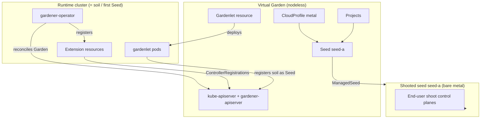
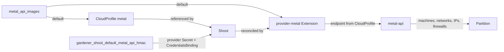

# Deploying Gardener with metal-stack

This guide shows how to deploy [Gardener](https://gardener.cloud/) on top of your metal-stack infrastructure using the [`gardener-*` Ansible roles](https://github.com/metal-stack/metal-roles/tree/master/control-plane) from the [metal-roles](https://github.com/metal-stack/metal-roles) repository. Gardener with metal-stack turns your bare-metal servers into a Kubernetes-as-a-Service platform where teams can self-serve clusters.

This guide assumes you are already familiar with Gardener's core concepts — [Garden](https://gardener.cloud/docs/gardener/concepts/operator/), [Seed](https://gardener.cloud/docs/gardener/concepts/gardenlet/), [Shoot](https://gardener.cloud/docs/gardener/concepts/apiserver/) and [CloudProfile](https://gardener.cloud/docs/gardener/concepts/apiserver/#cloudprofiles) — and have already completed the [Control Plane](./03_control-plane.mdx) and [Partition](./04_partition.md) deployment guides. For an overview of how Gardener integrates with metal-stack at a conceptual level, see the [Gardener concepts guide](../../05-Concepts/04-Kubernetes/02-gardener.md).

The upstream [Gardener landscape setup guide](https://gardener.cloud/docs/gardener/deployment/setup_gardener/) describes the same building blocks — operator, `Garden`, extensions, `CloudProfile`, DNS secrets, `Gardenlet`, `ManagedSeed` — but expects you to render and apply the manifests yourself. The `gardener-*` roles are a thin, opinionated automation layer over exactly those building blocks, pre-wired for metal-stack: each role owns one resource and pulls all container images and Helm chart references from the metal-stack [release vector](./03_control-plane.mdx#releases-and-ansible-role-dependencies).

:::tip
The [mini-lab](https://github.com/metal-stack/mini-lab) contains a working, minimal Gardener deployment (`deploy_gardener.yaml` plus `inventories/group_vars`) that uses the very same roles. It is a **development environment**, not a production reference, but it is the fastest way to see a complete, runnable parametrization.
:::

## Repository structure after this section

The following files are added to the repository structure from the previous sections:

```text
.
├── deploy_gardener.yaml                  # Gardener deployment playbook
├── inventories
│   ├── control-plane.yaml                # unchanged, reused for Gardener
│   └── group_vars
│       ├── all/
│       │   └── release_vector.yaml       # unchanged
│       └── control-plane/
│           ├── common.yaml               # updated: host provider, stage name
│           └── gardener/
│               ├── operator.yaml         # operator + virtual garden + backup + dns
│               ├── extensions.yaml       # provider/OS/CNI/shoot extensions
│               ├── cloud_profile.yaml    # CloudProfile
│               ├── projects.yaml         # Projects
│               ├── gardenlet.yaml        # first (unmanaged) Seed
│               ├── shoots.yaml           # Shoots / shooted seeds
│               ├── managed_seeds.yaml    # optional: ManagedSeeds
│               └── secrets.yaml          # vault-encrypted credentials
└── .github/
    └── workflows/
        └── deploy-control-plane.yaml     # updated: adds a gardener job
```

## Architecture Overview

The metal-roles deploy Gardener in the **virtual Garden** pattern described upstream: the `gardener-operator` runs on your *runtime cluster* and reconciles a `Garden` resource, which spins up a nodeless *virtual Garden* cluster hosting the Gardener API (`Shoot`, `Seed`, `Project`, `CloudProfile`, …). The gardenlet also runs on the runtime cluster and registers it as the first, unmanaged `Seed` (a "soil").



The soil is reserved for *infrastructure* shoots. Those shoots are turned into Gardener-managed Seeds via `ManagedSeed`, and end-user shoot control planes are hosted there. This is the recommended upstream pattern and the one the roles are built for.

**Order matters.** Every role except `gardener-operator` and `gardener-extensions` obtains a kubeconfig for the virtual Garden through the `virtual_garden_kubeconfig` module, which only works once the operator has created the `Garden` and `gardener-virtual-garden-access` has deployed the token-requestor secret:

| Role | Applies to | Deploys | Requires |
| ---- | ---------- | ------- | -------- |
| `gardener-operator` | runtime cluster | `garden` namespace, backup + DNS provider secrets, operator Helm chart, `Garden` resource | Runtime cluster; cert-manager only if the dashboard is enabled |
| `gardener-extensions` | runtime cluster | one `operator.gardener.cloud/v1alpha1` `Extension` per enabled extension | `gardener-operator` |
| `gardener-virtual-garden-access` | both | `ManagedResource` + token-requestor secret that yields a rotating virtual-Garden kubeconfig | `Garden` reconciled |
| `gardener-cloud-profile` | virtual Garden | `CloudProfile` named `metal` | virtual-garden-access |
| `gardener-projects` | virtual Garden | `Project` resources | virtual-garden-access |
| `gardener-gardenlet` | virtual Garden | internal/default domain secrets, backup secret, `Gardenlet` resource (first Seed) | virtual-garden-access, extensions |
| `gardener-shoots` | virtual Garden | provider `Secret` + `CredentialsBinding` + `Shoot` per entry | `CloudProfile`, `Project`, a ready `Seed` |
| `gardener-managed-seeds` | virtual Garden | backup secret + `ManagedSeed` per entry | a reconciled shooted seed |

Two optional roles are not part of the minimal setup but are worth knowing about: `gardener-monitoring-certs` (wildcard monitoring certificates for soil and seeds, requires reachable seed API servers) and `gardener-logging` (ships seed logs to the central metal-stack Loki, requires the `logging` role).

## Prerequisites

Before deploying Gardener, ensure the following is in place. This mirrors the [upstream prerequisites](https://gardener.cloud/docs/gardener/deployment/setup_gardener/#prerequisites), with the metal-stack specifics added:

- **A runtime cluster** — An existing Kubernetes cluster hosting the Gardener control plane. It can be the same cluster as your metal-stack control plane, but a dedicated cluster is recommended for production. See [Bootstrap Infrastructure](./02_bootstrap-infrastructure.md).
- **An ingress controller** — The roles assume `ingress-nginx` (the `Garden` and `Gardenlet` templates hardcode `ingress.controller.kind: nginx`). The virtual Garden API server itself is exposed through the Istio gateway that the operator deploys.
- **A DNS zone plus credentials** — Gardener needs to create records for the virtual Garden API server, the shoot internal and default domains, and seed ingress. Supported provider types come from the deployed DNS extensions (e.g. `google-clouddns` via `provider-gcp`, `powerdns` via the `dns-powerdns` extension).
- **A backup bucket** — S3-compatible or GCP object storage for the virtual Garden etcd and for every Seed. `gardener-operator` **asserts** that `gardener_operator_backup_infrastructure.provider` is either `gcp` or `S3`.
- **cert-manager with a DNS-solving `ClusterIssuer`** — Only required if you let the operator deploy the Gardener dashboard; the role then requests a wildcard certificate for the ingress domain.
- **ACME account** — The `shoot-cert-service` extension is enabled by default and requires `gardener_extension_shoot_cert_service_issuer_email` to be set (asserted).
- **metal-stack API credentials** — An admin/edit HMAC key for the metal-api, handed to shoots via the provider secret.
- **Cluster networking facts** — `gardener-operator` derives the runtime cluster's node, pod and service CIDRs. For `metal_control_plane_host_provider: metal` it reads them from the `kube-system/shoot-info` ConfigMap (present in every Gardener-managed shoot); for `gcp` it queries `gcloud` and additionally needs `gcp_cluster_name` and `gcp_region`.

:::warning
`metal_control_plane_host_provider` has **no default** and is asserted to be `metal` or `gcp`. If your runtime cluster is neither a metal-stack shoot nor a GKE cluster, you must provide a `kube-system/shoot-info` ConfigMap with `nodeNetwork`, `podNetwork` and `serviceNetwork` yourself — this is exactly what the mini-lab does in its playbook's `pre_tasks`.
:::

## Step 1: Add the Playbook

Create `deploy_gardener.yaml` in your repository root. It reuses the `control-plane` inventory from the [Control Plane](./03_control-plane.mdx#inventory) guide (a single `localhost` entry, because everything is applied to Kubernetes) and chains the `gardener-*` roles in the order shown above:

```yaml
---
- name: Deploy Gardener
  hosts: control-plane
  connection: local
  gather_facts: false
  roles:
    - name: ansible-common
      tags: always
    - name: metal-roles/control-plane/roles/gardener-operator
    - name: metal-roles/control-plane/roles/gardener-extensions
    - name: metal-roles/control-plane/roles/gardener-virtual-garden-access
    - name: metal-roles/control-plane/roles/gardener-cloud-profile
    - name: metal-roles/control-plane/roles/gardener-projects
    - name: metal-roles/control-plane/roles/gardener-gardenlet
    # add once the first seed is ready:
    # - name: metal-roles/control-plane/roles/gardener-shoots
    # - name: metal-roles/control-plane/roles/gardener-managed-seeds
```

You do not need to list `metal-roles/common/roles/defaults` or the `gardener-defaults` role explicitly — each `gardener-*` role pulls them in through its `meta/main.yml` dependencies. Including `ansible-common` is what makes the custom modules (`setup_yaml`, `virtual_garden_kubeconfig`, `discovery_api_k8s`) and filters (`machine_images_for_cloud_profile`, `shoot_admin_kubeconfig`) available.

:::info
Deploy in two passes on a green field: first everything up to `gardener-gardenlet`, verify that the `Garden` reports `RuntimeComponentsHealthy` and `VirtualComponentsHealthy` and that the `Seed` becomes `GardenletReady`, then enable `gardener-shoots`. `gardener-shoots` waits for each `Shoot` to report `lastOperation.state: Succeeded` (36 retries, 10 s apart by default) and fails if no Seed can host it.
:::

To inspect the landscape afterwards, obtain a kubeconfig for the virtual Garden the same way the roles do:

```yaml
  post_tasks:
    - name: Get kubeconfig for virtual garden access
      virtual_garden_kubeconfig:
        garden_name: "{{ gardener_defaults_garden_name }}"

    - name: Write it out for manual inspection
      ansible.builtin.copy:
        content: "{{ virtual_garden_kubeconfig }}"
        dest: .virtual-garden-kubeconfig
        mode: "0600"
```

## Step 2: Configure Group Variables

All Gardener configuration lives under `inventories/group_vars/control-plane/gardener/`. Each file maps to a role. Container image names, image tags and Helm chart references are resolved from the release vector, so you normally only set the variables shown here. Sensitive values (HMAC keys, service account JSONs, ACME private keys) belong in an Ansible vault file.

Two shared variables must be set in `inventories/group_vars/control-plane/common.yaml`:

```yaml
# Names the Gardener landscape; also becomes the Garden resource name and the
# metalControlPlanes key in the CloudProfile. Defaults to metal_control_plane_stage_name.
metal_control_plane_stage_name: demo

# Mandatory and asserted: "metal" or "gcp". Determines how the runtime cluster
# CIDRs are discovered and becomes the Seed's provider type.
metal_control_plane_host_provider: metal
```

:::tip
`gardener_defaults_garden_name` defaults to `{{ metal_control_plane_stage_name }}` and is inherited by every role (`gardener_operator_garden_name`, `gardener_cloud_profile_garden_name`, …). Keep the default unless you have a reason to diverge — the gardenlet name must match the Seed name across upgrades.
:::

### operator.yaml — Operator, virtual Garden, backup and DNS

This role creates the `garden` namespace, installs the operator Helm chart and applies the `Garden` resource. Backup and DNS configuration belong to the same role because both are referenced by the `Garden`.

```yaml
# --- Virtual Garden -------------------------------------------------------
# Domain under which the virtual Garden kube-apiserver is exposed through Istio.
gardener_operator_virtual_garden_public_dns: gardener-kube-apiserver.{{ metal_control_plane_ingress_dns }}

# Domain for runtime-cluster ingresses (monitoring, dashboard). MANDATORY, no default.
gardener_operator_ingress_dns_domain: k8s.<your-ingress-dns>

# Storage class for the virtual Garden etcd volumes (20Gi main, 10Gi events).
gardener_operator_virtual_garden_etcd_storage_class: csi-lvm

# Renders spec.runtimeCluster.provider.region in the Garden resource.
gardener_operator_runtime_cluster_provider: local

# Multi-replica etcd + control plane for the virtual Garden.
gardener_operator_high_availability_control_plane: true

# --- etcd backup (asserted: provider must be "gcp" or "S3") ---------------
gardener_operator_backup_infrastructure:
  provider: S3
  bucket: my-garden-backup-bucket
  region: europe-west3

gardener_operator_backup_infrastructure_secret:
  endpoint: "{{ garden_backup_endpoint | b64encode }}"
  accessKeyID: "{{ garden_backup_access_key | b64encode }}"
  secretAccessKey: "{{ garden_backup_secret_key | b64encode }}"

# --- DNS providers --------------------------------------------------------
gardener_operator_dns_providers:
  - name: powerdns
    type: powerdns
    secretData:
      apiKey: "{{ powerdns_api_key | b64encode }}"
      server: "{{ powerdns_server | b64encode }}"

# --- Dashboard (optional) -------------------------------------------------
gardener_operator_dashboard_enabled: false
```

#### Notes on the operator configuration

- `gardener_operator_backup_infrastructure_secret` is applied verbatim as the `data:` of the `virtual-garden-etcd-main-backup-secret`, so all values must already be base64-encoded. The same applies to each DNS provider's `secretData`. Consult the [Gardener etcd backup secret examples](https://gardener.cloud/docs/gardener/deployment/setup_gardener/#garden) for the expected keys per provider.
- `provider: S3` requires the `backup-s3` extension, `provider: gcp` the `provider-gcp` extension (see below) — the extension is what reconciles the `BackupBucket` in the runtime cluster.
- The `Garden` template only renders `spec.runtimeCluster.ingress` and `spec.virtualCluster.dns` **if `gardener_operator_dns_providers` is non-empty**, and always uses `gardener_operator_dns_providers[0].type` as the provider for both. Put your primary provider first.
- The virtual Garden service CIDR is fixed to `100.64.0.0/13` and the maintenance window to `220000+0100`–`230000+0100` by the template. Make sure `100.64.0.0/13` does not overlap with your runtime cluster or partition networks.
- Enabling the dashboard additionally requires `gardener_operator_wildcard_ingress_certificate_cluster_issuer` plus a cert-manager `ClusterIssuer`; the role then blocks until the wildcard certificate secret exists (up to 10 minutes). For OIDC login set `gardener_operator_dashboard_oidc_issuer_url`, `..._client_id`, `..._client_id_public` and `..._client_secret`.
- If automatic DNS creation is not available, create the A record for `gardener_operator_virtual_garden_public_dns` manually, pointing at the external address of the `istio-ingressgateway` service in the `virtual-garden-istio-ingress` namespace.

### extensions.yaml — Provider and shoot extensions

This role applies one `operator.gardener.cloud/v1alpha1` `Extension` resource per enabled extension into the **runtime** cluster. The operator then translates each into a `ControllerDeployment` and `ControllerRegistration` in the virtual Garden, exactly as described in the [upstream extension registration docs](https://gardener.cloud/docs/gardener/extensions/registration/).

Every extension follows the same pattern: `gardener_extension_<name>_enabled` toggles it, and an assert makes sure the corresponding Helm chart reference resolved from the release vector. These are **enabled by default**: `provider-metal`, `provider-gcp`, `os-metal`, `networking-calico`, `networking-cilium`, `shoot-cert-service`, `shoot-dns-service`. All others default to `false`.

```yaml
# --- Infrastructure provider (the essential one) --------------------------
gardener_extension_provider_metal_enabled: true

# Machine images offered to Shoot workers. Defaults to metal_api_images, so it
# stays in sync with the images you registered in the metal-api.
gardener_extension_provider_metal_machine_images: "{{ metal_api_images | default([]) }}"

# Shoot etcd: storage class and backup cadence
gardener_extension_provider_metal_etcd_storage_class_name: csi-lvm
gardener_extension_provider_metal_etcd_backup_schedule: "0 */2 * * *"
gardener_extension_provider_metal_etcd_delta_snapshot_period: "5m"

# Defaults injected by the admission controller when a Shoot omits CIDRs
gardener_extension_provider_metal_admission_default_pods_cidr: 10.248.64.0/18
gardener_extension_provider_metal_admission_default_services_cidr: 10.248.192.0/18

# --- Operating system -----------------------------------------------------
# One OperatingSystemConfig resource is registered per type.
gardener_extension_os_metal_types:
  - ubuntu
  - debian

# --- CNI: keep only what you actually offer in the CloudProfile -----------
gardener_extension_networking_cilium_enabled: true
gardener_extension_networking_calico_enabled: false

# --- Shoot services -------------------------------------------------------
# shoot-cert-service is enabled by default and its issuer email is asserted.
gardener_extension_shoot_cert_service_issuer_email: support@example.com
gardener_extension_shoot_cert_service_issuer_private_key: "{{ acme_account_private_key }}"

# DNS for shoot API servers and shoot-owned records
gardener_extension_dns_powerdns_enabled: true

# --- Backup provider matching gardener_operator_backup_infrastructure -----
gardener_extension_backup_s3_enabled: true

# --- Optional add-ons -----------------------------------------------------
gardener_extension_csi_driver_lvm_enabled: true
gardener_extension_acl_enabled: false
gardener_extension_audit_enabled: false

# Not needed unless your runtime cluster is GKE
gardener_extension_provider_gcp_enabled: false
```

#### Notes on the extensions

- If you do not run on GCP, disable `provider-gcp` explicitly — it is on by default and would otherwise register an unusable `DNSRecord/google-clouddns` and `BackupBucket/gcp` handler.
- `provider-metal` embeds an `imageVectorOverwrite` pinning the metal-stack components deployed into shoots (`metal-ccm`, `firewall-controller-manager`, `machine-controller-manager-provider-metal`, `csi-lvm-*`, `droptailer`, `node-init`) to the versions from your release vector. This is why shoot components stay consistent across the fleet.
- `os-metal` also accepts `nvidia` for GPU worker groups — see [GPU Workers](./07-gpu-workers.md).
- Some variables were renamed and the role **fails hard** if you still use the old names (e.g. `gardener_cert_management_issuer_email` → `gardener_extension_shoot_cert_service_issuer_email`). The failure message names the replacement.
- The `duros` extension defaults still point at a pre-release chart; do not enable it in production.

For the complete list of extension variables see the [`gardener-extensions` role README](https://github.com/metal-stack/metal-roles/tree/master/control-plane/roles/gardener-extensions).

### cloud_profile.yaml — Defining your metal-stack infrastructure

The CloudProfile is a Gardener resource that describes your metal-stack infrastructure capabilities: available Kubernetes versions, machine types, regions, and zones. The `gardener-cloud-profile` role renders this from your group vars into a `CloudProfile` Kubernetes resource.

```yaml
# URL of the metal-api — critical for Gardener to provision infrastructure
gardener_cloud_profile_metal_api_url: https://api.<your-ingress-dns>

# Firewall images (auto-derived from machine images if not specified)
gardener_cloud_profile_firewall_images_from_machine_images: true
gardener_cloud_profile_firewall_images:
  - firewall-ubuntu-3.0

# Firewall controller versions
gardener_cloud_profile_firewall_controller_versions:
  - version: v2.5.0
    url: https://images.metal-stack.io/firewall-controller/v2.5.0/firewall-controller
    classification: supported

# Available Kubernetes versions for Shoot clusters
gardener_cloud_profile_kubernetes:
  versions:
    - version: 1.33.13
    - version: 1.34.9
    - version: 1.35.6

# Available machine types
gardener_cloud_profile_machine_types:
  - name: c1-medium-x86
    cpu: "8"
    gpu: "0"
    memory: 128Gi
    usable: true
    storage:
      class: standard
      type: default
      size: 960G

# Available regions and zones
gardener_cloud_profile_regions:
  - name: "{{ metal_region }}"
    zones:
      - name: demo-rack

# Partition configuration
gardener_cloud_profile_partitions:
  demo-rack:
    default-machine-types:
      firewall:
        - c1-medium-x86
```

#### Notes on the CloudProfile

- `gardener_cloud_profile_kubernetes` and `gardener_cloud_profile_regions` are the only **asserted** variables of this role. The resulting resource is always named `metal` with `spec.type: metal`; `gardener_cloud_profile_stage_name` becomes the key under `providerConfig.metalControlPlanes`, which is what shoots reference to reach your metal-api.
- `gardener_cloud_profile_metal_api_url` is derived automatically: `https://api.{{ metal_control_plane_gateway_dns }}` when `metal_api_httproute_enabled` is true, otherwise `https://api.{{ metal_control_plane_ingress_dns }}`. Only override it if your metal-api lives elsewhere.
- `gardener_cloud_profile_machine_images` defaults to `metal_api_images`, so CloudProfile and `provider-metal` always agree. With `gardener_cloud_profile_firewall_images_from_machine_images: true` (default) every image carrying the `firewall` feature is additionally offered as a firewall image — the explicit `gardener_cloud_profile_firewall_images` list is then only needed for extras.
- The role maps images to Gardener `machineImages` via `gardener_cloud_profile_os_cri_mapping`, which by default only covers `ubuntu` and `debian`. Add an entry for any further OS (for example `nvidia`) or its versions will be dropped from the CloudProfile.
- Use `gardener_cloud_profile_os_compatibility_mapping` to express kubelet/OS-version constraints, and Gardener's `classification` plus `expirationDate` fields inside `gardener_cloud_profile_kubernetes.versions` to steer deprecation and auto-updates.
- `zones` map to metal-stack partitions. `gardener_cloud_profile_partitions.<partition>.default-machine-types.firewall` restricts the firewall sizes selectable in that partition; an optional `network-isolation` key enables [isolated clusters](../../05-Concepts/04-Kubernetes/06-isolated-clusters.md).
- By default the role waits until the `CloudProfile` CRD is served by the virtual Garden before applying, which is what makes an initial bootstrap succeed on the first run.

### projects.yaml — Team isolation

Gardener `Project`s isolate teams and give them a namespace in the virtual Garden. You need at least one project to create shoots.

```yaml
gardener_project_defaults:
  namespace: garden
  owner: admin
  protected_toleration: true
  members: []

gardener_projects:
  - name: infrastructure       # holds the shooted seeds
    description: Infrastructure clusters
  - name: prod
    owner: alice@example.com
    members:
      - kind: User
        name: bob@example.com
        role: admin
        roles: [admin]
```

With `protected_toleration: true` (the default) the project may schedule shoots onto Seeds tainted with `seed.gardener.cloud/protected`. Keep this on for the project that holds your shooted seeds and consider turning it off for end-user projects, so their shoots never land on the soil.

:::info
The first project uses `namespace: garden`, which already exists. Additional projects get their own namespace derived from the project name.
:::

### gardenlet.yaml — Registering the first Seed

The gardenlet registers your runtime cluster as the first, unmanaged Seed ("soil"). The role also deploys the `internal-domain` and `default-domain` secrets that Gardener uses for shoot DNS records — these are what the upstream guide calls the [DNS setup for internal and external domains](https://gardener.cloud/docs/gardener/deployment/setup_gardener/#dns-setup-for-internal--external-domains).

```yaml
# All three are MANDATORY and asserted.
gardener_gardenlet_default_dns_domain: k8s.<your-ingress-dns>
gardener_gardenlet_default_dns_provider: powerdns
gardener_gardenlet_default_dns_credentials:
  apiKey: "{{ powerdns_api_key | b64encode }}"
  server: "{{ powerdns_server | b64encode }}"

gardener_gardenlets:
  - name: "{{ gardener_defaults_garden_name }}"

    # Required: every Seed needs its own backup configuration.
    backup_infrastructure:
      provider: S3
      region: europe-west3
      bucket: my-seed-backup-bucket
    backup_infrastructure_secret:
      endpoint: "{{ seed_backup_endpoint | b64encode }}"
      accessKeyID: "{{ seed_backup_access_key | b64encode }}"
      secretAccessKey: "{{ seed_backup_secret_key | b64encode }}"

    # Ingress domain of this Seed; falls back to the default DNS domain.
    dns_domain: "soil.{{ gardener_defaults_garden_name }}.<your-ingress-dns>"

    # Keep the soil invisible to the scheduler so only tolerating shoots
    # (your shooted seeds) land here.
    visible: false
    taints:
      - seed.gardener.cloud/protected

    additional_labels:
      cluster.metal-stack.io/partition: demo-rack

# Gardenlet defaults applied to all seeds
# shoot_reconcile_in_maintenance_only: true — only reconcile shoots during their maintenance window
# shoot_respect_sync_period_overwrite: true — respect the syncPeriod on Shoot specs
gardener_gardenlet_defaults:
  shoot_reconcile_in_maintenance_only: true
  shoot_respect_sync_period_overwrite: true
```

#### Notes on the gardenlet

- The gardenlet name should equal the Seed name and must remain stable — renaming it creates a new Seed instead of adopting the existing one.
- Pod and service CIDRs default to the runtime cluster's CIDRs, read from the `Garden` resource. Override them per gardenlet with `pods:` / `services:` if they would overlap with shoot networks.
- `taints: [seed.gardener.cloud/protected]` is the default. Combined with `visible: false` this reserves the soil for infrastructure shoots, matching the [upstream recommendation](https://gardener.cloud/docs/gardener/deployment/setup_gardener/#gardenlet).
- When the gardenlet must run in a **different** cluster than the operator, set `kubeconfigSecretRef` to a manually created kubeconfig secret plus `garden_client_connection.gardenClusterAddress: https://<your-virtual-garden-dns>` — see [Deploy Gardenlet via Operator](https://gardener.cloud/docs/gardener/deployment/deploy_gardenlet_via_operator/#remote-clusters).
- `shoot_reconcile_in_maintenance_only: true` and `shoot_respect_sync_period_overwrite: true` are the defaults, so shoots only reconcile inside their maintenance window and honour the ignore annotation. Adjust `shoot_concurrent_syncs` (default `20`) for large seeds.

### shoots.yaml — Shoot clusters and shooted seeds

Each entry produces a provider `Secret`, a `CredentialsBinding` and a `Shoot`. To scale the landscape you create "shooted seeds" here first — infrastructure shoots that are turned into Seeds by the `gardener-managed-seeds` role.

```yaml
# HMAC key that shoots use against the metal-api. Base64-encoded into the
# per-shoot provider secret.
gardener_shoot_default_metal_api_hmac: "{{ metal_api_admin_key }}"

# The role waits for each shoot to reach lastOperation.state == Succeeded.
gardener_shoot_rollout_wait_enabled: true
gardener_shoot_rollout_wait_retries: 36
gardener_shoot_rollout_wait_delay: 10

gardener_shoots:
  - name: seed-a
    seed_name: "{{ gardener_defaults_garden_name }}"   # scheduled onto the soil
    project_id: <infrastructure-project-uuid>
    purpose: infrastructure
    region: "{{ metal_region }}"
    partition: demo-rack
    networks:
      - internet
      - <partition-network-id>
    k8s_version: "1.34.9"
    networking_type: cilium
    networking_pod_cidr: 10.240.0.0/13
    networking_service_cidr: 10.248.0.0/18
    worker_groups:
      - worker_count: 3
        worker_size: c1-medium-x86
        worker_cri: containerd
        worker_max_surge: 1
        worker_max_unavailable: 0
        worker_image:
          name: debian
          version: "12.0"
    firewall_size: c1-medium-x86
    firewall_image: firewall-ubuntu-3.0
    high_availability_control_plane: node
    csi_driver_lvm_extension:
      enabled: true
      default_storage_class: csi-lvm

    # Makes this shoot eligible to become a Seed and sizes its API server.
    managed_seed:
      tolerations:
        - key: seed.gardener.cloud/protected
      api_server:
        replicas: 3
        autoscaler:
          min_replicas: 1
          max_replicas: 5
```

#### Notes on shoot configuration

- `project_id` is the metal-stack project UUID. It is written into the `cluster.metal-stack.io/project` annotation and the `InfrastructureConfig`, and determines which metal-stack project the machines, IPs and firewalls are allocated in.
- `networks` must list the metal-stack network IDs the firewall attaches to. `internet` is required for external reachability; add the partition's private network.
- `worker_size`, `firewall_size` and `firewall_image` must exist in the CloudProfile (and, for the firewall, in the partition's `firewallTypes`).
- `high_availability_control_plane` accepts `node` or `zone`. With a single partition per zone, use `node`.
- `namespace` defaults to `garden`; set it to the project namespace when the shoot belongs to a non-default project.
- Use `credentials_binding_name` to reference an existing binding instead of letting the role create one. The old `secret_binding_name` key is rejected by an assert.
- Optional per-shoot keys include `audit_policy` (rendered into a ConfigMap and wired into the kube-apiserver), `structured_auth_config`, `audit_extension_splunk`, `machine_creation_timeout`, `storage_class_name` and `control_plane_feature_gates`.

:::warning
`gardener_shoot_rollout_wait_enabled` makes the playbook block for up to six minutes per shoot by default. For landscapes with many shoots, either raise the retries or disable the wait and monitor reconciliation separately.
:::

### managed_seeds.yaml — Turning shooted seeds into Seeds

A `ManagedSeed` installs a gardenlet into an existing shoot and registers it as a Seed. This is how the landscape scales: end-user shoot control planes then run on these Gardener-managed seeds instead of on the soil. The `name` **must** match the shoot name defined in `shoots.yaml`.

```yaml
# Mandatory and asserted — used for the seed's internal DNS domain.
gardener_managed_seed_default_dns_domain: k8s.<your-ingress-dns>
gardener_managed_seed_default_dns_provider: powerdns

gardener_managed_seed_defaults:
  visible: true
  excess_capacity_reservation: true
  external_traffic_policy: Local

gardener_managed_seeds:
  - name: seed-a                       # must match a shoot from shoots.yaml
    region: "{{ metal_region }}"
    pod_cidr: 10.240.0.0/13            # must match the shoot's networking
    service_cidr: 10.248.0.0/18
    ingress_domain: ingress.seed-a.k8s.<your-ingress-dns>
    logging_enabled: false
    backup_infrastructure:
      provider: S3
      region: europe-west3
      bucket: my-seed-a-backup-bucket
    backup_infrastructure_secret:
      endpoint: "{{ seed_backup_endpoint | b64encode }}"
      accessKeyID: "{{ seed_backup_access_key | b64encode }}"
      secretAccessKey: "{{ seed_backup_secret_key | b64encode }}"
```

#### Notes on managed seeds

- `pod_cidr` and `service_cidr` must be the CIDRs of the underlying shoot, and they must not overlap with any shoot hosted on that seed. Plan your CIDR ranges before creating seeds.
- `backup_infrastructure_secret` is applied unconditionally, so it must be provided for every managed seed even though the commented example in the role omits it.
- `visible: true` (default) makes the seed eligible for end-user shoots, unlike the soil. `excess_capacity_reservation` keeps spare capacity so new shoot control planes schedule quickly.
- Unlike the soil, the gardenlet bootstraps itself here via a bootstrap token and inherits configuration from the parent gardenlet (`mergeWithParent`).

## Step 3: Run the Deployment

Run the playbook exactly like the control plane deployment, using the deployment base image so that the release vector and roles are fetched and verified:

```bash
export KUBECONFIG=<path-to-your-runtime-cluster-kubeconfig>

docker run --rm -it \
  -v $(pwd):/workdir \
  --workdir /workdir \
  -e KUBECONFIG="${KUBECONFIG}" \
  -e K8S_AUTH_KUBECONFIG="${KUBECONFIG}" \
  -e ANSIBLE_INVENTORY=inventories/control-plane.yaml \
  -e ANSIBLE_JINJA2_NATIVE=True \
  ghcr.io/metal-stack/metal-deployment-base:${METAL_VERSION} \
  /bin/bash -ce \
    "ansible -m metalstack.base.metal_stack_release_vector localhost
     ansible-playbook deploy_gardener.yaml"
```

The roles are idempotent: if a role fails, fix the configuration and re-run — only missing changes are applied. The mandatory-variable asserts fail fast with `not all mandatory variables given, check role documentation`, so most misconfigurations surface before anything is applied.

### Verifying the landscape

Against the **runtime** cluster:

```bash
kubectl get garden
# NAME   K8S VERSION   GARDENER VERSION   LAST OPERATION   RUNTIME   VIRTUAL   API SERVER   OBSERVABILITY
# demo   1.34.9        v1.125.0           Succeeded        True      True      True         True

kubectl get extensions.operator.gardener.cloud
```

Against the **virtual Garden** (using the kubeconfig from the playbook's `post_tasks`):

```bash
export KUBECONFIG=.virtual-garden-kubeconfig
kubectl get cloudprofile metal
kubectl get seeds
kubectl get shoots -A
```

Wait for the `Garden` conditions `RuntimeComponentsHealthy` and `VirtualComponentsHealthy`, then for the `Seed` condition `GardenletReady`, before enabling the shoot roles.

### CI/CD Pipeline

The Gardener deployment is part of the same workflow as the control plane deployment. Add a `gardener` job to your `.github/workflows/deploy-control-plane.yaml`:

```yaml
---
name: Deploy control plane

on:
  workflow_dispatch:
    inputs:
      deploy-control-plane:
        description: 'Which control-plane target to deploy'
        required: true
        type: choice
        options:
        - metal-stack
        - gardener

env:
  ANSIBLE_INVENTORY: inventories/control-plane.yaml
  ANSIBLE_FORCE_COLOR: "1"
  ANSIBLE_JINJA2_NATIVE: "True"

  # Update these with your actual values
  CLUSTER_ID: <your-cluster-id>
  DEFAULT_PROJECT_ID: <your-default-project-id>

  KUBECONFIG: /tmp/.kubeconfig

jobs:
  gardener:
    name: Deploy Gardener
    if: ${{ inputs.deploy-control-plane == 'gardener' }}

    runs-on: ubuntu-latest
    container: ghcr.io/metal-stack/metal-deployment-base:v0.9.2

    steps:
      - name: Checkout
        uses: actions/checkout@v7

      - run: |
          metal ctx add demo --api-token ${METALSTACKCLOUD_API_TOKEN} --default-project ${DEFAULT_PROJECT_ID} --activate
          metal cluster kubeconfig ${CLUSTER_ID}

          echo ${ANSIBLE_VAULT_PASSWORD} > ${ANSIBLE_VAULT_PASSWORD_FILE}

          ansible localhost -m metalstack.base.metal_stack_release_vector
          ansible-playbook deploy_gardener.yaml
        env:
          METALSTACKCLOUD_API_TOKEN: ${{ secrets.METALSTACKCLOUD_API_TOKEN }}
          ANSIBLE_VAULT_PASSWORD: ${{ secrets.ANSIBLE_VAULT_PASSWORD }}
          ANSIBLE_VAULT_PASSWORD_FILE: .vault.txt
```

:::tip
The example uses GitHub Actions with `ubuntu-latest` runners (not self-hosted) and a runtime cluster hosted on [metal-stack cloud](https://metalstack.cloud/en). As mentioned in [Bootstrap Infrastructure](./02_bootstrap-infrastructure.md), any Kubernetes cluster can serve as the runtime — you can adapt the workflow to use self-hosted runners or a different cluster provider as needed. The `metal` CLI is used to fetch the kubeconfig from the metal-stack API. Update the `CLUSTER_ID` and `DEFAULT_PROJECT_ID` environment variables with your actual values.
:::

## How the Pieces Connect

Understanding the data flow between metal-stack and Gardener helps troubleshoot issues:



| Connection | Configuration Variable | Purpose |
| ---------- | ---------------------- | ------- |
| metal-api URL | `gardener_cloud_profile_metal_api_url` | Endpoint the provider extension calls to provision resources |
| Control plane key | `gardener_cloud_profile_stage_name` | Key under `metalControlPlanes` that shoots resolve to the metal-api |
| Machine images | `metal_api_images` → `gardener_cloud_profile_machine_images` / `gardener_extension_provider_metal_machine_images` | Keeps CloudProfile and extension in sync |
| HMAC secret | `gardener_shoot_default_metal_api_hmac` | Shoot-to-metal-api authentication via the per-shoot provider secret |
| Machine types | `gardener_cloud_profile_machine_types` | Machine sizes selectable for workers and firewalls |
| Regions/zones | `gardener_cloud_profile_regions` | Region and zone (= partition) placement |
| Partition config | `gardener_cloud_profile_partitions` | Firewall types and network isolation per partition |
| Shoot networks | `gardener_shoots[].networks` | metal-stack network IDs the firewall attaches to |
| Shoot partition | `gardener_shoots[].partition` | Which metal-stack partition hosts the workers |

## Troubleshooting

| Symptom | Likely cause |
| ------- | ------------ |
| `not all mandatory variables given, check role documentation` | An asserted variable is unset. Check `metal_control_plane_host_provider`, `gardener_operator_backup_infrastructure.provider`, `gardener_operator_ingress_dns_domain`, `gardener_cloud_profile_kubernetes`, `gardener_cloud_profile_regions`, the three `gardener_gardenlet_default_dns_*` variables, `gardener_managed_seed_default_dns_domain` and `gardener_extension_shoot_cert_service_issuer_email`. |
| The role fails with `the variable ... was renamed to ...` | You are using a deprecated variable name; rename it as instructed and remove the old one. |
| `virtual_garden_kubeconfig` times out (120 retries) | The `Garden` is not healthy yet, or `gardener-virtual-garden-access` has not run. Check `kubectl get garden` and the operator logs in the `garden` namespace. |
| `KeyError: 'nodeNetwork'` in the operator role | The runtime cluster has no `kube-system/shoot-info` ConfigMap. Either set `metal_control_plane_host_provider: gcp` or provide the ConfigMap yourself. |
| etcd of the virtual Garden does not reconcile | Add the `druid.gardener.cloud/etcd-druid` finalizer on the `ETCD` resource manually, as noted in the role README. |
| Shoots stay pending | No Seed tolerates them. Check the Seed taints, `visible` setting, and the project's `protected_toleration`. |

For general deployment issues, see the [troubleshooting guide](../06-troubleshoot.md).

## Next Steps

- **[GPU Workers](./07-gpu-workers.md)** — Offer GPU worker groups in shoots
- **[Offline Resilience](./08_offline-resilience.md)** — Operating the landscape without upstream connectivity
- **[Gardener Concepts](../../05-Concepts/04-Kubernetes/02-gardener.md)** — Architecture, operational model and failure domains
- **[Upstream Gardener docs](https://gardener.cloud/docs/)** — API reference and component documentation
