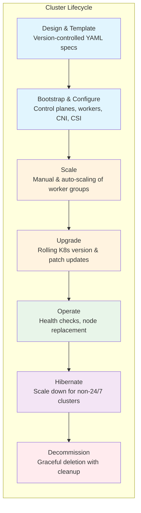
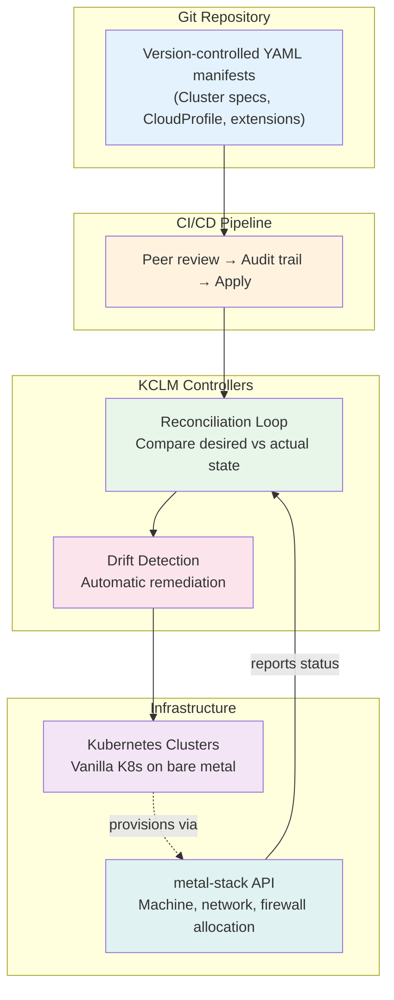
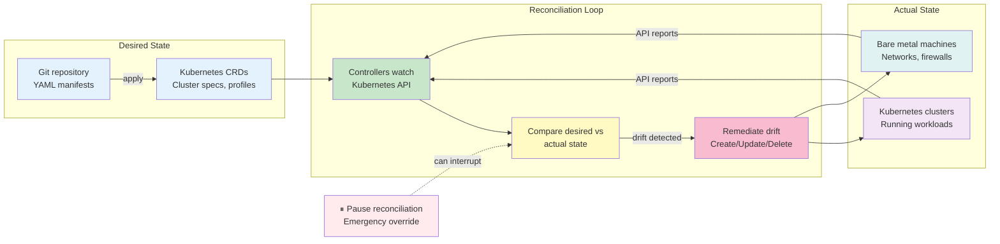

# Kubernetes Cluster Lifecycle Management

Kubernetes Cluster Lifecycle Management (KCLM) is the foundation of metal-stack's **Kubernetes as a Service** solution — enabling organizations to provision, operate, and decommission production-grade Kubernetes clusters on bare metal with the same ease and reliability as hyperscaler managed services, while retaining full control over the underlying infrastructure.

## Why Kubernetes Cluster Lifecycle Management?

Running Kubernetes on bare metal delivers unmatched performance, cost efficiency, and compliance advantages — but managing clusters at scale introduces significant operational complexity. Without automated lifecycle management, organizations face:

- **Manual provisioning** that is slow, error-prone, and inconsistent
- **Drift and configuration divergence** across clusters ("snowflake clusters")
- **Limited scalability** — human operators cannot manage hundreds or thousands of clusters
- **Compliance risks** in regulated environments where audit trails, isolation, and controlled change processes are mandatory
- **Operational burden** on platform teams who must manage Kubernetes internals rather than enabling developer self-service

KCLM solves these challenges by automating the entire cluster lifecycle — from design and bootstrap through scaling, upgrades, and decommissioning — while enforcing consistency, reproducibility, and separation of duties across multi-tenant environments.

## What KCLM Automates

metal-stack's KCLM solution covers the complete cluster lifecycle:

| Phase                         | Capabilities                                                                                                                                                                                 |
| ----------------------------- | -------------------------------------------------------------------------------------------------------------------------------------------------------------------------------------------- |
| **Design & Template**         | Version-controlled cluster specifications constrained by administrator-defined profiles (allowed regions, machine types, Kubernetes versions)                                                |
| **Bootstrap & Configuration** | Automated provisioning of control planes, worker nodes, CNI, CSI, and cloud controller — all reconciled to desired state                                                                     |
| **Scaling**                   | Manual and automatic scaling of worker groups with configurable strategies (max surge, max unavailable, drain timeouts)                                                                      |
| **Upgrades**                  | Rolling Kubernetes version upgrades, in-place Kubelet patch updates, and machine image updates within configurable maintenance windows (Gardener); spec-driven rolling updates (Cluster API) |
| **Node Replacement**          | Automatic health-based remediation with configurable timeouts; workload shifting to replacement nodes                                                                                        |
| **Decommissioning**           | Graceful cluster deletion with finalizer-based resource cleanup to prevent orphaned infrastructure                                                                                           |
| **Migration & Restore**       | Control plane migration across failure domains; etcd backup and automatic recovery (Gardener); clusterctl-based cluster migration between management clusters (Cluster API)                  |
| **Hibernation**               | Infrastructure scale-down for non-24/7 clusters to minimize resource waste (Gardener only)                                                                                                   |

## Kubernetes as a Service

KCLM transforms bare metal infrastructure into a **self-service Kubernetes platform** — but the degree of self-service varies significantly between the two approaches:

- **Gardener** provides a full self-service API where end-users (developers, team leads, project owners) can create clusters, manage node worker groups, configure maintenance windows, and enable/disable auto-upgrades — all limited only to whitelisted machine types and regions defined by platform administrators. Access is via standard `kubectl` with OIDC-based authorization and project-scoped permissions.
- **Cluster API** does not provide end-user self-service natively. Administrators manage the management cluster and provision clusters through GitOps workflows. If self-service is desired, a custom API layer must be built on top of Cluster API.

Platform administrators, meanwhile, focus on **providing the platform** — managing seed clusters (Gardener) or the management cluster (Cluster API), whitelisting machine types, delivering Kubernetes version updates, and ensuring fleet-wide consistency through GitOps-driven processes. This separation of responsibilities mirrors how hyperscalers operate: administrators manage the infrastructure and platform components; end-users consume the Kubernetes API and focus on their workloads.

## Two Approaches, One Infrastructure

metal-stack provides KCLM through two integration paths, both consuming the same metal-stack API for bare-metal node provisioning:

| Aspect                          | [Gardener](./02-gardener.md)                                           | [Cluster API](./03-cluster-api.md)                                                      |
| ------------------------------- | ---------------------------------------------------------------------- | --------------------------------------------------------------------------------------- |
| **Status**                      | Recommended, production-ready                                          | Beta, under active development                                                          |
| **Governance**                  | NeoNephos Foundation                                                   | CNCF (Kubernetes SIG)                                                                   |
| **Experience**                  | 7+ years in financial-sector production                                | CNCF project, metal-stack integration in development                                    |
| **Day-2 capabilities**          | Native (DNS, backup, audit, certificate rotation, maintenance windows) | Assembled through GitOps and add-on providers                                           |
| **Control plane hosting**       | Dedicated namespaces on Seed clusters (physically isolated)            | On worker nodes (CABPK) or dedicated (Kamaji, integration unevaluated)                  |
| **Operational model**           | End-user self-service via Virtual Garden API                           | Administrator-managed GitOps workflows                                                  |
| **Complexity**                  | More opinionated, higher initial setup                                 | Less opinionated, lower initial setup but higher ongoing administration                 |
| **Maintenance windows**         | Built-in, per-cluster configurable                                     | Continuous reconciliation, no built-in windows                                          |
| **Control plane resource cost** | Shared on Seed clusters (efficient)                                    | 3 dedicated nodes per cluster (wasteful) or shared via Kamaji (integration unevaluated) |
| **Use case**                    | Production fleets, regulated environments, multi-tenant platforms      | Simple deployments, teams willing to build day-2 operations                             |

Both converge on vanilla Kubernetes and metal-stack infrastructure, ensuring replaceability and vendor independence.

## Platform vs Framework: What Each Solution Does For You

The fundamental difference between Gardener and Cluster API is philosophical: **Gardener is a complete platform** (like AWS EKS or GKE), while **Cluster API is a framework** (like building your own managed Kubernetes service). This distinction drives everything else — administration burden, resource efficiency, day-2 capabilities, and operational complexity.

### Gardener: The Complete Platform

Gardener delivers a **turnkey Kubernetes as a Service platform** out of the box. When you deploy Gardener, you get:

- **Built-in day-2 operations**: DNS management, etcd backup & restore, certificate rotation, audit logging, access control lists, hibernation, shoot migration, VPN — all native, no assembly required
- **Multi-tenant self-service**: End-users create and manage clusters through a Kubernetes-native API with project isolation, quotas, and role-based access control
- **Maintenance windows**: Per-cluster configurable windows for automatic updates (Kubernetes versions, machine images) — no manual coordination
- **Version skew enforcement**: Static validation rules in the API server that cannot be circumvented, preventing incompatible Kubernetes version combinations
- **Physical isolation**: Each Shoot's control plane runs in a dedicated namespace on a Seed cluster, physically separated from end-user workloads — critical for compliance requirements
- **Fleet-wide consistency**: All components (CNI, CSI, CCM, DNS, backup) are rolled out fleet-wide with every platform release, integration-tested across the compatibility matrix

**What you build and maintain**: A Garden cluster (Gardener control plane), Seed clusters (one per data center site), and the Virtual Garden. This is significant infrastructure — typically 3-5 nodes for the Garden cluster and one Seed cluster per site. But once running, day-2 operations are largely automated.

**Administration burden**: High initial setup (deploying Garden, Seeds, extensions), but **low ongoing administration**. Once the platform is running, cluster provisioning, upgrades, backups, certificate rotation, and decommissioning are all automated. Platform administrators focus on platform updates and extension management, not individual cluster operations.

**Resource efficiency**: Control planes run as pods on Seed clusters — multiple Shoot control planes share Seed infrastructure. This is efficient for fleets but means control planes are not physically isolated from other workloads on the same Seed (though they are in dedicated namespaces).

### Cluster API + CABPK: The Bare Framework

Cluster API with the Kubeadm Bootstrap Provider (CABPK) is a **cluster provisioning framework** — it creates Kubernetes clusters but leaves everything else to you.

**What you get out of the box**:

- Cluster creation, scaling, and deletion via declarative manifests
- Machine provisioning on metal-stack infrastructure
- Add-on installation via ClusterResourceSet + CAAPH (Helm)

**What you must build yourself**:

- DNS management (no built-in DNS service)
- etcd backup & restore (no built-in operator)
- Certificate rotation (manual processes or custom tooling)
- Audit logging (configure via kubeadmConfigSpec, no centralized management)
- Maintenance windows (none — CAPI reconciles continuously)
- Version skew enforcement (not strictly enforced — risk management is your responsibility)
- Hibernation (no built-in capability)
- Cluster migration (no built-in capability)
- Multi-tenant self-service (no built-in project isolation, quotas, or user API)
- Access control lists (no built-in firewall controller)

**Resource waste**: With CABPK, each cluster's control plane runs on dedicated worker nodes. For high availability, you need **3 control plane nodes per cluster** — nodes that exist solely to run kube-apiserver, etcd, controller-manager, and scheduler. These nodes cannot run user workloads. For a fleet of 10 clusters, that's 30 nodes wasted on control planes alone. This is a significant cost multiplier.

**Administration burden**: Low initial setup (just the management cluster), but **very high ongoing administration**. Every day-2 task — certificate rotation, backup management, DNS configuration, audit policy management, version upgrades — must be built, tested, and maintained by your team. Each cluster upgrade requires manual coordination. There are no maintenance windows, no version skew enforcement, and no automated failure recovery beyond basic MachineHealthCheck.

**Philosophy**: CAPI+CABPK is for teams that want maximum flexibility and are willing to invest significant engineering effort to build their own managed Kubernetes platform. It's the difference between buying AWS EKS and building your own EKS on EC2.

### Cluster API + Kamaji: The Middle Ground

Kamaji acts as a Control Plane Manager for Cluster API, running tenant control planes as pods within the management cluster rather than on dedicated worker nodes.

**What Kamaji adds over CABPK**:

- **Resource efficiency**: Multiple tenant control planes share management cluster infrastructure — no dedicated control plane nodes per cluster. A single management cluster can host dozens of tenant control planes
- **Physical isolation**: Control planes run in dedicated namespaces, separate from worker node workloads
- **Multi-tenant capability**: Built-in support for multiple tenant clusters on shared infrastructure

**What you still must build yourself** (same as CABPK):

- DNS, backup, certificate rotation, audit logging, maintenance windows, version skew enforcement, hibernation, cluster migration, multi-tenant self-service, ACLs

**Resource efficiency**: Dramatically better than CABPK. Instead of 3 dedicated nodes per cluster for control planes, you share management cluster capacity across all tenants. For a fleet of 10 clusters, you might need only 3-5 management cluster nodes total.

**Administration burden**: Still high ongoing administration — Kamaji solves the control plane hosting problem but not the day-2 operations problem. You still assemble and maintain all day-2 tooling through GitOps workflows.

**Status**: Kamaji integrations with metal-stack have not been evaluated in production-grade scenarios by metal-stack. Kamaji itself is used in production elsewhere; it is the metal-stack integration that lacks our validation. It is a promising approach for resource efficiency but carries higher risk for production workloads.

### Decision Matrix

| Aspect                              | Gardener                                                          | CAPI + CABPK                                               | CAPI + Kamaji                                             |
| ----------------------------------- | ----------------------------------------------------------------- | ---------------------------------------------------------- | --------------------------------------------------------- |
| **Philosophy**                      | Complete platform (buy)                                           | Framework (build)                                          | Framework + shared control planes                         |
| **Day-2 operations**                | All built-in, automated                                           | Build everything yourself                                  | Build everything yourself                                 |
| **Control plane nodes per cluster** | Shared on Seeds (efficient)                                       | 3 dedicated nodes (wasteful)                               | Shared on management cluster (efficient)                  |
| **Resource waste for 10 clusters**  | Minimal                                                           | ~30 nodes wasted                                           | Minimal                                                   |
| **Multi-tenant self-service**       | Built-in (projects, quotas, API)                                  | Build yourself                                             | Build yourself                                            |
| **Maintenance windows**             | Built-in, per-cluster                                             | None                                                       | None                                                      |
| **Version skew enforcement**        | Enforced by API server                                            | Not enforced                                               | Not enforced                                              |
| **Certificate rotation**            | Automated (8-hour windows)                                        | Manual/custom                                              | Manual/custom                                             |
| **etcd backup & restore**           | Built-in (etcd-druid)                                             | Build yourself                                             | Build yourself                                            |
| **Hibernation**                     | Built-in                                                          | Not available                                              | Not available                                             |
| **Shoot/Cluster migration**         | Built-in                                                          | Not available                                              | Not available                                             |
| **Initial setup complexity**        | High (Garden + Seeds)                                             | Low (management cluster)                                   | Low (management cluster)                                  |
| **Ongoing administration**          | Low (platform updates)                                            | Very high (build & maintain everything)                    | Very high (build & maintain everything)                   |
| **Production readiness**            | 7+ years, 10,000+ clusters                                        | Beta, metal-stack integration in development               | Not evaluated with metal-stack                            |
| **Best for**                        | Production fleets, regulated environments, multi-tenant platforms | Simple deployments, teams with strong Kubernetes expertise | Resource-constrained fleets, teams willing to accept risk |

:::tip[Recommendation]
For production workloads, regulated environments, or any scenario where you need multi-tenant self-service with minimal ongoing administration, **Gardener is the clear choice**. The platform approach eliminates the need to build and maintain day-2 operations tooling, enforces version skew policies, and provides physical isolation between control planes and workloads.

Cluster API with CABPK is only recommended for simple, single-cluster deployments where you accept the resource waste of dedicated control plane nodes and the ongoing administration burden of building your own day-2 operations. Cluster API with Kamaji offers better resource efficiency but carries higher risk, as we have not evaluated that integration in production-grade scenarios.
:::

## Core Concepts

These concepts apply to both Gardener and Cluster-API approaches.

### Domain Abstraction

KCLM separates lifecycle management concerns from adjacent domains through well-defined contracts and extension points. Bare-metal provisioning, networking, storage, and Kubernetes distribution are integrated via provider extensions that implement generic interfaces — allowing each domain to evolve independently without requiring changes to the lifecycle orchestrator. This contract-based approach ensures that KCLM components do not depend on any specific infrastructure provider, and multiple domains can run in parallel.

### Declarative State & GitOps

The intended cluster state is defined declaratively in version-controlled YAML manifests stored in Git repositories, serving as the single source of truth. Changes are applied by updating specifications in the repository, with CI/CD pipelines enforcing peer review, audit trails, and rollback capability. This GitOps-driven workflow prevents configuration drift and ensures every cluster is reproducible from its manifest.

### Reconciliation & Drift Detection

KCLM follows an orchestration-driven model where controllers run continuous reconciliation loops, comparing the current state against the desired state defined in version-controlled specs. Drift is detected at an early stage and remediated automatically without manual intervention. In emergency situations, operators can pause reconciliation to prevent unintended changes. When controllers cannot self-heal, monitoring integrations alert operators.

### Replaceability & Vendor Independence

KCLM produces clusters built on **vanilla Kubernetes** — no forks or patches. As long as a replacement lifecycle management tool supports vanilla Kubernetes, migration requires no action on the cluster side. The contract-based integration model means that replacing the KCLM orchestrator or the infrastructure provider does not force changes to the Kubernetes distribution or the workloads running on it.

## High Availability & Failure Domains

KCLM supports multiple control plane topologies for on-prem failure domains. The available options differ between Gardener and Cluster API:

| Topology                | Gardener                                                                                                                                                                                                                                                    | Cluster API                                                                                                                                                                                                     |
| ----------------------- | ----------------------------------------------------------------------------------------------------------------------------------------------------------------------------------------------------------------------------------------------------------- | --------------------------------------------------------------------------------------------------------------------------------------------------------------------------------------------------------------- |
| **Single-site HA**      | Multiple control plane nodes across machines in the same Seed with etcd spread for quorum. Default production-confirmed choice.                                                                                                                             | Multiple control plane Machines within a single partition with etcd replicas on separate Machines. Natively supported.                                                                                          |
| **Multi-rack**          | Shoot control plane nodes spread across multiple racks within one Seed with etcd spread across racks. Rack-level failure isolation via MachineDeployment topology spread constraints.                                                                       | Multi-failure-domain topology distributes control plane Machines across multiple zones or regions with etcd spread accordingly. Natively supported through ClusterClass topology definitions.                   |
| **Multi-site**          | Shoot control planes replicated across Seeds corresponding to different sites or data centers. MachineDeployments use zone constraints to distribute workers across regions. Higher latency for cross-seed communication requires multi-seed configuration. | Control plane Machines deployed across multiple CAPI management clusters or across widely separated MetalPools with cross-site etcd replication. Requires additional operator effort for cross-site networking. |
| **Dedicated isolation** | A Shoot gets its own dedicated Seed cluster with no shared control plane with other tenants. Highest compliance level for critical infrastructure at highest resource cost.                                                                                 | A dedicated Cluster with its own isolated MetalPool and exclusive use of MetalPools. Same isolation level as Gardener's dedicated Seed for critical infrastructure.                                             |

Worker nodes are automatically distributed across racks using a rack-spreading algorithm, and well-known Kubernetes topology labels (`machine.metal-stack.io/rack`, `machine.metal-stack.io/chassis`, `topology.kubernetes.io/region`, `topology.kubernetes.io/zone`) are provided on nodes — enabling end-users to configure Pod topology spread and anti-affinity rules. With MEP-19 (metal-stack Enhancement Proposal 19), routing across data center partitions will also be supported, allowing worker nodes to reside in separate metal-stack partitions while maintaining a single Kubernetes cluster — provided the partitions are geographically close enough for stable low-latency connectivity.

Failure scenarios are engineered for automation:

- **Worker failures** — Automatic health-based replacement within configurable health timeouts (default monitored by node-problem-detector in Gardener; MachineHealthCheck in Cluster API)
- **HA control plane** — Orchestrated three-node etcd clusters spread across the cluster topology with pod disruption budgets and topology spread constraints
- **etcd backups** — Scheduled full and incremental snapshots (typically three-minute deltas) enable automatic recovery from data loss
- **Accidental deletion protection** — Configurable backup retention allows emergency access to cluster resources before cleanup
- **BGP Anycast** — Spreads traffic across partitions and automatically routes around unreachable nodes within seconds

:::note[Management plane availability]
The KCLM management layer is designed so that its absence does not impact cluster availability. Workloads continue running and end-users retain Kubernetes API access even when the management plane is unavailable. Outages of the Gardener cluster or the management cluster only cause cluster provisioning to become unavailable.
:::

## Upgrades, Rollback, and Change Management

**Upgrade strategies** — For minor Kubernetes version upgrades, Gardener rolls worker groups according to a configurable rollout strategy (max surge, max unavailable, drain timeouts). For patch updates, Gardener applies in-place Kubelet upgrades within a jittered 5-minute window, preventing vanishing of route announcements for more than one node at a time. Cluster API orchestrates a one-by-one worker node roll triggered by spec updates.

**Blue-green updates** — End-users can achieve zero-downtime upgrades through two approaches: (1) using multiple clusters with BGP Anycast to spread workloads across clusters, or (2) using worker groups or machine pools with different Kubernetes kubelet versions and OS versions, combined with Kubernetes node taints and tolerations for traffic routing.

**Rollback** — Kubernetes versions are not allowed to be rolled back. End-users are required to test Kubernetes upgrades in a staging cluster first. Tools exist to test for deprecated APIs before running the actual upgrade.

**Downtime expectations** — With Gardener's HA control plane feature enabled, no downtime is expected during regular version or Kubernetes upgrades. In-place Kubelet upgrades happen within a jittered 5-minute window. MetalLB follows a one-by-one rolling update strategy so that route announcements only occur node-by-node until the speaker daemon set pod reports readiness again. Cluster API triggers an orchestrated worker roll, updating control planes and kubelets one-by-one.

## Audit & Traceability

Kubernetes API audit policies are configurable per cluster, with logs forwarded to external sinks (e.g., Splunk, S3) for auditable change tracking:

- **Gardener** — The `gardener-extension-audit` extension allows shoot owners or operators to configure buffered forwarders to audit sinks. Audit policies for the kube-apiserver are configured via standard Kubernetes Policy manifests, with each cluster having its own set of policies. The same extension can be configured for the Garden cluster's apiserver.
- **Cluster API** — Audit configuration can be passed to the kube-apiserver via the `kubeadmConfigSpec` of the `KubeadmControlPlane` resource before cluster creation. The management cluster's kube-apiserver audit also needs to be configured separately. Cluster API does not provide a centralized audit management toolset and relies on cloud-native standards to be set up by the operator.

## Day-2 Operations, HA, and Advanced Topics

The following topics differ significantly between the two solutions and are therefore covered on the individual solution pages:

| Topic                | Gardener                                                                                 | Cluster API                                                                                                |
| -------------------- | ---------------------------------------------------------------------------------------- | ---------------------------------------------------------------------------------------------------------- |
| Day-2 operations     | [Operational features](./02-gardener.md#operational-features) — built-in                 | [What to build yourself](./03-cluster-api.md#what-to-build-yourself) — assembled through GitOps            |
| HA & failure domains | [Control plane topologies](./02-gardener.md#control-plane-topologies)                    | [Control plane topologies](./03-cluster-api.md#control-plane-topologies)                                   |
| Add-on lifecycle     | [Operational features](./02-gardener.md#operational-features) — fleet-wide               | [Fleet management](./03-cluster-api.md#fleet-management-and-gitops) — per cluster via `ClusterResourceSet` |
| Version policy       | [Version skew policy](./02-gardener.md#version-skew-policy) — enforced by the API server | [Operational model](./03-cluster-api.md#operational-model) — risk management via approval gates            |
| Upgrades & rollback  | [Upgrade & rollback](./02-gardener.md#upgrade--rollback)                                 | [Upgrade & rollback](./03-cluster-api.md#upgrade--rollback)                                                |
| Audit & traceability | [Audit & traceability](./02-gardener.md#audit--traceability)                             | [Fleet management](./03-cluster-api.md#fleet-management-and-gitops)                                        |

## Network Integration

KCLM interacts with network automation systems through the cloud provider contract. During cluster creation, private node networks are automatically allocated, firewall rules are generated from cluster policies, and public IPs for LoadBalancer services are dynamically assigned. The [metal-ccm](./04-cloud-controller-manager.md) (cloud controller manager) bridges Kubernetes services with the underlying bare-metal networking stack, supporting MetalLB in BGP mode for IP address announcement. CNIs leverage the native routing infrastructure and auto-detect MTU requirements.

## Bootstrap & Air-Gapped Environments

KCLM bootstraps clusters using OCI-registry-pulled images and bootstrap tokens that work once for node joining. All cluster components — including the node agent, kubelet, CNI, and CSI — are pulled from registries that must be reachable from the target environment. This model supports air-gapped deployments where all required images are pre-pulled into a local registry. Clusters only reach ready state when all worker nodes have joined, VPN is established, and all managed resources are healthy.

## What Makes metal-stack KCLM Great

The combination of metal-stack's bare-metal infrastructure with KCLM delivers unique advantages:

### Physical Isolation for Compliance

Kubernetes control planes run in dedicated namespaces or seed clusters, physically separated from end-user workloads on metal-stack partitions. Operator-managed components are inaccessible to cluster owners — critical for compliance requirements.

### Fleet-Wide Consistency

Every cluster is provisioned from version-controlled YAML manifests with thorough integration testing across the compatibility matrix. No exceptions, no snowflake clusters — all features implemented as Kubernetes controllers and carried out fleet-wide.

### Automatic Failure Recovery

Controllers continuously reconcile desired state against actual state. Failed nodes are automatically detected and replaced within configurable health timeouts. Workloads shift seamlessly to replacement nodes without manual intervention.

### Topology Awareness

metal-stack distributes worker nodes across racks using a rack-spreading algorithm and provides well-known Kubernetes topology labels — enabling end-users to configure Pod topology spread and anti-affinity rules for high availability.

### Zero Downtime for Management Outages

The KCLM management layer is designed so that its absence does not impact cluster availability. Workloads continue running and end-users retain Kubernetes API access even when the management plane is unavailable.

### Proven at Scale

metal-stack with Gardener operates environments with **280 Kubernetes clusters** across **5 data centers** and **1,800 physical servers** (including 200 servers in a metro environment across disjunct locations). The largest observed clusters hold 64 nodes; metal-stack itself supports up to 1,024 nodes per cluster. Proven Gardener installations elsewhere manage **10,000+ clusters** — demonstrating that consistent, automated lifecycle management is the key to scaling bare-metal Kubernetes fleets. For Cluster API, the integration test environment covers a management cluster with three worker nodes, with the biggest test clusters including 8 cluster nodes.
