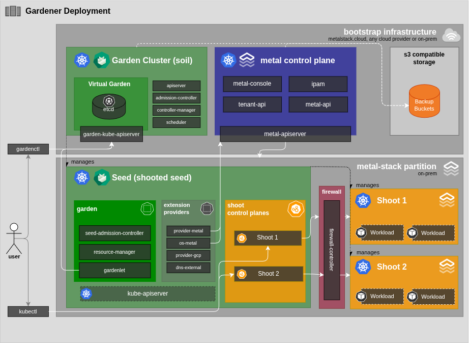
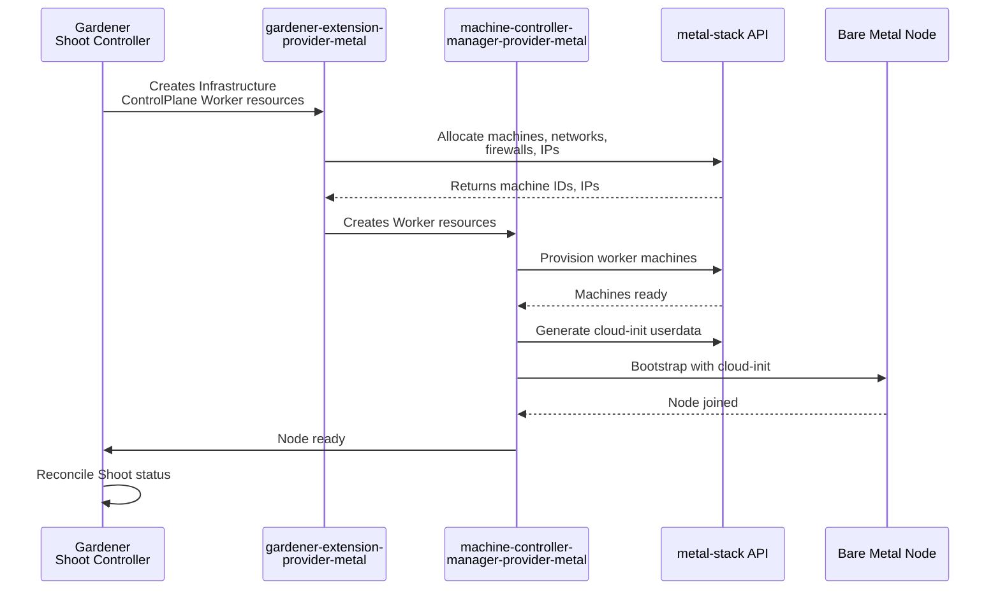

# Gardener

[Gardener](https://gardener.cloud/) is an open source project for orchestrated Kubernetes cluster provisioning governed by the NeoNephos Foundation. It supports many different cloud providers, metal-stack being one of them. Using the Gardener project, metal-stack can act as a machine provider for Kubernetes worker nodes.

Gardener is the **recommended** Kubernetes Cluster Lifecycle Management (KCLM) solution for metal-stack. It is battle-tested in production for over seven years at financial-sector customers and bundles more day-2 capabilities natively (DNS, backup, audit). Gardener manages entire clusters as Kubernetes-native resources with a strong separation between platform operators and end-users.

This page describes **what** Gardener with metal-stack does and why. For **how** to deploy it, see the [Gardener deployment guide](../04-For%20Operators/03-Deployment/05_gardener.md); for the comparison with the alternative, see the [KCLM overview](./01-kclm.md#two-approaches-one-infrastructure).

## Outcomes

Gardener targets three primary outcomes for bare-metal Kubernetes operations:

- **Automation:** Gardener reconciliation loops across Shoot, Seed, and extension CRDs automate design, bootstrap, scaling, upgrades, and decommission end-to-end. The machine-controller-manager handles node lifecycle (create, replace, drain) automatically. Certificate rotation, ETCD backup, and add-on installation are built-in extensions.
- **Reproducibility:** Every Gardener Shoot cluster is a Git-versioned YAML manifest with a CloudProfile constraining versions, machine types, and regions. Infrastructure definitions, extension Helm charts, and seed configurations are version-controlled. GitOps operators deploy those manifests via CI/CD pipelines enabling peer review, audit trails, and rollback.
- **Risk reduction:** Gardener isolates each Shoot's control plane in its own namespace with dedicated ETCD, physically separated from end-user workloads on metal-stack partitions. Operator-managed control plane components (kube-apiserver, ETCD) are inaccessible to Shoot owners. etcd-druid provides continuous backup and automatic recovery. Admission controllers, health probes, and readiness gates reject misconfigurations early.

## Architecture

Gardener uses a hierarchical cluster model — often called the "kubeception" model — where Kubernetes clusters host other Kubernetes clusters. This architecture provides physical isolation between the Kubernetes control plane and end-user workloads, which is critical for compliance in regulated environments.

### Cluster Hierarchy

The diagram below shows the full deployment architecture — from the bootstrap infrastructure hosting the Garden Cluster (which can run on metal-stack cloud, any cloud provider, or on-prem), through the metal control plane, down to the metal-stack partition where Seeds provision Shoot clusters with their workloads. The firewall-controller in the partition integrates with the metal-stack firewall for Shoot network isolation.

### Core Components

| Component          | Responsibility                                                                                                                                                                                                                                                                         |
| ------------------ | -------------------------------------------------------------------------------------------------------------------------------------------------------------------------------------------------------------------------------------------------------------------------------------- |
| **Garden cluster** | The top-level cluster that runs the Gardener control plane (API server, controller manager, scheduler, admission controller). Deployed via the `gardener-operator`.                                                                                                                    |
| **Virtual Garden** | A recommended deployment pattern where Gardener runs inside a virtual cluster on the Garden cluster. This provides a dedicated ETCD for Gardener resources and an independent update lifecycle from the Garden cluster itself. End users get project namespaces in the virtual garden. |
| **Seed cluster**   | A cluster where a `gardenlet` agent runs. The gardenlet connects to the Gardener control plane and orchestrates provisioning of new clusters within that Seed. Typically one Seed per data-center site. A Seed that has been manually deployed (not by Gardener) is called a **soil**. |
| **Shoot cluster**  | Every fully provisioned and managed Kubernetes cluster. The Shoot's control plane (kube-apiserver, etcd, controller-manager, scheduler) runs as pods in a dedicated namespace on a Seed, while worker nodes run on bare-metal machines provisioned via the metal-stack API.            |

### Core Controllers

| Controller                    | Purpose                                                                                  |
| ----------------------------- | ---------------------------------------------------------------------------------------- |
| `gardener-operator`           | Deploys Gardener components, gardenlets, and extensions; manages platform updates        |
| `gardener-apiserver`          | Extends the kube-apiserver with Gardener-specific resources (Shoot, Seed, Project, etc.) |
| `gardener-scheduler`          | Decides where clusters are placed across the Gardener landscape (Seeds)                  |
| `gardener-controller-manager` | Reconciles common Gardener resources (projects, controller installations, etc.)          |
| `gardenlet`                   | Agent running on each Seed; orchestrates provisioning of new clusters within that Seed   |
| `gardener-resource-manager`   | Runs inside Shoots; reconciles desired resources and checks their health                 |
| `etcd-druid`                  | etcd cluster operator with built-in backup-restore functionality                         |
| `machine-controller-manager`  | Manages worker node lifecycle (rolling updates, health recreation, scaling)              |

### Provider Extensions

| Extension                               | Purpose                                                                                                                                                                                                                                              |
| --------------------------------------- | ---------------------------------------------------------------------------------------------------------------------------------------------------------------------------------------------------------------------------------------------------- |
| `gardener-extension-provider-metal`     | Integrates metal-stack API with Gardener (machines, networks, firewalls, IPs). See also [Cloud Controller Manager](./04-cloud-controller-manager.md) and [Firewall Controller Manager](./05-firewall-controller-manager.md) for integration details. |
| `gardener-extension-audit`              | Configures buffered forwarders to audit sinks (e.g., Splunk, S3)                                                                                                                                                                                     |
| `gardener-extension-networking-calico`  | Provides Calico CNI in shoot clusters                                                                                                                                                                                                                |
| `gardener-extension-networking-cilium`  | Provides Cilium CNI in shoot clusters                                                                                                                                                                                                                |
| `gardener-extension-shoot-dns-service`  | Provides DNS records for the Kubernetes API server; allows shoot owners to create DNS records within their project domain                                                                                                                            |
| `gardener-extension-shoot-cert-service` | Provides certificates for services exposed in shoot clusters                                                                                                                                                                                         |

### Integration Extensions

| Extension                                   | Purpose                                                                                                                   |
| ------------------------------------------- | ------------------------------------------------------------------------------------------------------------------------- |
| `os-metal-extension`                        | Translates Gardener's generic `OperatingSystemConfig` format into cloud-init (or ignition) userdata for metal-stack nodes |
| `machine-controller-manager-provider-metal` | Integrates metal-stack machine provisioning API with Gardener's MCM as an out-of-tree sidecar                             |

For a complete architecture overview with diagrams, see the [Gardener documentation](https://gardener.cloud/docs/getting-started/architecture/).

## Gardener Integration Components

During the provisioning flow of a cluster, Gardener emits resources that are expected to be reconciled by controllers of a cloud provider. metal-stack implements the following integration components:

### gardener-extension-provider-metal

The [gardener-extension-provider-metal](https://github.com/metal-stack/gardener-extension-provider-metal) contains a set of webhooks and controllers for reconciling cloud provider specific resources of `type: Metal`, which are created by Gardener during the cluster provisioning flow.

Primarily, its purpose is to reconcile `Infrastructure`, `ControlPlane`, and `Worker` resources. The project also introduces its own API (`ProviderConfiguration` resources) and consists of an admission controller to validate them.

### os-metal-extension

The [os-metal-extension](https://github.com/metal-stack/os-metal-extension) translates Gardener's generic `OperatingSystemConfig` format into cloud-init (or ignition) userdata for metal-stack nodes. It enables the operating system bootstrap process for worker nodes.

### machine-controller-manager-provider-metal

Worker nodes are managed through Gardener's [machine-controller-manager](https://github.com/gardener/machine-controller-manager) (MCM). The MCM allows out-of-tree provider implementation via sidecar, which is implemented in the [machine-controller-manager-provider-metal](https://github.com/metal-stack/machine-controller-manager-provider-metal) repository.

The MCM handles the full worker node lifecycle: creating new machines, draining and replacing unhealthy nodes, and performing rolling updates across worker groups. It prevents meltdown scenarios through configurable backoffs and watches Kubernetes node conditions continuously — certain conditions can be configured as critical, triggering health timeouts that cause automatic node replacement. The MCM also supports custom controllers that contribute to node conditions, enabling advanced health monitoring beyond the default `node-problem-detector`.

## Operational Model

Gardener differentiates between **end-users** (shoot owners) and **platform administrators** (seed owners), similar to how hyperscalers offer Kubernetes as a Service:

| Role               | Responsibilities                                                                                                                                                         |
| ------------------ | ------------------------------------------------------------------------------------------------------------------------------------------------------------------------ |
| **End-Users**      | Create/manage clusters via API (limited to whitelisted machine types), manage worker groups, trigger cluster updates, configure maintenance windows and auto-updates     |
| **Administrators** | Set up Seed clusters in data centers, whitelist machine types, provide Kubernetes versions and OS images, define lifecycle policies, fleet-wide GitOps-driven operations |

End-users access the Virtual Garden through a feature-rich Kubernetes API with OIDC-based authorization. Resources like `ShootQuota` and custom webhooks can further restrict what end-users can do and ensure that they operate only within their specific, operational boundaries. As the API of Gardener is provided by Kubernetes itself, it is also an option to further narrow down the end-user scope by hiding the Gardener API behind a custom API. Platform administrators manage the entire platform through GitOps-driven processes with approval workflows.

Gardener clearly defines responsibility boundaries — administrators manage the control plane lifecycle, CNI, CSI drivers, and other platform components, while end-users focus on their workloads. Components on the worker nodes like the Kubelet or CNI/CSI pods are continuously monitored and reconciled to the desired state, which makes it hard for end-users to misconfigure essential cluster components. The `node-problem-detector` is deployed by default to contribute node conditions that the machine-controller-manager watches for health timeouts. Custom controllers can also contribute node conditions for advanced health monitoring. Features like auto-updates for Kubernetes versions or machine images can be enabled and disabled by end-users individually and are carried out by Gardener in configurable maintenance time windows.

## Failure Domains

From a Kubernetes Cluster Lifecycle Management perspective, managing multiple failure domains is essential — allowing clusters to be provided in different geographical locations and enabling end-users to distribute workloads across different failure domains. To make topology information available in the resulting Kubernetes clusters, metal-stack's KCLM integrations automatically provide well-known Kubernetes topology labels on the node resources:

- `machine.metal-stack.io/chassis`
- `machine.metal-stack.io/rack`
- `topology.kubernetes.io/region`
- `topology.kubernetes.io/zone`

While metal-stack distributes cluster worker nodes across racks automatically using a rack-spreading algorithm, information like region and zone comes from the end-user's requirements. With this information, Kubernetes features like Topology Spread and PodAntiAffinity can be configured easily by end-users. With MEP-19 (metal-stack Enhancement Proposal 19), routing across data center partitions will also be supported, allowing worker nodes to reside in separate metal-stack partitions while maintaining a single Kubernetes cluster — provided the partitions are geographically close enough for stable low-latency connectivity.

The KCLM is designed so that every failure domain can function without the KCLM itself — meaning the absence of the KCLM does not impact the availability of the Kubernetes clusters or the network traffic. Outages of the Gardener cluster only cause cluster provisioning to become unavailable, without interrupting workloads or preventing end-users from interacting with the Kubernetes API of their clusters.

## Control Plane Hosting

In Gardener, the Kubernetes control planes for end-user clusters reside in so-called "seed clusters". In the metal-stack case, the seed clusters run on bare metal servers and are physically divided from the end-user worker nodes. Seed clusters can run at geographically different locations from the worker nodes. A secure connection between the Kubernetes control plane and components running on the worker nodes is established using VPN. It is also possible with Gardener to migrate Kubernetes control planes across seed clusters if necessary (shoot migration).

There is a clear distinction between administrators, who are responsible for the Kubernetes control plane to run, and end-users, which only consume the provided Kubernetes API. This hosting model is mandatory in Gardener and suits well for pairing with bare metal in compliance-sensitive environments.

## Control Plane Topologies

Gardener supports multiple control plane topologies for on-prem failure domains:

| Topology           | Description                                                                                                                                                                                                                                                 | Use Case                                                      |
| ------------------ | ----------------------------------------------------------------------------------------------------------------------------------------------------------------------------------------------------------------------------------------------------------- | ------------------------------------------------------------- |
| **Single-seed HA** | Multiple control plane nodes (kube-apiserver, controller-manager, scheduler) across machines in the same Seed with etcd spread across machines for quorum. Default production-confirmed choice.                                                             | Single-site deployments, standard production                  |
| **Multi-rack**     | Shoot control plane nodes spread across multiple racks within one Seed with etcd spread across racks. Rack-level failure isolation via MachineDeployment topology spread constraints.                                                                       | Rack-level failure isolation within a single data center      |
| **Multi-site**     | Shoot control planes replicated across Seeds corresponding to different sites or data centers. MachineDeployments use zone constraints to distribute workers across regions. Higher latency for cross-seed communication requires multi-seed configuration. | Disaster recovery across geographically separated sites       |
| **Dedicated Seed** | A Shoot gets its own dedicated Seed cluster with no shared control plane with other tenants. Highest compliance level for critical infrastructure at highest resource cost.                                                                                 | Strictest compliance requirements for critical infrastructure |

All topologies are natively supported. Multi-site requires additional multi-seed configuration but no special extensions.

## Upgrade & Rollback

**Minor version upgrades** — Gardener rolls worker groups according to a configurable rollout strategy (drain timeouts, serial stateful set eviction, max surge and max unavailable nodes). For patch updates, Gardener applies in-place Kubelet upgrades within a jittered 5-minute window, preventing vanishing of route announcements for more than one node at a time.

**Blue-green updates** — End-users can achieve zero-downtime upgrades through two approaches: (1) using multiple clusters with BGP Anycast to spread workloads across clusters, or (2) using worker groups with different Kubernetes kubelet versions and OS versions, combined with Kubernetes node taints and tolerations for traffic routing.

**Rollback** — Kubernetes versions are not allowed to be rolled back. End-users are required to test Kubernetes upgrades in a staging cluster first. Tools exist to test for deprecated APIs before running the actual upgrade.

**Downtime expectations** — With HA control plane enabled, no downtime is expected during regular version or Kubernetes upgrades. When upgrading MetalLB in a shoot cluster, it follows a one-by-one rolling update strategy so that route announcements only occur node-by-node until the speaker daemon set pod reports readiness again.

## Domain Model

The KCLM integrates with adjacent domains based on contracts. This way, the domains can be used without requiring direct upstream contributions to the KCLM but rather extend it and ideally run multiple domains in parallel. Gardener does not depend in any form on metal-stack components or APIs nor does it depend on other adjacent domains. metal-stack has implemented the integration in the form of extensions:

- **Bare metal machine provisioning** — Abstraction through `CloudProfile`, which is referenced in a Shoot resource. Provider extensions can then implement the contracts for provisioning a cluster. For metal-stack this is the `gardener-extension-provider-metal`.
- **Network** — Abstraction through Kubernetes CNI, provider and network extensions. Gardener itself is unaware of the concrete network infrastructure that it provisions clusters on. Network extensions allow setting up CNIs like Cilium, Calico or others while provider extensions can set up infrastructure resources dynamically during provisioning.
- **Storage** — Abstraction through Kubernetes CSI, provider and storage extensions. Identical to network.
- **Kubernetes Distribution** — Gardener creates a Shoot cluster with vanilla Kubernetes components from the upstream Kubernetes project. No other Kubernetes distributions are supported.

Gardener produces clusters built on vanilla Kubernetes that passes 100% CNCF Kubernetes conformance. It provisions and manages upstream Kubernetes distributions without modification — no fork or patched Kubernetes is used. As long as a replacement KCLM also supports vanilla Kubernetes, no action is required.

## Operational Features

Gardener provides several day-2 operational capabilities out of the box:

- **Shoot migration** — Control planes can be migrated across Seed clusters for geographic relocation
- **VPN** — Secure connection between control plane components on Seeds and worker nodes
- **Scaling** — Manual and automatic scaling of worker groups with configurable strategies (max surge, max unavailable, drain timeouts); Cluster Autoscaler automatically adjusts worker groups based on requested pod resources
- **Hibernation** — Scale down infrastructure by deleting worker nodes and scaling down control plane components; can be triggered manually or by schedule
- **Maintenance time windows** — End-user configurable windows for automatic updates (Kubernetes versions, machine images)
- **Certificate rotation** — Automated certificate management for cluster components and shoot services; certificates are rotated in short time frames (8 hours). For certain components (e.g., CA of the Kubernetes API server), rotation is a two-phase process: first the new CA is added (giving users time to reconfigure clients), then the old CA is removed in a completion phase
- **etcd backup & restore** — Continuous etcd backups with automatic recovery via etcd-druid (typically configured with three-minute incremental deltas); configurable backup retention allows emergency access to cluster resources after accidental shoot deletion, which is further protected by special labels that prevent accidental shoot deletion. Shoot deletion is safeguarded by specific annotations — during deletion, Gardener attempts to clean up resources gracefully by triggering finalizers of controllers deployed into the shoot cluster, preventing orphaned external resources
- **DNS management** — Automatic DNS record creation for shoot API servers and cluster-internal services
- **Audit logging** — Configurable per-cluster audit policies with forwarding to external sinks
- **Access control lists** — Network-level access control for shoot clusters
- **Emergency reconciliation pause** — Operators can use Kubernetes annotations on seed resources to prevent shoot cluster reconciliation in emergency situations
- **Image vector overwrites** — Administrators can perform emergency patching fleet-wide by configuring image vector overwrites in the Gardener deployment Git repository, validated in staging environments before rollout. Emergency patches for OS images can also be offered through the `CloudProfile` and automatically applied within configured maintenance time windows for clusters with auto-upgrade enabled
- **Component upgrades** — Essential cluster components (CNI, CSI, CCM, DNS, audit) are rolled out with every new Gardener version fleet-wide, ensuring consistency across the entire landscape. End-users focus on their workloads without needing to manage Kubernetes internals

## Bootstrap & Air-Gapped Environments

Gardener uses a built-in bootstrap mechanism based on the `gardener-node-agent`. The kubelet and gardener-node-agent are both pulled from an OCI registry just like all other components running in the final cluster. This OCI registry must be reachable from within the (air-gapped) environment and must contain all images of the Gardener release's compatibility matrix.

The kubelet is joined using a bootstrap token that is generated during the shoot provisioning workflow and only works once from the node to join the control plane. After a creation timeout in the machine-controller-manager (by default 20 minutes) the token gets recreated with another attempt to join the worker node with a new machine.

Shoot clusters only reach ready state when all worker nodes have successfully joined, shoot VPN is running, and all managed resources (includes CNI, CSI, etc.) are healthy and running.

## External Dependencies

The following data center infrastructure dependencies are treated as given and must be available before deploying Gardener:

- **DNS** — For cluster domain resolution (PowerDNS or external)
- **NTP** — Time synchronization across all nodes
- **ACME** — Certificate authority (for shoot certificates via shoot-cert-service)
- **S3-compatible object storage** — For etcd backups (gardener-extension-backup-s3)
- **Git-Hosting with CI/CD** — For GitOps-driven deployment of manifests
- **MetalLB** — For exposing Kubernetes API servers of Shoot clusters (layer 2 load balancing)

## Scalability

With the described operational model it is possible to scale massively. metal-stack operates an environment with **280 Kubernetes clusters** across **5 data centers** and **1,800 physical servers**. Proven Gardener installations manage **10,000+ clusters** — demonstrating that consistent, automated lifecycle management is the key to scaling bare-metal Kubernetes fleets. The key behind this high degree of scalability is that all clusters are provided consistently, providing a high level of integration testing and avoiding custom provisioning solutions.

End-users can test minor Kubernetes upgrades first in clusters labeled `evaluation` or `development` before rolling out to `production`-labeled clusters. For evaluation clusters, auto-upgrades for Kubernetes and OS images can be enabled to stage updates, reduce manual effort, and gain security patches more quickly. Deprecation of Kubernetes versions can be configured in the `CloudProfile`, and end-users can pin worker group Kubernetes versions as long as the version skew policy is adhered. The Cluster Autoscaler automatically adjusts worker groups based on requested pod resources.

## Version Skew Policy

Gardener enforces Kubernetes version skew policies through static validation rules in the `gardener-apiserver` that cannot be circumvented. Worker group versions can be pinned as long as the skew policy is respected. Minor version upgrades are applied one-by-one following the [Gardener version skew policy](https://gardener.cloud/docs/gardener/deployment/version_skew_policy/). For details on supported Kubernetes versions and upgrade sequencing, see the [Gardener deployment documentation](https://gardener.cloud/docs/).

## Audit & Traceability

Kubernetes API audit policies are configurable per cluster, with logs forwarded to external sinks (e.g., Splunk, S3) for auditable change tracking:

- **Shoot clusters** — The `gardener-extension-audit` extension allows shoot owners or operators to configure buffered forwarders to audit sinks. Audit policies for the kube-apiserver are configured via standard Kubernetes Policy manifests, with each cluster having its own set of policies.
- **Garden cluster** — The same audit extension can be configured for the gardener-apiserver and virtual kube-apiserver.

For configuration examples, see the [Gardener deployment guide](../04-For%20Operators/03-Deployment/05_gardener.md).
