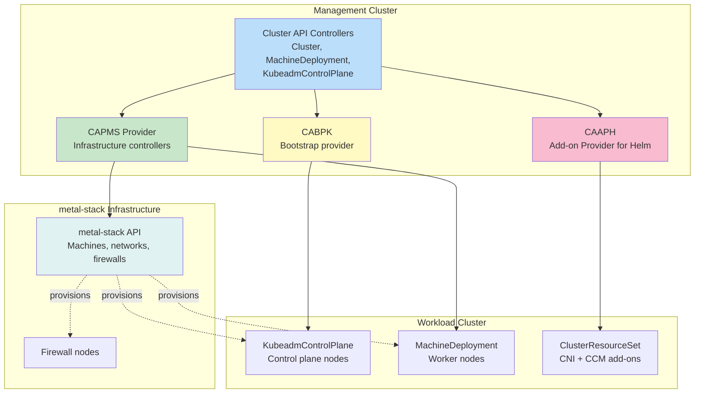

# Cluster API

[Cluster API](https://cluster-api.sigs.k8s.io/) is a Kubernetes project that aims to simplify the management of Kubernetes clusters. It provides a declarative way to create, configure, and manage clusters using Kubernetes-style APIs.

We provide the [Cluster API provider for metal-stack (CAPMS)](https://github.com/metal-stack/cluster-api-provider-metal-stack) infrastructure provider that allows the declaration of Kubernetes clusters.

:::warning[Beta]
Cluster API with metal-stack is in beta and not yet recommended for production workloads. Please use [Gardener](./02-gardener.md) for production deployments. We are actively looking for exchange and adopters — if you are interested in using Cluster API with metal-stack, please [join our community](/community) to help shape future integration efforts.
:::

For deployment instructions, see the [KCLM deployment guide](../04-For%20Operators/03-Deployment/05_kclm.md).

## Architecture

Cluster API (CAPI) is a CNCF project maintained by a Kubernetes SIG that manages clusters through a management cluster holding `Cluster`, `MachineDeployment`, and `KubeadmControlPlane` resources. A metal-stack-specific CAPI infrastructure provider translates CAPI resources into metal-stack API calls. Control plane nodes are created as Machines on metal-stack infrastructure, and node bootstrapping uses kubeadm (or alternative bootstrap providers). Add-on lifecycle is managed through `ClusterResourceSet` objects.

### Core Components

| Component | Responsibility |
|-----------|---------------|
| **Management Cluster** | A Kubernetes cluster that hosts the Cluster API controllers and the desired cluster state (as custom resources). It is the central control plane from which new workload clusters are declared and reconciled. |
| **Workload Cluster** | A Kubernetes cluster whose lifecycle is managed by the Management Cluster via CAPI resources. Its control plane and worker nodes are provisioned according to the declarative spec. |
| **Infrastructure Provider** | A set of controllers that translate CAPI's generic infrastructure resources (Cluster, Machine) into provider-specific resources. metal-stack is an officially listed infrastructure provider for Cluster API. The provider implementation is called cluster-api-provider-metal-stack (CAPMS). |
| **Bootstrap Provider** | Generates bootstrap data (e.g., cloud-init or ignition userdata) for joining new nodes. CAPMS is tested against the Kubeadm Bootstrap Provider (CABPK). |
| **ClusterResourceSet** | A CAPI feature for applying add-on resources (CNI, CCM, etc.) to newly created workload clusters automatically. CAPMS uses this with the Add-on Provider for Helm (CAAPH) for its calico flavor, to install calico as CNI and the [metal-ccm](./04-cloud-controller-manager.md). |
| **ClusterClass** | Defines reusable templates with parameterized variable schemas for tenant customization, enabling standardized cluster templates across the fleet. |
| **MachineHealthCheck** | Checks machine healthiness and takes remediation steps — unhealthy machines are automatically replaced by adding and deleting them on the infrastructure provider side, with safeguards in place (e.g., for not losing etcd quorum). |

For a complete architecture overview with diagrams, see the [Cluster API documentation](https://cluster-api.sigs.k8s.io/user/concepts#concepts).

## CAPMS CRDs

CAPMS implements the CAPI infrastructure provider contract for bare metal via metal-stack. The following CRDs are provided by CAPMS:

| CRD | Purpose |
|-----|---------|
| `MetalStackCluster` | Infrastructure cluster resource — allocates a control plane virtual IP (VIP) |
| `MetalStackMachine` | Bridges CAPI infrastructure machines to metal-stack machines (bare metal servers) |
| `MetalStackMachineTemplate` | Defines reusable machine specs (image, size, etc.) for MetalStackMachine resources |
| `MetalStackFirewallDeployment` | Declares firewall deployments protecting a cluster's network perimeter |
| `MetalStackFirewallTemplate` | Provides the configuration template for deployed firewalls |

## Operational Model

The operational model for Cluster API is less opinionated than the one described for [Gardener](./02-gardener.md). We recommend administrators to fully take care of the management cluster and control the declarative state of the entire infrastructure using GitOps-driven workflows. For this scenario, administrators provide end-users with workload clusters and end-users do not gain access to the management clusters. This approach is very controlled and does not allow end-users to provide clusters in a self-service fashion. If such a behavior is desired, we recommend developing another API layer on top of Cluster API that solves this specific purpose.

In comparison to the Gardener approach, the Cluster API model is much less complex and more versatile, allowing for more individual configurations at the cost of operational overhead, time and scalability. With the kubeadm controller there is no physical isolation between the Kubernetes control plane and the end-user. Provisioned clusters should be configured with proper RBAC permissions for end-users such that unintended misconfiguration or meltdown is prevented.

Changes need to be coordinated individually per cluster. Cluster API itself does not provide a maintenance time window and reconciles continuously instead. Unlike Gardener, the Kubernetes version skew policy is not strictly enforced in Cluster API — risk management falls within the scope of platform administration and deployment processes with approval gates.

## Control Plane Hosting

In the case of Cluster API with bootstrap provider Kubeadm (CABPK), the Kubernetes control planes reside on the worker nodes in the same cluster and are not fully isolated from the end-users. This hierarchy is a mandatory setup in Cluster API when using the Kubeadm provider.

There are other providers from the CABPK ecosystem (e.g. [Kamaji](https://kamaji.clastix.io/)), which allow similar hosting models as the one described for Gardener, where the control plane runs on dedicated infrastructure separate from worker nodes. However, those integrations have not been evaluated in production-grade scenarios — at least from our side.

### Control Plane Topologies

Cluster API supports multiple control plane topologies for on-prem failure domains:

| Topology | Description | Use Case |
|----------|-------------|----------|
| **Single-site HA** | Multiple control plane Machines within a single partition with etcd replicas on separate Machines. Natively supported. | Single-site deployments, standard production |
| **Multi-failure-domain** | Control plane Machines distributed across multiple zones or regions with etcd spread accordingly. Natively supported through ClusterClass topology definitions. | Rack/zone-level failure isolation |
| **Multi-site** | Control plane Machines deployed across multiple CAPI management clusters or across widely separated MetalPools with cross-site etcd replication. Requires additional operator effort for cross-site networking. | Disaster recovery across geographically separated sites |
| **Dedicated isolation** | A dedicated Cluster with its own isolated MetalPool and exclusive use of MetalPools. Same isolation level as Gardener's dedicated Seed for critical infrastructure. | Strictest compliance requirements for critical infrastructure |

All topologies are natively supported. Multi-site requires additional multi-pool configuration and cross-site networking setup.

### Kamaji with metal-stack

[Kamaji](https://kamaji.clastix.io/) is a Control Plane Manager for Kubernetes that runs control planes as pods within a management cluster, reducing operational overhead and costs. It supports multi-tenancy, high availability, and integrates with Cluster API as a `ControlPlaneProvider`.

Kamaji allows a similar control plane hosting model as Gardener, where the control plane runs on dedicated infrastructure separate from worker nodes.

:::warning
Kamaji integrations with metal-stack have not been evaluated in production-grade scenarios. We are actively looking for exchange and adopters — if you are interested in using Kamaji with metal-stack, please [join our community](/community) to help shape future integration efforts.
:::

Kamaji acts as a `ControlPlaneProvider` with Cluster API, while CAPMS acts as the `InfrastructureProvider`. This setup manages **tenant clusters** on metal-stack infrastructure, combining Kamaji's control plane management with metal-stack's bare-metal provisioning.

Like Cluster-API, Kamaji is a framework rather than a complete platform — operators must assemble their own day-2 tooling (CNI, CCM, DNS, backup, certificate management) and manage them through GitOps workflows.

**Deployment**

1. **Prepare management cluster** — A Kubernetes cluster to host Kamaji and CAPMS providers
2. **Install Kamaji and CAPMS** — Deploy both providers into the management cluster
3. **Create a control plane VIP** — MetalLB assigns a virtual IP for the tenant API server
4. **Generate and apply tenant cluster manifest** — Use `clusterctl generate cluster` to produce a YAML with `Cluster`, `MetalStackCluster`, `KubeadmControlPlane`, `MachineDeployment`, and `MetalStackMachine` resources, then apply it
5. **Deploy add-ons** — Install CNI (Calico) and `metal-ccm` into the tenant cluster

A working showcase is available in the [`capi-lab`](https://github.com/metal-stack/cluster-api-provider-metal-stack/blob/main/DEVELOPMENT.md#running-the-kamaji-flavor) setup, which extends the `mini-lab` with a Kamaji flavor. See our [blog post](/blog/2026/04-kamaji) for a detailed walkthrough of the architecture and setup.

**Fleet management and GitOps**

Since Kamaji with metal-stack uses Cluster-API under the hood, fleet management follows the same pattern as Cluster API. Tenant cluster manifests are generated via `clusterctl`, stored in Git, and deployed through your CI/CD pipeline.

## Domain Model

CAPI does not depend in any form on metal-stack components or APIs. metal-stack has implemented the integration in the form of the CAPMS infrastructure provider. The different domains are abstracted/integrated as follows:

- **Bare metal machine provisioning** — Abstraction through Cluster resource, which holds references to a specific control plane and infrastructure provider, for which dedicated CRDs exist. For the metal-stack integration, the dedicated resources are provided by the cluster-api-provider-metal-stack.
- **Network** — Abstraction through Kubernetes CNI, infrastructure provider and ClusterResourceSet. It is unaware of the concrete network infrastructure and the infrastructure provider can set up resources dynamically if necessary.
- **Storage** — Abstraction through Kubernetes CSI and ClusterResourceSet. Identical to network with the exception that the infrastructure provider does not really participate in providing CSI for the workload cluster.
- **Kubernetes Distribution** — CAPMS currently integrates with CABPK for installing vanilla Kubernetes via kubeadm. This relies on vanilla Kubernetes; other distributions have not been explored.

CAPI produces clusters built on vanilla Kubernetes. As long as a replacement KCLM also supports vanilla Kubernetes, no action is required.

## Outcomes

- **Automation:** CAPI reconciles Cluster, KubeadmControlPlane, and MachineDeployment CRDs from a management cluster. The metal-stack CAPI provider allocates machines, firewalls, and IPs declaratively via manifests. Scaling, upgrading, deletion, and add-on installation (via ClusterResourceSet + Helm) follow the same reconciler loop.
- **Reproducibility:** CAPI stores all resources (Cluster, ClusterClass, MachineTemplate, MetalPool) as Git-versioned YAML. ClusterClass defines reusable templates with parameterized variable schemas for tenant customization. GitOps operators (ArgoCD/FluxCD) ensure drift-free declarative delivery.
- **Risk reduction:** CAPI isolates each managed Cluster in its own namespace within the management cluster. The reconciler continuously compares actual infrastructure against desired spec. Failed nodes trigger automatic MachineHealthCheck remediation. Each managed cluster is independent, so automation errors affect only the target cluster. All operations are Git-auditable through versioned manifests.

## Network Integration

Network integration for Cluster API is currently more manual compared to Gardener. Node networks must be created manually via `metalctl` and provided as environment variables. IP addresses for the control plane also need to be allocated in advance through `metalctl`. Firewall rules are currently static and can be applied to firewall nodes; no automatic firewall controller is in place yet. Automatic network resource allocation is on the roadmap for CAPMS.

For service exposure, CAPMS uses KubeVIP in BGP mode to allocate and announce public IPs, similar to the MetalLB-based approach in Gardener.

## Air-Gapped Environments

For air-gapped deployments, follow the [Cluster API Operator air-gapped environment guide](https://cluster-api-operator.sigs.k8s.io/topics/configuration/air-gapped-environtment). All required images must be mirrored to an OCI registry reachable from the management cluster.

## Fleet Management and GitOps

You must set up your own Git repository and GitOps operator to manage cluster deployments.

**What you need to build:**

1. **Git repository** — Store cluster manifests generated via `clusterctl generate cluster <cluster-name>`. Each cluster gets its own set of YAML files containing `Cluster`, `MetalStackCluster`, `KubeadmControlPlane`, `MachineDeployment`, and `MetalStackMachine` resources.
2. **GitOps operator** — Deploy ArgoCD or FluxCD to watch your Git repository and apply manifests to the management cluster, ensuring drift-free declarative delivery.
3. **Per-cluster CI/CD** — Essential components (CNI, CCM) are rolled out on a per-cluster basis. Changes to `MachineTemplate` or `ClusterResourceSet` are staged through the Git repository with standard approval processes.

**Platform capabilities:**

- **Cluster migration** — `clusterctl move` enables moving workload cluster resources between management clusters, pausing controllers during the move to prevent worker node loss
- **Emergency patching** — Achieved through editing resources in the management cluster, e.g., update of machine OS image in the `MachineTemplate` or update of `ClusterResourceSet`. Unlike Gardener, this change is not rolled out fleet-wide automatically and should be staged through the Git repository with standard approval processes
- **Certificate rotation** — No direct workflow is described for certificate rotation at the landscape level; this is to be defined by platform administrators using manual/custom processes based on standard tooling (e.g., `kubeadm` certificate renewal)
- **Shoot deletion protection** — Special labels safeguard against accidental shoot deletion; configurable backup retention allows emergency access to cluster resources before cleanup
- **Cluster Autoscaler** — Automatic scaling of worker groups based on requested pod resources, configured per `MachineDeployment`

**Audit configuration** — Audit configuration can be passed to the kube-apiserver via the `kubeadmConfigSpec` of the `KubeadmControlPlane` resource before cluster creation. Each cluster can have its own audit policy. The management cluster's kube-apiserver audit also needs to be configured separately. Cluster API does not provide a centralized audit management toolset and relies on cloud-native standards to be set up by the operator.

## External Dependencies

The following data center infrastructure dependencies are treated as given and must be available before deploying Cluster API with metal-stack:

- **DNS** — For cluster domain resolution
- **NTP** — Time synchronization across all nodes
- **ACME** — Certificate authority
- **S3-compatible storage** — For backups
- **Git-Hosting with CI/CD** — For GitOps-driven deployment of manifests

## Scale & Testing

For Cluster API, the integration test environment covers a management cluster with three worker nodes. The biggest test clusters have included 8 cluster nodes. As both CAPI and Gardener share the same metal-stack control plane, from the metal-stack perspective it is guaranteed to work with the numbers mentioned for Gardener (200+ clusters, 5 data centers, 1,800 physical servers). Validations in CAPI are not as thoroughly implemented as in Gardener, but all usual management workflows for metal-stack clusters (creation, move, and deletion) are integration tested within a matrix of Kubernetes version, CNI, and OS version.

## Fleet Operations

Unlike Gardener, Cluster API does not provide built-in fleet-wide operations. All operational changes must be applied through GitOps-driven workflows with approval processes. The risk of platform updates can be reduced by utilizing multi-stage environments (staging → production). Cluster manifests should be validated through CI/CD pipelines before deployment to prevent misconfigurations and manage divergence across the fleet.

End-users can test Kubernetes upgrades first in clusters labeled `evaluation` or `development` before rolling out to `production`-labeled clusters. For evaluation clusters, auto-upgrades for machine specs can be enabled to stage updates and reduce manual effort.

## Upgrade & Rollback

**Minor version upgrades** — Control plane upgrades are triggered by spec updates in the `Cluster` resource, which should be managed in Git using GitOps-driven processes for deployment and approval. Cluster API orchestrates a one-by-one worker node roll. There are no maintenance time windows — CAPI reconciles continuously.

**Blue-green updates** — End-users can achieve zero-downtime upgrades through two approaches: (1) using multiple clusters with BGP Anycast to spread workloads across clusters, or (2) using worker groups or machine pools with different Kubernetes kubelet versions and OS versions, combined with Kubernetes node taints and tolerations for traffic routing.

**Rollback** — Kubernetes versions are not allowed to be rolled back. End-users are required to test Kubernetes upgrades in a staging cluster first. Tools exist to test for deprecated APIs before running the actual upgrade.

**Downtime expectations** — Every Kubernetes or machine update triggers an orchestrated worker roll, updating the Kubernetes control planes and kubelets of the worker nodes one-by-one. Unlike Gardener, there is no jittered upgrade window to prevent simultaneous route announcement vanishing.

## MEP-19 — Cross-Partition Clusters

With metal-stack Enhancement Proposal 19 (MEP-19), routing across data center partitions will be supported, allowing worker nodes to reside in separate metal-stack partitions while maintaining a single Kubernetes cluster. This requires partitions to be geographically close enough for stable low-latency connectivity. This enhancement will enable Cluster API to provision clusters with workers spread across partitions, similar to the multi-failure-domain topology.

## What to Build Yourself

Unlike Gardener, Cluster API with metal-stack requires you to assemble your own day-2 operations tooling:

- **DNS management** — No built-in DNS service; configure via external DNS providers
- **etcd backup & restore** — No built-in operator; deploy etcd-druid or similar tooling
- **Certificate rotation** — No direct workflow; use manual/custom processes based on `kubeadm` certificate renewal
- **Audit logging** — Configure via `kubeadmConfigSpec` per cluster; no centralized management
- **Maintenance windows** — None built-in; CAPI reconciles continuously
- **Version skew enforcement** — Not strictly enforced; risk management via approval gates
- **Hibernation** — Not available
- **Cluster migration** — Available via `clusterctl move` between management clusters
- **Multi-tenant self-service** — Not available; build custom API layer on top of Cluster API
- **Access control lists** — No built-in firewall controller; firewall rules are currently static

## Next Steps

- **[KCLM Overview](./01-kclm.md)** — Introduction to Kubernetes Cluster Lifecycle Management with metal-stack
- **[Gardener](./02-gardener.md)** — metal-stack's recommended, production-ready KCLM solution
- **[KCLM Deployment Guide](../04-For%20Operators/03-Deployment/05_kclm.md)** — Step-by-step deployment instructions
- **[Cluster API Documentation](https://cluster-api.sigs.k8s.io/)** — Official Cluster API documentation
