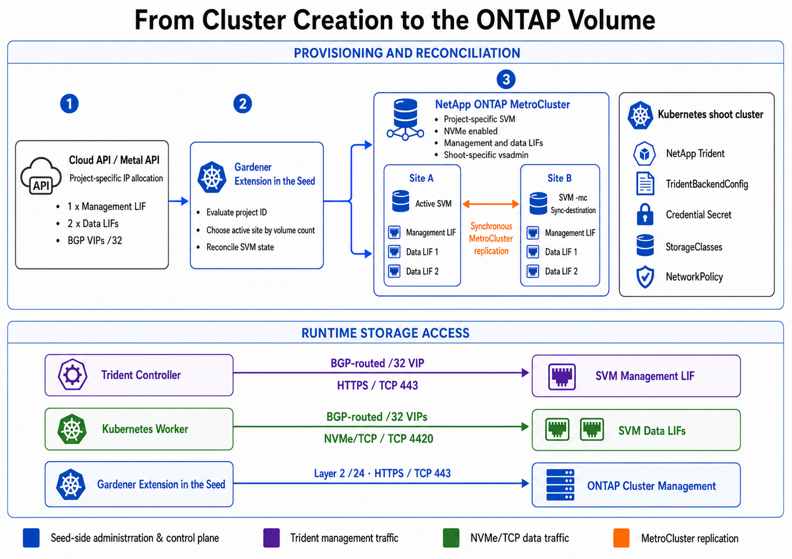

# Gardener Extension for ONTAP Documentation

> Technical background documentation for the extension, ONTAP, and their integration into metal-stack.

These pages supplement the concise project overview and development instructions in the [repository README](./README.md). They can be read independently as topic-based reference material.

---

## Topics

| Topic | Content | Start here |
|-------|---------|------------|
| **NetApp ONTAP** | ONTAP concepts, HA pairs, MetroCluster, SVMs, aggregates, LIFs, NVMe/TCP, Trident, and the PVC data path | [`./././ontap-storage.md`](ontap-storage.md) |
| **Gardener Extension for ONTAP** | Activation, inputs, reconciliation, SVM and credential lifecycle, ManagedResources, shoot webhook, and cleanup boundaries | [`./././gardener-extension-ontap.md`](gardener-extension-ontap.md) |

---

## Recommended Reading Paths

### I want to understand the storage architecture

1. [`ONTAP Storage`](ontap-storage.md) — from the physical MetroCluster to a project-specific SVM
2. [`Gardener Extension for ONTAP`](gardener-extension-ontap.md) — how the architecture is automated for a shoot cluster

### I am investigating a provisioning failure

1. [`Gardener Extension for ONTAP: Reconciliation`](gardener-extension-ontap.md#reconciliation)
2. [`Gardener Extension for ONTAP: State Inspection`](gardener-extension-ontap.md#state-inspection)
3. [`ONTAP Storage: Management and Data Paths`](ontap-storage.md#management-and-data-paths)

### I am investigating a mount or I/O failure

1. [`ONTAP Storage: From a PVC to a Volume`](ontap-storage.md#from-a-pvc-to-a-volume)
2. [`ONTAP Storage: Management and Data Paths`](ontap-storage.md#management-and-data-paths)
3. [`Gardener Extension for ONTAP: Shoot Webhook`](gardener-extension-ontap.md#shoot-webhook-and-node-preparation)

### I am planning maintenance or cleanup

1. [`ONTAP Storage: Failure Behavior`](ontap-storage.md#failure-behavior)
2. [`Gardener Extension for ONTAP: Delete Lifecycle`](gardener-extension-ontap.md#delete-lifecycle-and-responsibility-boundary)

---

## System Overview

The components have distinct responsibilities:

| Component | Responsibility |
|-----------|----------------|
| **Cloud API / Metal API** | Detects the ONTAP-enabled cluster configuration and reserves project-specific LIF addresses. |
| **Gardener extension** | Establishes the desired ONTAP and shoot state. |
| **ONTAP MetroCluster** | Stores and replicates data and provides SVMs and network endpoints. |
| **Trident** | Translates Kubernetes storage operations into ONTAP operations. |
| **Kubernetes worker** | Connects the remote block device over NVMe/TCP and mounts it into the workload. |

---

## Documentation Structure

[`gardener-extension-ontap.md`](gardener-extension-ontap.md) documents the behavior of this repository and links to the relevant source paths. [`ontap-storage.md`](ontap-storage.md) describes the wider platform and storage context in which the extension operates.
