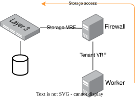
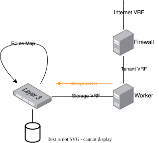
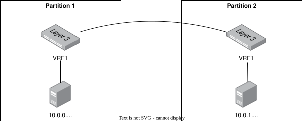
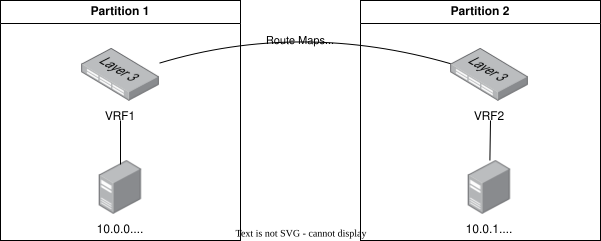

# Zone Awareness

## Current Situation

In metal-stack, the concepts of regions and zones are currently represented implicitly through partition names rather than as dedicated API entities. This design uses naming conventions to encode both region and zone information within a partition identifier. For example, the partition name `fra_eqx_01` translates to Frankfurt (region), Equinix (zone).

From a networking perspective, traffic between private node networks is not routed between partitions. To prevent misconfiguration, private networks are derived from partition-scoped `supernetworks`, preventing private node networks to be used across different partitions. Only external networks such as the Internet or Datacenter Interconnect (DCI) connections can be used to route traffic between partitions.

Additionally, all networks have disjunct IP prefixes. With the introduction of [MEP-4](../MEP4/README.md), this behavior will change: Network prefixes may overlap across partitions but must remain disjunct within a single project. This is possible since go-ipam release `v1.12.0`, which introduced the concept of network namespaces.

Every partition is a self-contained EVPN fabric. VNIs are drawn from a single, installation-wide integer pool in the `metal-api`, so a VNI identifies exactly one network in exactly one partition. Storage systems are deployed per partition and are reached by a machine through its firewall.

## Motivation

Already, with current metal-stack installations, it is possible to spread a single partition across data centers. This can be achieved through the rack spreading feature (introduced by [MEP-12](../MEP12/README.md)).

Limitations of this feature are: It can not be explicitly decided, in which racks machines are placed. Moreover, this is performed with a best-effort strategy. If no machine is available in one rack, it might get placed in the one where already a machine is present.

Another issue with this approach is that the single partition is still one failure domain, e.g. a single BGP failure could bring down the whole partition. As known from major cloud providers, zonal distribution of workload enhances availability and fault tolerance.

## Goals

This proposal explores how node networks can be connected across multiple partitions while every partition remains an independent failure domain. Three goals hold for all approaches:

1. **Partitions stay separate EVPN failure domains.** There is no stretched EVPN control plane, no shared route reflectors and no VXLAN data plane spanning partitions. So EVPN has to be terminated at the partition border.
2. **Storage is independent in every partition.** A machine only ever accesses the storage system of its own partition. Storage traffic never crosses a partition boundary, which means the API has to expose in which partition a network and its storage live, so that zone affinity can be enforced by whoever consumes the metal layer.
3. **Private node networks may communicate directly.** Machines of the same project in different partitions can be allowed to reach each other over their private networks, without NAT and — depending on the approach — without traversing a firewall.

## Non-goals

1. Stretching a single partition across data centers. That is what rack spreading ([MEP-12](../MEP12/README.md)) does and metro setups do and it explicitly does not give separate failure domains.
2. Cross-region connectivity. All approaches here target partitions within the same region with low latencies btw. the data centers.
3. A full storage design. This proposal only derives the requirements a zone-aware setup places on storage, see [Storage in a Zone-Aware Setup](#storage-in-a-zone-aware-setup).

## Terminology

| Term | Meaning |
| :--- | :------ |
| Region | A geographic location, e.g. Frankfurt. Contains one or more zones. |
| Partition | The existing metal-stack unit: one EVPN fabric with its own leaves, spines, exit switches and control plane. |
| EVPN failure domain | The blast radius of the EVPN control plane: everything sharing BGP EVPN sessions. |
| DCI | Data Center Interconnect: the transport between border leaves of partitions. |
| Border leaf / exit switch | The switch terminating a partition's EVPN domain towards the outside. Called `exit` in [MEP-17](../MEP17/README.md). |
| VPC | A proposed new metal-stack entity grouping the private networks of one project across partitions, see [B3](#b3-transit-vpc-dci). |

## Requirements

To support explicit region and zone concepts in metal-stack, several functional and architectural requirements must be met. They all concern the metal layer itself - machines, networks and switches:

- Machines of one project must be placeable in several partitions of the same region, explicitly and not on a best-effort basis.
- Machines that belong to the same project must have the configurable capability to communicate directly with each other, even if they are located in different partitions.
- A project's private networks must be able to use a different node CIDR per partition, which requires the `metal-api` to model that one project has private networks in more than one partition.
- A zone aware setup consits of multiple partitions with separate failure domains (e.g. a failure in the EVPN control-plane of one partition must not affect the other to avoid EVPN fate-sharing).

## Evaluation Criteria

The approaches below are compared along these criteria:

- **Hops**: number of hops for machine-to-machine traffic across partitions, machine-to-storage and machine-to-internet.
- **Blast radius**: what stops working when one partition fails completely.
- **East-west enforcement point**: which component filters traffic between private networks of different partitions.
- **API constraints**: what has to change in the `metal-api`.
- **Platform dependency**: whether the approach works with plain FRR or requires a specific switch OS or ASIC feature.
- **Cost**: number of firewall machines and additional VRFs per private network.
- **Visibility to consumers**: what the approach makes visible to whoever consumes the metal layer — egress identity, affinity of storage and announcement of external IPs.

Part A describes *where the firewall sits* and which traffic it sees. Part B describes *how the private networks are technically connected* across partitions. The two are largely independent, see [Combining A and B](#combining-a-and-b).

## Part A — Firewall and Traffic Architecture

Each approach is described along the same structure: firewall, storage, internet access and reachability, failure behavior, required changes and trade-offs.

### A0. Todays situation: One Firewall, No Cross-Partition Private Routing

A project's private network lives in exactly one partition and has exactly one firewall, which is attached to that private network and to the external networks (internet, DCI, storage).

**Firewall.** A single firewall (or an active/standby pair) per private network. It sees all north-south traffic and all traffic leaving the private network. Its rule set is rendered into nftables rules by the firewall-controller and is fully enforced, because there is no path out of the private network that avoids the firewall.

**Storage.** The machine reaches the storage system through the firewall: the storage network is a separate VRF and route exchange between the tenant VRF and the storage VRF happens on the firewall.

**Internet access and reachability.** Egress may be SNAT'ed by the firewall, so the private network has one stable public egress IP. Ingress works via external IPs announced by BGP from inside the private network into the VRF of the external network. Both directions have exactly one well-defined path.

**Failure behavior.** The partition is a single failure domain. A partition outage takes down every machine of the private network, which is precisely the motivation for this MEP.

**Trade-offs.** Simple, fully enforced, cheap — and gives no zone availability at all. Every approach below trades some of this simplicity for failure domain independence.

### A1. Separate Firewall per Partition

Every partition in which the project has machines gets its own firewall. Cross-partition traffic between private networks does not pass a firewall at all; it is routed in the fabric using one of the mechanisms from [Part B](#part-b--connecting-private-networks-across-partitions).

**Firewall.** One firewall per partition, each attached to the partition-local private network and to the partition-local internet network. All firewalls of one project carry the same rule set. This requires the firewall-controller-manager to become zone-aware: it has to ensure that there exist for each partition for each zonal deployment a firewall.

Note that the firewalls only see traffic that leaves their own partition northbound. East-west traffic between two private networks is routed directly and is *not* filtered by any firewall — this is a direct consequence of premise 3. If east-west filtering is required, the only remaining enforcement points are filtering on the machines themselves and route-leak scoping in the fabric (see Part B).

**Storage.** Every partition has its own storage system and its own storage VRF. A machine reaches the storage of its own partition either through the local firewall (as in A0, shown above) or, if the additional hop and the firewall bandwidth are a concern, through a route-map on the leaf that leaks routes between the tenant VRF and the storage VRF for that project — the direct path described in [A2](#a2-firewall-for-north-south-traffic-only).

Because storage is partition-local, no storage traffic ever touches the DCI. This has to be visible in the API: a storage volume is always bound to a partition, and whatever consumes it has to stay in the same partition.

**Internet access and reachability.** Each partition has its own internet uplink and its own firewall doing SNAT, so multiple public egress IPs are used instead of one.

Ingress is the harder part. An external IP is announced by BGP into the external VRF of the partition in which the announcing machine runs. With machines spread across partitions, a single external IP would have to be announced from both partitions simultaneously, which requires it to come from an external network that is shared across partitions and reachable from both (anycast setup).

**Failure behavior.** The best of all approaches: a total partition outage affects the availability of all that partition's machines, its firewall, its storage and its internet services, and nothing else. The remaining partitions keep full north-south connectivity because they never depended on the failed partition's firewall.

**Required changes.** The firewall-controller-manager must be able to create and reconcile more than one firewall for a project's private networks, distributed over partitions. The firewall-controller must handle a node network consisting of several prefixes. `metal-api` needs to allow a project's private networks to exist in several partitions at once.

**Trade-offs.** Highest availability, but also *n* firewall machines per project and *n* egress identities. East-west traffic is unfiltered.

### A2 Firewall for North-South Traffic Only

The firewall is deliberately restricted to the north-south path. Everything east-west — machine to machine across zones and machine to storage — is routed in the fabric and never passes a firewall.

Strictly speaking A2 answers a different question than A1: A1 is about *how many* firewalls a private network has, A2 is about *which traffic* they see. The two are therefore not mutually exclusive. In fact, a north-south-only firewall that exists just once for all partitions re-introduces exactly the single point of failure this MEP wants to remove — if the partition hosting it fails, all remaining zones lose internet connectivity. A2 is therefore only sensible in combination with a per-partition firewall for the north-south path, which makes A1 and A2 a combination rather than an alternative: A1 defines the placement, A2 additionally removes the firewall from the storage path.

**Firewall.** One north-south firewall per partition. It handles SNAT for egress and enforces the firewall rules for traffic to and from the internet. It has no route to the private networks of other partitions and no route into the storage VRF, so it cannot filter that traffic even in principle.

The consequence for the security model must be stated plainly: firewall rules are no longer enforceable between partitions towards storage. East-west isolation has to come from two other places — filtering on the machines themselves, and the scoping of the route leaks in the fabric, which must only ever leak the networks of the project itself. Isolation towards the storage system additionally relies on the storage system's own authentication and ACLs.

**Storage.** The direct path is the point of this approach. On the leaf, a route-map leaks routes between the tenant VRF and the storage VRF on a per-project basis, so a machine reaches its partition-local storage in the minimum number of hops and without the firewall as a bandwidth bottleneck. Because storage remains partition-local, the leak is a purely local operation and the leaked prefixes must not be redistributed towards the DCI.

**Internet access and reachability.** Unchanged from A1: per-partition uplink, per-partition SNAT, *n* egress IPs. The important difference to A0 is that internet traffic is now the *only* traffic on the firewall, which makes its sizing predictable and decouples storage throughput from firewall throughput.

**Failure behavior.** A partition outage removes that zone only, provided the north-south firewall is per partition. With a single north-south firewall for all partitions, its partition becomes a shared failure domain for internet connectivity — which is why that variant is not recommended.

**Required changes.** Everything from A1, plus route-leak management for tenant-to-storage on the leaves. `metal-core` has to program and reconcile these route-maps per project, which means it needs to know which projects have storage access in its partition.

**Trade-offs.** Fewest hops for both east-west and storage traffic, and the firewall no longer sits in the data path of the most bandwidth-hungry workload. Paid for with the loss of a central east-west enforcement point.

### Comparison

| | A0 Baseline | A1 Firewall per Partition | A2 North-South Only |
| :--- | :--- | :--- | :--- |
| Firewalls per private network | 1 | *n* (one per partition) | *n* (one per partition) |
| Machine ↔ machine cross-zone | not possible | fabric, no firewall | fabric, no firewall |
| Machine → storage | via firewall | via firewall or route-leak | route-leak, direct |
| Machine → internet | via firewall | via local firewall | via local firewall |
| Public egress IPs | 1 | *n* | *n* |
| East-west enforcement | firewall (n/a) | on-machine filtering + route-leak scope | on-machine filtering + route-leak scope |
| Blast radius of partition loss | whole private network | one zone | one zone |
| Additional cost | — | *n* firewall machines | *n* firewall machines + leaf route-maps |

---

## Part B — Connecting Private Networks Across Partitions

All options in Part B solve the same problem: a project's private networks live in separate EVPN domains and have to be connected without merging those domains. They differ in what carries the traffic between the partition borders and in what they demand from the `metal-api`.

### B1 VNI Stitching to SRv6

The EVPN service is terminated on the border leaf and stitched into an SRv6 transport across the DCI. The L3VNI of the tenant VRF is mapped to an SRv6 SID that identifies the VPN; the remote border leaf performs the inverse mapping back into its own local VNI. Both partitions keep their own EVPN control plane and their own, independent VNI numbering.

**VNI and IPAM constraints.** None on VNIs — this is the main attraction of this option. VNIs stay partition-local and the existing installation-wide integer pool in the `metal-api` can remain as it is. IPAM must guarantee that the connected prefixes are disjunct within a project, which [MEP-4](../MEP4/README.md) provides through network namespaces.

**Platform dependency.** The critical one. SRv6 L3VPN support has to exist both in the switch OS and in the forwarding ASIC of the border leaves. FRR's SRv6 support is maturing but the availability in Enterprise SONiC builds and the ASIC capabilities of the boxes typically used as exit switches have to be verified before this option can be considered viable. SRv6 also adds encapsulation overhead, so the MTU budget across the DCI has to be checked.

**Required changes.** A controller — most likely `metal-core` on the exit switches — has to maintain the VNI-to-SID mapping for every project network that participates in cross-partition connectivity, and keep it consistent with the remote side.

**Implications.** For the firewall, nothing changes: this is a pure transport question below the firewall. Storage is untouched, since storage traffic never crosses the DCI. Internet reachability is unaffected, as the DCI carries private traffic only.

**Trade-offs.** No API changes and no vendor feature, but the least mature option operationally, with a hard dependency on hardware capabilities and an additional mapping state to keep consistent between partitions.

### B2 Broadcom Enterprise SONiC Multi-Site DCI

The border leaves act as multi-site border gateways. They re-originate EVPN routes between sites with themselves as next-hop, so the control planes of the two partitions stay separate while the same VNI identifies the same tenant network end-to-end. This is the well-understood, standard EVPN multi-site design.

**VNI and IPAM constraints.** This option requires the strongest change in the `metal-api`. Today the VRF/VNI is drawn from a single installation-wide integer pool and a network exists in exactly one partition, so a VNI unambiguously identifies one network in one partition. For multi-site, the same tenant network must carry the same VNI in every partition it spans. The constraint therefore has to be relaxed from *"a VNI is globally unique"* to *"a VNI is allocated once per network and reused in every partition in which that network is instantiated"*. Note this is a weaker requirement than making VNIs freely reusable across partitions: uniqueness per network is preserved, what disappears is the assumption that a network lives in a single partition.

**Platform dependency.** Requires the Multi-Site DCI feature of Enterprise SONiC on the border leaves, including the corresponding licensing. This ties a core metal-stack capability to a vendor feature, which is a departure from the current approach of building on features available in the SONiC community distribution and FRR.

**Required changes.** VNI allocation in the `metal-api` as described above; `metal-core` has to configure the border gateway role and the site identifiers on the exit switches.

**Implications.** From a metal-stack perspective each partition still defines its own node networks, but the same VRFs exist in every partition, which makes the firewall's view of the project uniform across zones — a practical benefit for A1, where all firewalls then carry structurally identical configuration. Storage stays partition-local and outside the multi-site domain. Internet reachability is unaffected.

**Trade-offs.** The most standard and best-understood data plane, with split-horizon built into the feature, at the price of a vendor dependency and the most invasive API change.

### B3 Transit VPC DCI

Each partition keeps a distinct set of VNIs. Connectivity is built from two ingredients: route leaking on the leaves, and plain BGP between the border leaves.

`metal-core`, running on the leaf switches, builds and manages route leaks: from a tenant VRF into a DCI VRF, which is propagated zone-wide.

The DCI itself is made of interconnected exit switches speaking **plain BGP** — no EVPN routes, no VXLAN — that exchanges the private prefixes of the participating zones. The exit switches act as VTEP for the DCI VRF locally, but the interconnect between them carries ordinary IP routing and therefore does not depend on any Multi-Site DCI feature.

To make this a first-class concept rather than a switch configuration detail, this option introduces a **VPC** to the `metal-api`: an entity that groups the private networks of one project across partitions and defines which of them are stitched together. The VPC is what the route-leak automation reconciles against.

**VNI and IPAM constraints.** VNIs stay disjunct and partition-local; the installation-wide integer pool is unchanged. What matters instead is IPAM: the prefixes joined by a VPC must be disjunct within the VPC.

**Platform dependency.** None beyond FRR. This is the only option that requires neither a vendor feature nor a specific ASIC capability.

**Prototype.** The mechanism has been validated in a virtual lab environment: three exit switches form a ring with a `VrfDCI`, each holding a tenant VRF, and route leaking between them is expressed with FRR's `import vrf` plus a route-map matching on `source-vrf`. Prefix-lists separate the two directions — the tenant VRF imports the aggregate from the DCI VRF while the DCI VRF only accepts the longer, node-specific prefixes from the tenant VRF — and leaked routes are tagged with the `no-export` community so they cannot escape the interconnect.

**Required changes.** A new VPC entity in the `metal-api` and the corresponding route-leak reconciliation in `metal-core` on both leaves and exit switches. The number of VRFs on the exit switches grows with the number of VPCs, which is the main scaling consideration. If the DCI VRF is shared between projects, route-target filtering has to be watertight to prevent leaks between projects.

**Implications.** Because the firewall is not in the path, cross-zone traffic is transported very efficiently. The same mechanism also provides the direct machine-to-storage path used by [A2](#a2-firewall-for-north-south-traffic-only), which makes B3 and A2 a natural pair. Internet reachability is unaffected: the DCI carries private prefixes only, tagged `no-export`.

**Trade-offs.** No vendor dependency, an existing prototype and a single mechanism serving both cross-partition and storage traffic. In exchange it puts the most logic into metal-stack itself — the route-leak automation and the VPC concept both have to be built and maintained.

### Comparison

| | B1 SRv6 Stitching | B2 Multi-Site DCI | B3 Transit VPC DCI |
| :--- | :--- | :--- | :--- |
| DCI data plane | SRv6 | EVPN re-origination | plain BGP / IP |
| VNI constraint change | none | VNI per network, reused per partition | none |
| New API entity | none | none | VPC |
| Platform dependency | SRv6 in switch OS **and** ASIC | Enterprise SONiC feature + license | none (FRR) |
| Control plane state | VNI ↔ SID mapping per network | border gateway config | route-leaks + DCI VRF |
| Maturity in metal-stack | unverified | unverified | prototype in `dci-lab` |
| Scaling limit | SID/mapping table | EVPN routes across sites | VRFs per exit switch |

### Combining A and B

Part A and Part B are largely independent, but not every combination is equally sensible:

| | B1 SRv6 | B2 Multi-Site | B3 Transit VPC |
| :--- | :--- | :--- | :--- |
| **A1** Firewall per partition | works; DCI transport is invisible to the firewall | works; uniform VRF layout across partitions simplifies firewall config | works; DCI carries east-west only |
| **A2** North-south only | works, but the storage path still needs the leaf route-leak from B3 | works, same caveat | natural pair — one route-leak mechanism serves both cross-zone and storage traffic |

The relevant observation is that A2's direct storage path is built from exactly the leaf route-leaking that B3 introduces anyway. Choosing A2 together with B1 or B2 means building that mechanism regardless, only for storage instead of for the DCI.

## Storage in a Zone-Aware Setup

A dedicated storage MEP is expected to cover the storage design itself. This proposal only records the requirements that zone awareness places on it:

- **Storage is partition-local.** Every partition runs its own storage system in its own storage VRF. Storage traffic must not cross the DCI — neither in the normal case nor during failover.
- **Two access paths must be supported.** Through the firewall, as today (A0, and optionally A1), and directly via a leaf route-map between the tenant VRF and the storage VRF on a per-project basis (A2). The direct path removes a hop and takes storage throughput off the firewall.
- **Leaked storage routes must stay local.** The prefixes leaked between tenant VRF and storage VRF must never be redistributed towards the DCI VRF, or a machine would be able to reach a remote partition's storage.
- **Partition affinity must be expressible through the API.** Resources must either be strictly located in a single partition or replicated across all partitions, and the API has to state which of the two applies. Whatever consumes a volume has to stay in the partition that volume lives in.
- **Isolation without a firewall must be defined.** Once the firewall leaves the storage path, isolation rests on the scoping of the route-leak and on the storage system's own authentication. Both have to be explicit requirements on the storage design rather than assumptions.

## Open Questions

- **Egress identity.** A project with *n* firewalls has *n* public egress IPs and the one in use depends on the partition a machine runs in. Is that acceptable, or is a stable egress identity per private network required?
- **East-west filtering.** Is filtering on the machines themselves plus route-leak scoping sufficient, or does an enforcement point for cross-zone traffic have to exist?
- **Maximum distance between partitions of a zone.** A recommendation for the maximum practical distance between partitions of one region is needed, particularly with regard to latency-sensitive distributed systems. This belongs into the operator documentation.
