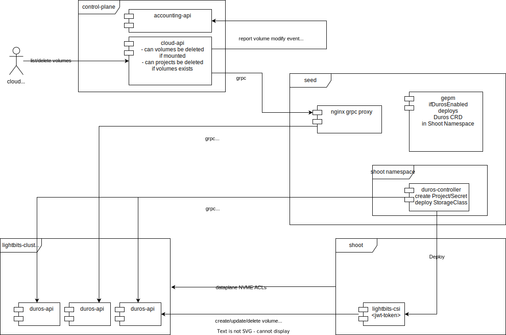
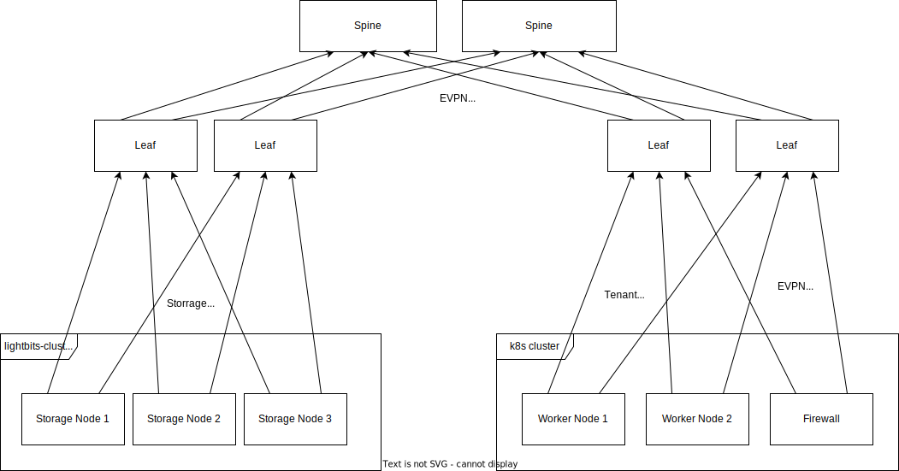

# duros-controller

A Bridge between cloud-native and duros storage controller. This controller is responsible to create a project in the duros-api and an authentication token to access the duros storage.
After the authentication token is created, it creates a storage class deployment in the shoot which itself authenticates against the duros storage to create/delete PV and mount them.

## Architecture



The Dataplane is built like this:



## Configuration

The configuration is done through a CustomResource in the shoot namespace in the seed. The Duros CustomResource contains a Reference to the metal-api project the Endpoints and the name of StorageClasses which should be created. The JWT Token is stored as StorageClass Secret.
The Gardener Extension Provider Metal will create a Duros CustomResource on shoot creation.

Example CR which will reconcile 2 StorageClasses, one with 2 replicas, and one with 3 replicas.

```yaml
---
apiVersion: storage.metal-stack.io/v1
kind: Duros
metadata:
  namespace: duros
  name: sample
spec:
  metalProjectID: 5820c4e7-fbd4-4e4b-a40b-2b83eb34bbe3
  storageClasses:
    - name: partition-silver
      replicas: 2
      compression: "true"
    - name: partition-gold
      replicas: 3
      compression: "true"
```

Ensure you also have a ClusterwideNetworkPolicy deployed to have access to the duros storage servers with the required ports

```yaml
---
apiVersion: metal-stack.io/v1
kind: ClusterwideNetworkPolicy
metadata:
  name: allow-to-storage
  namespace: firewall
spec:
  egress:
  - ports:
    - port: 443
      protocol: TCP
    - port: 4420
      protocol: TCP
    - port: 8009
      protocol: TCP
    to:
    - cidr: 10.128.0.0/14
```

## Use Cases

There are several use cases during the lifecycle of storage consumed by customers.

### First usage from a tenants project

There was no storage usage from a project before, e.g. because the customer created a new project and then a cluster is created.
Then `gepm` will create the `Duros` CR and deploys the `duros-controller` into the shoot namespace in the seed.
The `duros-controller` will check if there is already a project present in the `duros-api` with the metal-api project ID and create it if it does not exist.
A JWT Token with project permission is created and stored as secret in the shoot namespace.
With this Secret a `StorageClass` deployment in the shoot is created.

Then the Cluster user is able to create PVs.

### Second cluster in the same project

If a second cluster in the same project in the same partition is created, the `duros-controller` will see there is already a project present in the duros-api.
A new secret for this cluster is created and stored StorageClass Secret.

### Clusters are deleted

If a cluster is deleted, even if it is the latest in the project, storage volumes are not deleted. This enables customers to keep their storage and consume it in new clusters.

### Storage Volume and Project list/delete

The cloud-api will add endpoints to list/delete duros volumes and list projects, this will be done through a grpc proxy as shown in the architecture.
A Duros project will be deleted if the metal-api project is deleted. A check if there are no volumes present is also implemented.

## Accounting

Accounting of volumes is done with the kube-counter running in every shoot in the seed. Accounting of volumes currently not in use in any of the clusters
are listed from the cloud-api and reported to the accounting-api.

## Tenant separation

How tenant separation works is described more detailed [here](./MULTITENANCY.md)

## TODO

- check if Gardener deletes PVC's after cluster deletion.
