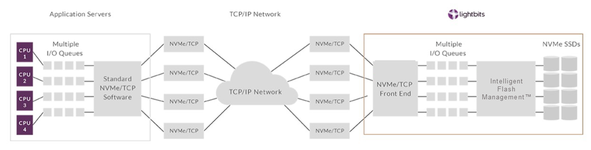

# Multi tenancy with lightbits storage

Multi tenancy is a crucial aspect when providing central storage. This divides into several aspects, impact to storage from one tenant to another tenant must be restricted so that neither data can be seen, destroyed or modified by another tenant, but also read and write actions at a high rate must not impact the performance of the storage of other tenants.

Lightbits storage uses NVMEoTCP (NVME over TCP) as transport protocol as defined here: [NVMEoF](https://nvmexpress.org/developers/nvme-of-specification/). The storage traffic is routed over the same network as normal TCP/IP traffic. The basic setup of the components is shown here:



The current implementation prevents malicious access to data, prevention of performance impacts are subject of later lightos releases.

## Gardener and metal-stack

Multi tenancy in metal-stack and gardener are based on projects. In metal-stack, projects additionally belong to a tenant entity that groups projects. A single kubernetes cluster is created in the scope of project, one project can have multiple kubernetes clusters. Every kubernetes cluster will get physically separated firewall and worker nodes in a dedicated routing domain called VRF. Every kubernetes cluster is totally separated from a physical an network perspective, nothing is shared.

Lightbits storage has also the notion of a project, once a cluster is created, a new project is created in the lightos storage API, the project there matches the project from the gardener/metal-stack perspective. For every cluster an authentication token in the JWT format is created, this token is able to create/update/list/delete volumes in the lightos cluster in the given project, resp. lightos project. For every kubernetes cluster, even in the same project, an individual JWT token is created. The token is also set to have a 8 day validity, 1 day before the token will get invalid and the cluster still exists, a new token is issued.

The duros-controller is responsible to create such tokens, it is deployed in the seed's shoot namespace (find details on gardener architecture [here](../../../05-Concepts/01-architecture.md)). This namespace is fully managed by the provider and invisible for the cluster user. Once the token has been created, the token is stored in a secret in the actual user cluster alongside with the deployment of the lightbits CSI driver and storage classes. This CSI driver will then be responsible to create/update/delete volumes based on the manifests deployed in the cluster.

```bash
k get sc

NAME                PROVISIONER              RECLAIMPOLICY   VOLUMEBINDINGMODE      ALLOWVOLUMEEXPANSION   AGE
partition-gold      csi.lightbitslabs.com    Delete          Immediate              true                   7d4h
partition-silver    csi.lightbitslabs.com    Delete          Immediate              true                   7d4h
```

The storageclass partition-gold with 3 fold replication and the pointers to the secrets.

```bash
k get sc partition-gold -o yaml

allowVolumeExpansion: true
apiVersion: storage.k8s.io/v1
kind: StorageClass
metadata:
  creationTimestamp: "2022-01-24T08:40:03Z"
  name: partition-gold
  resourceVersion: "234"
  uid: 3b40edfa-ff72-4426-904c-4205b061e311
parameters:
  compression: enabled
  csi.storage.k8s.io/controller-expand-secret-name: lb-csi-creds
  csi.storage.k8s.io/controller-expand-secret-namespace: kube-system
  csi.storage.k8s.io/controller-publish-secret-name: lb-csi-creds
  csi.storage.k8s.io/controller-publish-secret-namespace: kube-system
  csi.storage.k8s.io/node-publish-secret-name: lb-csi-creds
  csi.storage.k8s.io/node-publish-secret-namespace: kube-system
  csi.storage.k8s.io/node-stage-secret-name: lb-csi-creds
  csi.storage.k8s.io/node-stage-secret-namespace: kube-system
  csi.storage.k8s.io/provisioner-secret-name: lb-csi-creds
  csi.storage.k8s.io/provisioner-secret-namespace: kube-system
  mgmt-endpoint: 10.131.44.1:443,10.131.44.2:443,10.131.44.3:443
  mgmt-scheme: grpcs
  project-name: 0f89286d-0429-4209-a8a9-8612befbff97
  replica-count: "3"
provisioner: csi.lightbitslabs.com
reclaimPolicy: Delete
volumeBindingMode: Immediate
```

This is the secret where the storageclass points to:

```bash
k get secret lb-csi-creds -o yaml

apiVersion: v1
data:
  jwt: ZXlKaGJHY2lPaUpTVXpJMU5pSXNJbXRwWkNJNklqQm1PRGt5T0Raa0xUQTBNamt0TkRJd09TMWhPR0U1TFRnMk1USmlaV1ppWm1ZNU56cHliMjkwSWl3aWRIbHdJam9pU2xkVUluMC5leUpsZUhBaU9qRTJORFF6TURrMk1qa3NJbXAwYVNJNkltUmpNVGc0TWpVd0xUZGtORGt0TkRjMk1DMWlZVGs0TFdGbE1ESmpNR0l5WmpNeVpTSXNJbWxoZENJNk1UWTBNell4T0RReU9Td2lhWE56SWpvaVpIVnliM010WTI5dWRISnZiR3hsY2lJc0luTjFZaUk2SW5Ob2IyOTBMUzF3WkRjMmJYSXRMV2x1ZEhSbGMzUXdJaXdpY205c1pYTWlPbHNpTUdZNE9USTRObVF0TURReU9TMDBNakE1TFdFNFlUa3RPRFl4TW1KbFptSm1aamszT21Ga2JXbHVJbDE5LmIxaWo0aHV0R2lmUll1YlZMb1J5WlBKRHZ0ZWpodDZqdW1KdW1xbEMyOWpwRUxWa0JfdG4tZU9VbERPb09HUEZTN2FhRDBGOXRKSGVrOGVYQ0xqZ1R2RkdCMzI5aE5zTzlra0M5OXNQZWJvaWE1RmRLUmlUbjNBTC1KcXZZZ3pKZTNaZmZNWFdFVHhsZmxSXzFTNERpQlZFNERSc3hNczNpbWt2Nl83cU5BUEhXd2ZCdU5OUDVyMmxOdGRqdVl2VXlqN3hNWTZhODdSU1RkMUZINGlaMUx3OEZwLW9haTdyN1M1SlhnMkhBcUU2VTJ1UTMzMWhwMlREY3M2ZTJjcDdpbjJNSnhHWkRYUE5SSGFnRUJyWFdfYVVJdjJpYTU3emVGeWoyMFdhVVlUVS1rRFhxYXBUaDJfQXlPV19jQ1hhbTJWdVY0N1IwOWxqdVNocGRaXzJFZw==
kind: Secret
metadata:
  creationTimestamp: "2022-01-24T08:40:02Z"
  name: lb-csi-creds
  namespace: kube-system
  resourceVersion: "1837602"
  uid: 406c3583-d4cd-4a0b-8615-3a6f2b9b7577
```

## Lightbits and NVMEoTCP

Once a volume is created and mounted, e.g. a PVC and PV, the csi driver will first create the volume on the lightos API with his token and set the hosts which are allowed to talk to this volume to the name of the worker nodes.

```bash
k get pvc,pv,node
NAME                                     STATUS   VOLUME                                     CAPACITY   ACCESS MODES   STORAGECLASS       AGE
persistentvolumeclaim/data-sampla-app-0  Bound    pvc-c4b7822b-b3c8-414a-a1fa-9350d30a4f5c   1Gi        RWO            partition-silver   25s

NAME                                                        CAPACITY   ACCESS MODES   RECLAIM POLICY   STATUS   CLAIM                        STORAGECLASS       REASON   AGE
persistentvolume/pvc-c4b7822b-b3c8-414a-a1fa-9350d30a4f5c   1Gi        RWO            Delete           Bound    sampla-app/data-sampla-app-0 partition-silver            25s

NAME                                               STATUS   ROLES   AGE     VERSION
node/shoot--pd76mr--inttest0-group-0-845b8-49r7x   Ready    node    6d21h   v1.21.9
node/shoot--pd76mr--inttest0-group-0-845b8-ng7xh   Ready    node    7d1h    v1.21.9
```

The pod which mounts this volume is running on the node `shoot--pd76mr--inttest0-group-0-845b8-49r7x`.

```bash
k get pod -o wide
NAME          READY   STATUS    RESTARTS   AGE     IP              NODE                                          NOMINATED NODE   READINESS GATES
sampla-app-0  1/1     Running   0          5m34s   10.244.15.152   shoot--pd76mr--inttest0-group-0-845b8-49r7x   <none>           <none>
```

Once the lightos cluster has set the ACL of this volume only a node which sets the hostnqn matching the given ACL is able to mount that volume.

```bash
lbcli list volumes 
Name                                       UUID                                   State       Protection State   NSID      Size      Replicas   Compression   ACL                                                                                               Rebuild Progress
pvc-c4b7822b-b3c8-414a-a1fa-9350d30a4f5c   7828aa17-2316-442d-883e-d000436d41f2   Available   FullyProtected     631       1.0 GiB   2          true          values:"nqn.2019-09.com.lightbitslabs:host:shoot--pd76mr--inttest0-group-0-845b8-49r7x.node"      None
```

The NVMEoTCP module in the linux kernel on the worker node side and on the lightos side implements setting the host nqn to match these ACL expectations.

This can be inspected on the worker node side by looking at the host nqn, e.g. the name of the nvme drive (NVMe qualified name). This nqn matches the ACL on the lightos server side.

```bash
cat /sys/devices/virtual/nvme-fabrics/ctl/nvme1/hostnqn
nqn.2019-09.com.lightbitslabs:host:shoot--pd76mr--inttest0-group-0-845b8-49r7x.node
```

## Further improvements

In the upcoming lightos release the performance aspects of multi tenancy are addressed. This is achieved that it will be possible to cap the maximum throughput possible per volume. This will ensure that no single tenant is able to saturate the whole lightos cluster and impact other tenants using this lightos cluster.
